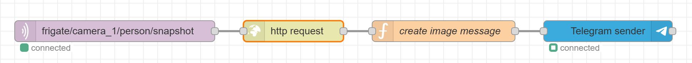

# Node-RED Frigate image notification

<a href="index"></a>

Here you find how you can send a notification with a captured image from Frigate by Node-RED to Telegram or the Home Assistant Companion app.

<br>
<br>

---

## Send Telegram photo from Frigate



* MQTT output node 
  * With the topic `frigate/camera_1/person/snapshot` where `camera_1` the defined name in Frigate is.

* HTTP request node
  * Define a GET url to the latest snapshot from frigate `http://192.168.1.123:5000/api/camera_1/latest.jpg?h=1024`
  * Set as return type **Binary buffer**

* Function node
  * Create the payload for the Telegram message. Fill in your own `chatId`.
    ```
    msg.payload = {
        content: msg.payload, //the image buffer
        caption: 'There is someone at the door',
        type: 'photo',
        fileName : "frontdoor.jpg",
        chatId: "123456"
    }
    return msg;
    ```
    
* Telegram node
  * Send the photo to the defined user.