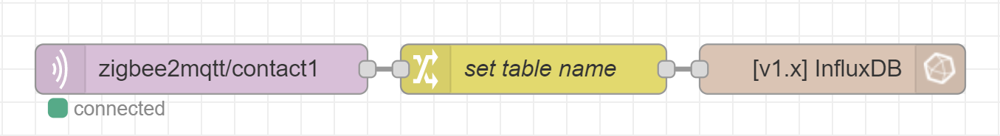
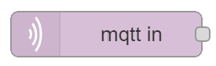
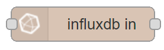

35
# Node-RED Cheat Sheet - Grafana


## Save device data to Grafana
If the InfluxDB is up and running you can use Node-RED to push every message, which comes from a sensor, direct into the database.

The InfluxDB node converts every json entity to a separated column.
Only the table name (in InfluxDB this called a `measurement`) needs to be set, this can be done in this node but, it's also possible to set it dynamic, this avoids making for every sensor duplicate flows. 

When the node get this `msg.measurement=contact1` as input it will store the sensor data in `contact1`.


Used nodes:





The content of **change node**:

<div class="nodered">

|                      |                                                                   |          |
|:---------------------|-------------------------------------------------------------------|---------:|
| zigbee2mqtt/contact1 |  | contact1 |

</div>

```
Set [msg.]measurement
    [expression]msg.topic.$split('/')[1]
```


---
[<< See also my other Node-RED pages](index)
