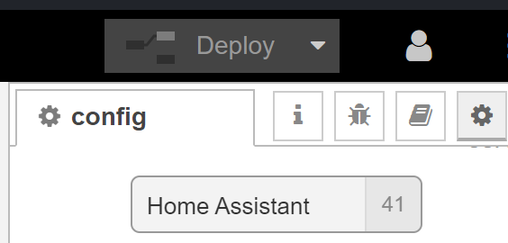
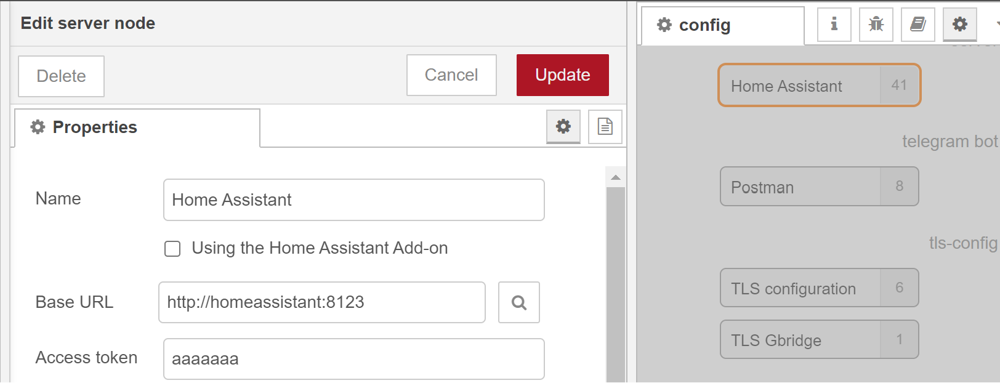
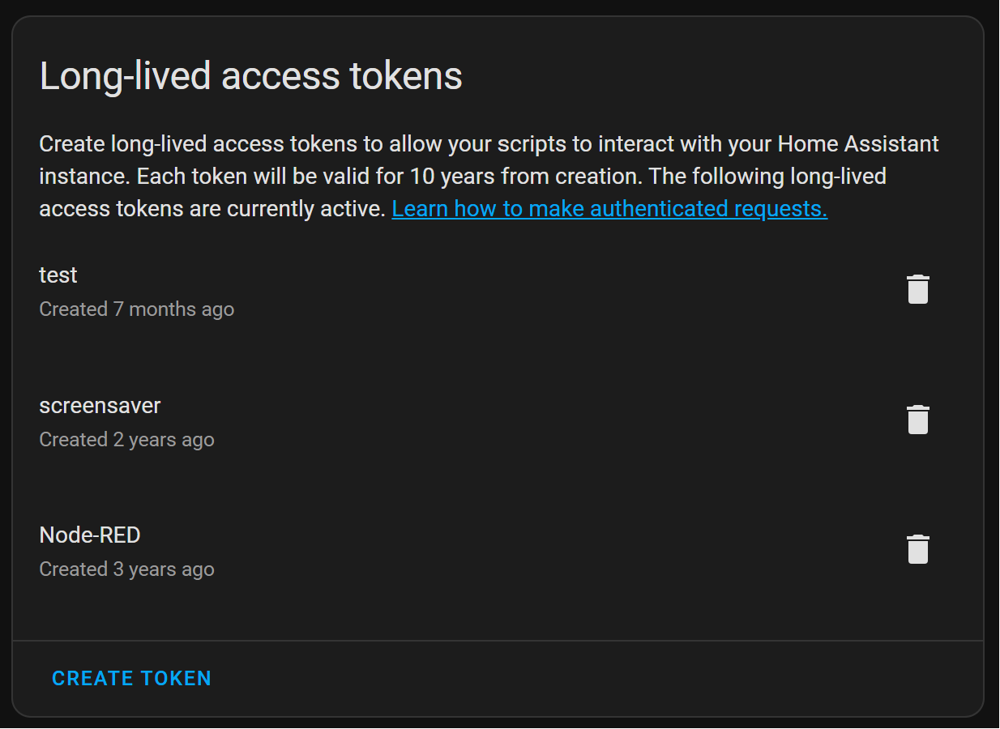

# Node-RED + Home Assistant: team work

Combine the power of Node-RED and Home Assistant.

Examples:
* [Home Assistant state change -> trigger Node-RED flow](node-red_home-assistant_full_moon)
* [Node-RED + Home Assistant: Full moon trigger](node-red_home-assistant_full_moon)
* [Node-RED flow -> HA App notification](node-red_home-assistant_notifications)

[//]: # (* [Node-RED flow -> update HA helper entity]&#40;node-red_home-assistant_update_helper&#41;)

[//]: # (* [HA Rain data -> Handle entity data in Node-RED]&#40;node-red_home-assistant_buienalarm_rain_expected&#41;)

---
## Initial setup
You need to install some extra Home Assistant nodes in Node-RED, so they can communicate with each other.

### Install the extra nodes
To get data from Home Assistant you need, in Node-RED, to install the extra nodes `node-red-contrib-home-assistant-websocket`.

* Go to the hamburger menu on the top right and select the menu item "Manage pallete"
* Select the tab Install and enter "home-assistant-websocket"
* Click on the install button to install it.
* After the installation, you see a set new node in your left sidebar.

### Configure your Home Assistant server
* Go to the sidebar and open the Configuration nodes (the wheel icon).
  

* Under the section 'On all flows' scroll to server and double-click on the Home Assistant element.
* Define the *Base URL*, this must be the url where Home Assistant can be reached from Node-RED. If you run both in a docker in the same network, you can use the name of the docker image as host name. For example http://homeassistant:8123 Now Node-RED reach Home Assistant from inside the docker network. It's also possible to use the IP-address, but this can change, and then it access it outside the docker and via your network which can act slower.

  

* The *Access token* can be created when you logged in into Home Assistant. Select your user from the menu and scroll down on your profile to "Long-Lived Access Tokens" and click on Create Token. Give it a name like 'Node-RED'. Now you get the token, copy the token in the field.

  

---

[<< See also my other Node-RED pages](index)
