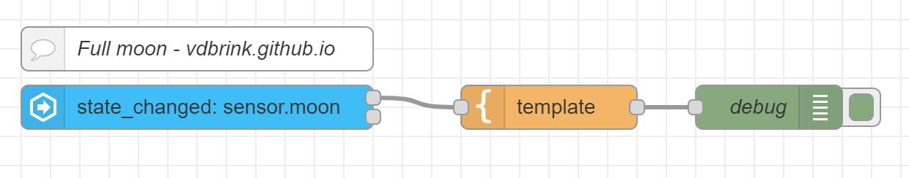
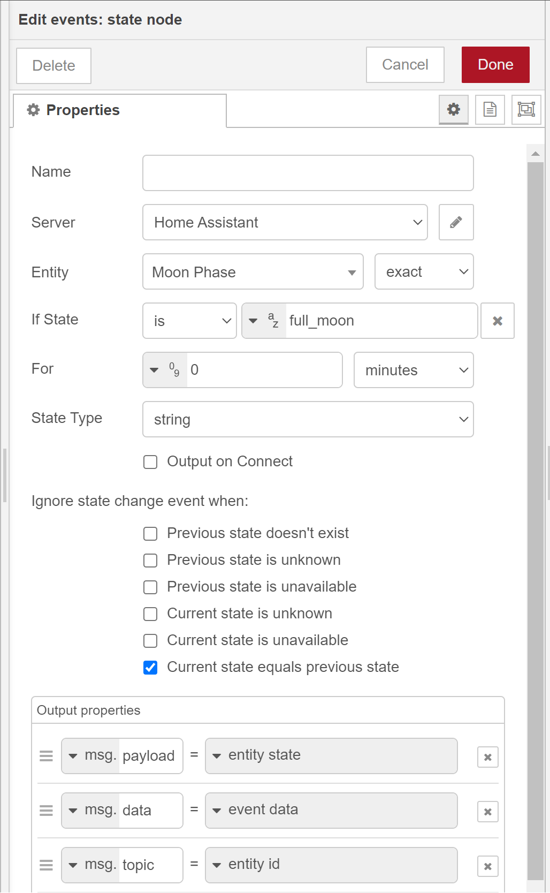

50

# Node-RED + Home Assistant integration : Full moon


<a href="node-red_home-assistant">


</a>

When receiving an event from Home Assistant, let's say that the moon state change to full moon, trigger a flow in Node-RED. 

See [initial setup](node-red_home-assistant#initial-setup) for the required additional nodes and setup.

---

## Home Assistant state update trigger in Node-RED

To trigger a flow in Node-RED based on an event updates in Home Assistant you can use the node 'events: state'

An example is to send a message (in this case to the debug node, replace it with you own chat app) when it's full moon.



[Download this flow](flows/vdbrink_ha_full_moon.json)

The configuration of the state node:
```
Server     Home Assistant
Entity     Moon Phase [exact]
If state   [is] [a-z] full_moon
For        [0-9] 0 [minutes]
State type [string]
```




---

[<< See also my other Node-RED Home + Assistant pages](node-red_home-assistant)
