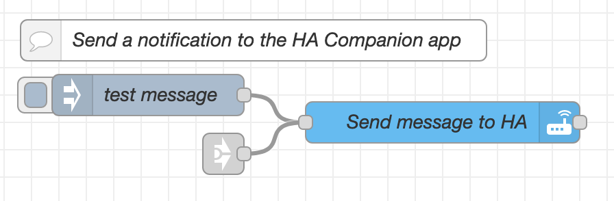
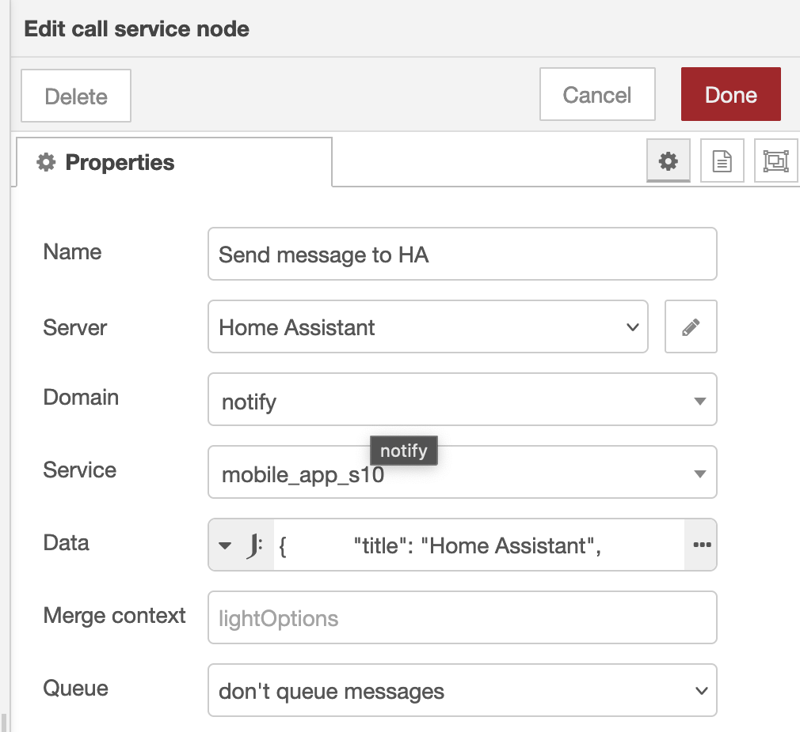

# Node-RED send notifications to the Home Assistant app

<a href="node-red_home-assistant">


</a>

Send notifications from Node-RED to your phone via the Home Assistant companion app.

*See the [initial setup](node-red_home-assistant#initial-setup) for the required additional nodes and setup.*

---
## Introduction

With Node-RED you can choose which application you prefer to use to send notifications to your phone. 
Example are Telegram, Pushover, PushBullet, WhatsApp and the Home Assistant Companion app. 

In this example, I show you how to send a notification to the Home Assistant Companion app. 

---

## Flow description



This flow contains three nodes:
* A trigger node which contains a test message to test if the notification works.
* A "link in" node to trigger a notification from any location in Node-RED via a "link out" node.
* A "call service" node which sends the notification text to the Home Assistant Companion app. This node needs to be configured with the correct HA server and phone.

### Call service node settings

These are the settings for the "call service" node.



| Property | Values                                                                           | Description                                                   |
|----------|----------------------------------------------------------------------------------|---------------------------------------------------------------|
| Server   | Home Assistant                                                                   | [Your defined HA server](node-red_home-assistant)             |
| Domain   | notify                                                                           | Select it from the list                                       |
| Service  | mobile_app_{phone_name}                                                          | When you use the Companion app you can select here your phone |
| Data     | ```json{ "title": "Home Assistant", "message": payload }``` | Some template code                                            |

---

## Node-RED flow

The corresponding code for this flow.


```yaml

[{"id":"6b4525966f26b516","type":"tab","label":"Notify on HA app","disabled":false,"info":"","env":[]},{"id":"55a8ea76c92e9816","type":"api-call-service","z":"6b4525966f26b516","name":"Send message to HA","server":"969e9e50.88897","version":5,"debugenabled":true,"domain":"notify","service":"mobile_app_s10","areaId":[],"deviceId":[],"entityId":[],"data":"{     \t    \"title\": \"Home Assistant\",     \t    \"message\": payload\t}","dataType":"jsonata","mergeContext":"","mustacheAltTags":false,"outputProperties":[],"queue":"none","x":340,"y":100,"wires":[[]]},{"id":"d79b22b6c66e16b5","type":"inject","z":"6b4525966f26b516","name":"test message","props":[{"p":"payload"},{"p":"topic","vt":"str"}],"repeat":"","crontab":"","once":false,"onceDelay":0.1,"topic":"","payload":"test message","payloadType":"str","x":125,"y":80,"wires":[["55a8ea76c92e9816"]]},{"id":"774e6671bf8d04db","type":"link in","z":"6b4525966f26b516","name":"Send notification","links":[],"x":180,"y":123,"wires":[["55a8ea76c92e9816"]]},{"id":"db6f4edc8f6e76ce","type":"comment","z":"6b4525966f26b516","name":"Send a notification to the HA Companion app","info":"","x":210,"y":40,"wires":[]},{"id":"969e9e50.88897","type":"server","name":"Home Assistant","version":5,"addon":false,"rejectUnauthorizedCerts":true,"ha_boolean":"y|yes|true|on|home|open","connectionDelay":false,"cacheJson":true,"heartbeat":false,"heartbeatInterval":"30","areaSelector":"friendlyName","deviceSelector":"friendlyName","entitySelector":"friendlyName","statusSeparator":"at: ","statusYear":"hidden","statusMonth":"short","statusDay":"numeric","statusHourCycle":"h23","statusTimeFormat":"h:m","enableGlobalContextStore":true}]

```

Good luck!

---

## References
* https://developers.home-assistant.io/docs/api/native-app-integration/notifications

---

[<< See also my other Node-RED Home + Assistant pages](node-red_home-assistant)
