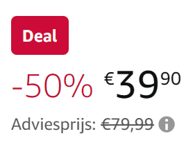
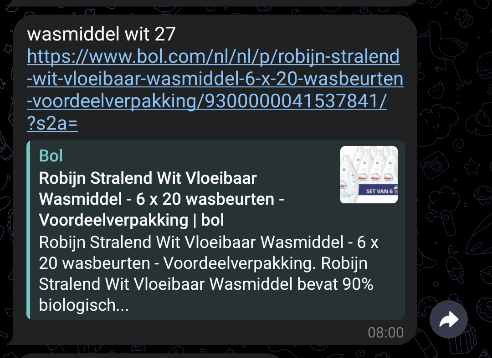
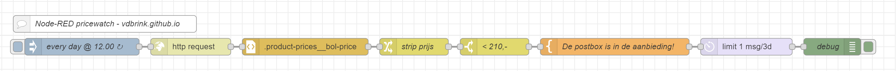

# Node-RED Pricewatch


<a name="top"></a>


Let Node-RED check, on a daily basis, the actual product prices, on different websites, for you and only send a notification when it meets your desired (sales) price.



<br>

---
## Table of Contents
<!-- TOC -->
* [Node-RED Pricewatch](#node-red-pricewatch)
  * [Table of Contents](#table-of-contents)
  * [How it works](#how-it-works)
  * [Flow explanation](#flow-explanation)
  * [Flows for different sites](#flows-for-different-sites)
    * [Amazon](#amazon)
    * [Bol.com](#bolcom)
    * [iBood.com](#iboodcom)
    * [Coolblue](#coolblue)
  * [Create your own prize checker](#create-your-own-prize-checker)
  * [Price Formatter examples](#price-formatter-examples)
    * [With new lines](#with-new-lines)
    * [Other format?](#other-format)
  * [Define the selector](#define-the-selector)
<!-- TOC -->

---

## How it works

With this flow you download a whole webpage and via HTML and CSS element names you filter out only the price of the product.
Then you compare the price with your desired price. If this is lower it creates a message with the product name and a link and sends it to your phone as notification.



Now you only need to click on the link and order it!

---
## Flow explanation

With this flow you can check a website for the actual price of a product.



**Explanation of each node:**

* **[inject node]** Trigger this flow every day at 12.00.
    ```
    Repeat     at a specific time
    at         12.00 
    on         (Check all the days to check)
    ```
* **[http request node]** Download the webpage.
    ```
    Method     GET
    URL        (the full url of the webpage)
    ```
    Output msg.payload:
    ```
    <html><head>...<div id="price">20,95</div>...</head></html>
    ```
    Sometimes you can try the other options if there comes no data out of this node. 


* **[html node]** Grab only the price from the page.
    ```
    Property   msg.payload
    Selector   #price
    Output     only the text content of the elements
               as a single message containing an array
               in msg.payload
    
    ```
    Output msg.payload:
    ```
    20,95
    ```
  See [CSS Selector](#define-the-selector) how you can define your own required Selector.

 
* **[change node]** Extract the price to a real number.
    ```
    Set           msg.payload
    to the value  [expression] $number((payload.$split(',')[0]))  
    ```
  Output msg.payload:
    ```
    20
    ```
  See [Price formatter examples](#price-formatter-examples) how you can convert a text to extract only the raw price.


* **[switch node]** Compare the raw price with your desired price.
    ```
    Property   msg.payload 
               '<=' [number] 20     
    ```
    Is your input price smaller or equal (`<=`) then your desired price (for example `20`) then the flow continues otherwise it stops here.

  Output msg.payload:
    ```
    20
    ```

* **[template node]** Create a notification message text.
    ```
    Property    msg.payload
    Template    De wasverzachter is in de aanbieding! Huidige prijs {{payload}}
                https://www.bol.com/nl/p/robijn-puur-zacht-wasverzachter-4-x-18-wasbeurten-voordeelverpakking/9200000108581694/     
    ```
  Output msg.payload:
    ```
    De wasverzachter is in de aanbieding! Huidige prijs 20
    https://www.bol.com/nl/p/robijn-puur-zacht-wasverzachter-4-x-18-wasbeurten-voordeelverpakking/9200000108581694/   
    ```
  * **[delay node]** Only send a notification once per 3 days.
      ```
      Action Rate Limit
             All messages
      Rate  1 [msg(s) per] 3 [Days]
            Drop intermediate messages     
      ```
    The output msg.payload is still the same.


* **[debug node]** Gets only the message when the product has the desired price. This node should be replaced and connected with your own configured notification app.

This is how this message looks like in Telegram.


---

## Flows for different sites

Here I defined the Selectors and formatter for some sites.

### Amazon

```
Selector:       .a-price-whole

Price formatter: $number((payload.$split('<')[0]))
```
Download an example flow.

### Bol.com

```
Selector:       .buy-block .promo-price

Price formatter: $number((payload.$split('\n')[0]))
```
Download an example flow.

### iBood.com

```
Selector:       ._price_n1pwc_7

Price formatter: $number((payload[0].$split(',')[0]))
```
Download an example flow.

### Coolblue

```
Selector:       .js-product-order-form .sales-price__current

Price formatter: $number((payload.$split(',')[0]))
```
[Download an example flow](flows/vdbrink_pricewatch.json)

If they change their site structure, this will break. Let me know [here](#remarks-or-suggestions) if one is broken then I can fix it.

---

## Create your own prize checker

-- does the page work with the http request node?

The html node use [CSS4 and/or jQuery](https://github.com/fb55/css-select#user-content-supported-selectors) to grabs the correct CSS element. The CSS name is normally used to style the element on the page with size, color, etc.

## Price Formatter examples
 What you need is the raw price, without decimals, and as number. Only with this value you can compare the price if it match your desired price.

### With new lines

The price is spread over multiple lines.
```
20
95
```
Convert the values by putting each value in a new array element after each new line (`\n`)
Then only use the data in the first element (`[0]`)
Then convert the value from a string to a number (`$number()`)
```
$number((payload.$split('\n')[0]))
```

### Other format?

Panic? If the above examples doesn't match your format just google for it to find out how you can extract the price. That's also how I find mine! Let me know if you have some additions, then I can add those here.

---
## Define the selector

These steps are needed to take to get the **selector** value to get the price:
1. Get the whole webpage source into an online evaluate page
2. Find the corresponding Selector for your text
3. Strip the unneeded part from the selector

---
[Top ^](#top)

[<< See also my other Node-RED pages](index)
