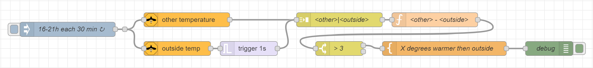

50

# Node-RED Temperature flows

Node-RED example flows related to temperature.

---

## Table of Contents

<!-- TOC -->

* [Compare two temperatures](#compare-two-temperatures)

<!-- TOC -->

---

## Compare two temperatures

With this flow you can compare the current state of two temperature sensors.


You can download this flow [here](flows/compare_two_temperatures.json).

**Scenario:**

* Open a window open if, in the summer, the outside temperature is lower than the inside temperature.

<br>

**Explanation of each node:**

* **[inject node]** Every 30 minutes a trigger between 16.00 and 21.00. It's also possible to use the 'other temperature' as trigger for this flow.
    * top flow **[get node]**\* Get the current temperature in a room.
    * bottom flow **[get node]**\* Get the current outside temperature.
    * bottom flow **[trigger node]** Add a delay of 1 second to force the correct order of input values for the next node.
     ```
    Send       nothing
    then       wait for
                1 seconds
    then send  the original message
     ```
* **[join node]** Merge the two temperatures together as one value like "26|18". The second value is always the outside temperature.
  ```
    Mode                              Manual
    Combine each                      msg.payload
    to create                         a String
    joined using                      [a-z] |
    Send the message:
      After a number of message parts  2
  ```
* **[function node]** Calculate the difference between the two temperatures.
   ```javascript
    var temps = msg.payload.split('|');
    var diff = Math.round(temps[0] - temps[1]);
    node.status({text:diff})
    msg.payload = diff;
    return msg;
   ```
* **[switch node]** Only continue if the difference is bigger than X degrees.
   ```
    Property  msg.payload
    > [0-9] X
   ```
* **[template node]** Define the text which will be sent to inform you.
  ```
    The temperature in room X is \{\{payload\}\} degrees higher than outside
   ```
* **[debug node]** This can be replaced with an output node of your choice. Like Telegram/Whatsapp/speaker/etc

\* This get node is part of the additional nodes set, named **node-red-contrib-zigbee2mqtt**. You must install this first to used it. Via the menu > Manage Palette > Palette

**Suggestions for related flows:**

* This flow can also be used for controlling a fan in the bathroom, compare humidity in the bathroom with the humidity from somewhere else in the house. 
During the year the humidity has different values.
<br>

**Additions to this flow:**

* Use the 'other temperature' sensor as trigger for this flow;
* You can also check if the window is already open, before running this flow. This can be accomplished by adding a contact sensor on the window;
* If you use the temperature sensor as trigger then the inject node can be removed. And you need to add a filter to only send messages in a specific timeframe and limit the amount of messages.

---
[Table of Content ^](#table-of-contents)

[<< See also my other Node-RED pages](index)

[Sponsor me](../sponsor_me)
