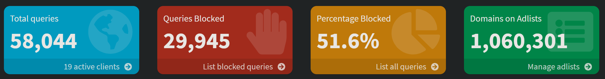

# Pi-hole
*Advertisement and tracking blocker*

## Introduction

Pi-hole is an application that validates DNS requests and allows or blocks it based on a list with "bad" domains.

This prevents to see a lot of advertisements when your browsing but underwater it blocks also many tracking sites!
These tracking sites use your visited websites to make a profile from your browse behavior.

This is my dashboard, and as you can see in the third yellow box, more than 50% of the requested website urls are blocked!
And in total one million domains are blocked. 
You probably think I can't browse anymore because everything is blocked now, 
but I almost never bump to a website that isn't loaded.
If this happened and I want to visit it you can whitelist is forever or disable the blocking functionality for an X amount of time to visit the site.

The advantage of blocking these websites is also that the scripts and images from those websites are not downloaded 
which result in faster loading of the websites.

Website: https://pi-hole.net/

[//]: # ()
[//]: # (---)

[//]: # (## Installation)

---

## AdLists

An AdList is an online page with a list of domains that will be blocked when you load this list.
You can combine multiple lists.
These are the list I use:

* https://raw.githubusercontent.com/StevenBlack/hosts/master/hosts
* https://gist.githubusercontent.com/anudeepND/adac7982307fec6ee23605e281a57f1a/raw/5b8582b906a9497624c3f3187a49ebc23a9cf2fb/Test.txt
* https://github.com/justdomains/blocklists/raw/master/lists/adguarddns-justdomains.txt
* https://raw.githubusercontent.com/chadmayfield/my-pihole-blocklists/master/lists/pi_blocklist_porn_top1m.list
* https://phishing.army/download/phishing_army_blocklist.txt
* https://urlhaus.abuse.ch/downloads/hostfile/
* https://www.github.developerdan.com/hosts/lists/ads-and-tracking-extended.txt
* https://raw.githubusercontent.com/badmojr/1Hosts/master/Xtra/domains.txt

To **update** the list and apply them:
* Go in the menu to **Tools**;
* Select **Update Gravity**;
* Click on the big button **Update** to download the latest versions;

