# Automate Christmas decorations


 | 


## Introduction

<a href="images_christmas_decorations/christmas_tree.jpg">
</a>

During the Christmas season, I have a lot of extra lights and other powered decorations in and around our house. 
**Christmas trees**, **battery powered decorations** and **outside lights** to cheer up the dark days.

It's a lot of work to control them manually every day.\
It's also a waste of energy when no one sees it or it a clear day.\
I've made my life easier by automating them all!

Now I also can control all my Christmas decorations from my phone in a Home Assistant dashboard.

<i>Click to see a video of this dashboard in action.</i>\
<a href="https://www.facebook.com/reel/841128491664565">
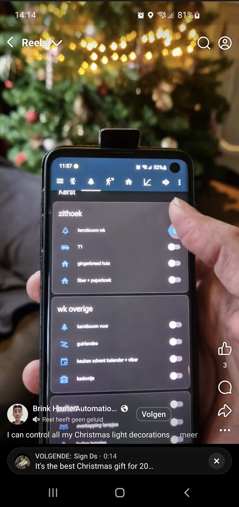
</a>

<br>

On this page, you can read how I did this to enjoy the Christmas season even more in a more relaxed way!


Quick links: 
* [Convert battery powered devices -> main power](#battery-powered-decorations)
* [Automate infrared LEDs / candles / tea lights](#infrared-lights)
* [Automate Christmas tree lights -> no activate button anymore](#christmas-tree-lights)
* [Automate decorations powered with a power plug](#decorations-powered-with-a-power-plug)

> **_TIP:_** I used here Christmas as my example project, but these tips can be used for any kind of (battery/plug/outside) powered projects like Halloween automations.

> **_NOTE:_** Also affiliate links are used on this page.

---
## Table of Contents
<a href="images_christmas_decorations/door_deco_lights2.jpg">
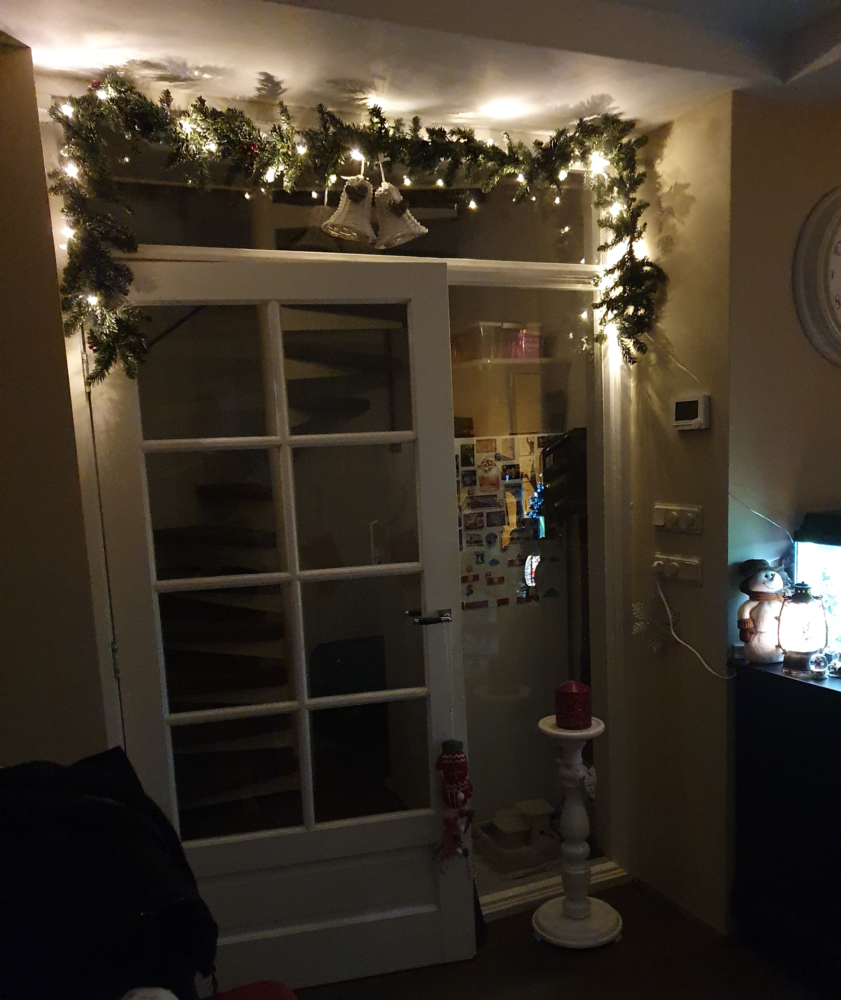</a>

<!-- TOC -->
  * [Advantages](#advantages)
  * [My old situation](#my-old-situation)
  * [My smart hardware solutions](#my-smart-hardware-solutions)
    * [Battery powered decorations](#battery-powered-decorations)
    * [Infrared lights](#infrared-lights)
    * [Christmas tree lights](#christmas-tree-lights)
    * [Decorations powered with a power plug](#decorations-powered-with-a-power-plug)
    * [Outdoor lights](#outdoor-lights)
  * [Automations](#automations)
  * [Do you have other solutions?](#do-you-have-other-solutions)
<!-- TOC -->

---
## Advantages

<a href="images_christmas_decorations/ani_snow_globe.gif">
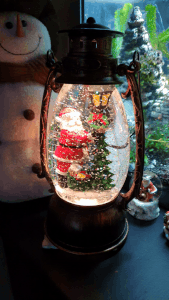
</a>

There are a lot of advantages to automate all the lights and electric decorations. 
It's not only about turning them on and off.
It's more than you can think of, like:
* Don't start every day turning on all the (battery powered) decorations one-by-one manually and at the end of the day turning them off again; [Node-RED automation](#activate-a-light-on-motion-detection)
    * _No use of batteries, no useless power usage, more time for other things, more comfort_
    * _Only downside: No morning gymnastics to switch all the buttons in each corner_
* Come downstairs, and all the cozy lights are (just) on; [Node-RED automation](#activate-a-light-on-motion-detection)
    * _More joy, quicker to the coffee!_
* Outside lights only on when it becomes dark; [Node-RED automation](#activate-a-socket-based-on-outside-lux)
    * _On a sunny day it doesn't make sense to put also all outside lights on_
* Activate something (like playing Christmas music, or a dancing Santa) when someone shows up at your doorstep; [Node-RED automation](#activate-a-socket-based-on-someone-entering-the-house)
    * _A smile on their face_     
* No lights on when there is nobody around for a while; [Node-RED automation](#disable-a-socket-after-a-period-of-inactivity)
    * _No useless power usage, which saves money_
* No power cables to paper Christmas stars;
  * _Freedom to place paper Christmas stars everywhere_
* Spend more time in bed and sleep like a baby; <a href="images_christmas_decorations/outside_tree_light.jpg">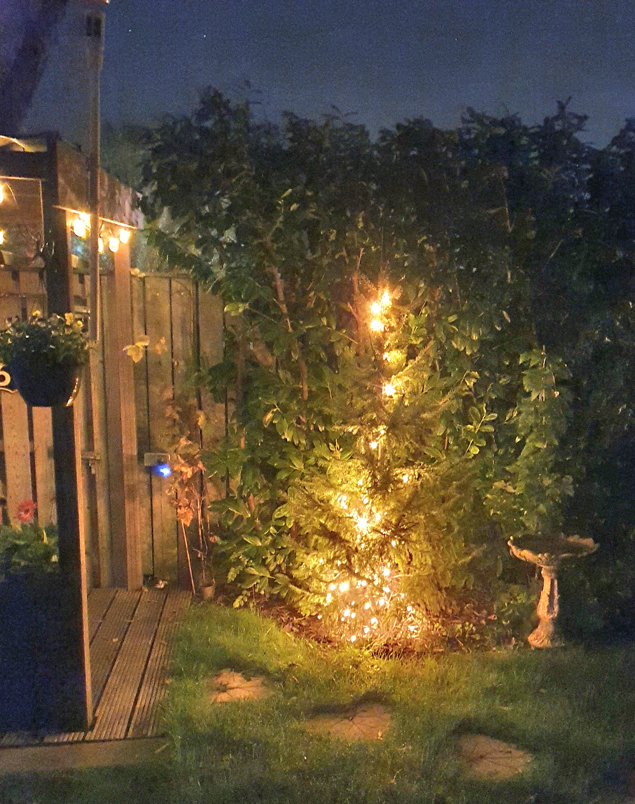</a>
    * _More rest, more energy, less coffee_
* Fellow house members have no one to blame when the cozy lights are off because you were in a hurry to go to work;
    * _More harmonie, for a better Christmas spirit_
* Less energy consumption, no batteries that need to be replaced which saves money. You still need to buy once the hardware to automate it, but in the end it earns itself back very fast;
    * _Save money to spend on Christmas presents or extra [home automation hardware](/buy/smart_home_best_buy_tips)_
<br>
  
These advantages must be enough excuses to automate these decorations. I even convinced myself again!

Home Alone with a smart home is like:

[](http://www.youtube.com/watch?v=-lfHXKbsMLE "Home Alone with a smart home")

---
## My old situation

<a href="images_christmas_decorations/tree_light_plug_button.jpg">
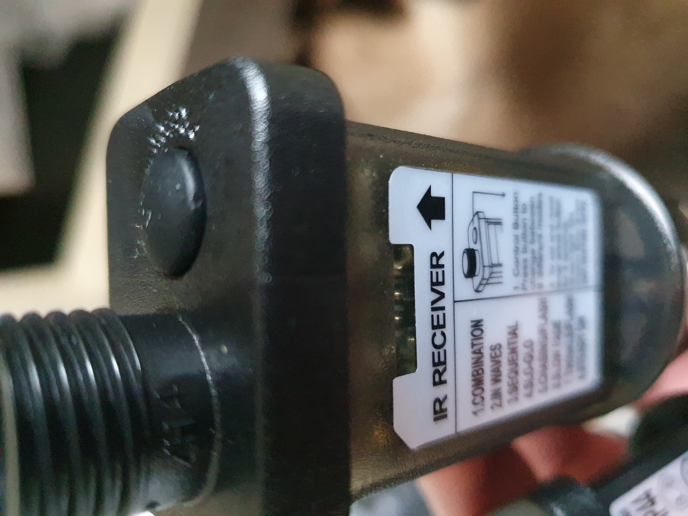
</a>

Before I automated it, there were a lot of manual actions I had to deal with.

I, as a home automation geek, I was (previous year) looking for solutions and found them for all my decorations and lights!
Read along how I did that.

<details>
  <summary><b>> Click here to read the situation before I automated it >></b></summary>

For example, my biggest **Christmas tree** lights have two light strings, and each has a power socket with a button which controls seven different flash modes. 
Each time you press the button, it switches from mode. 
And the normal required non-disco mode is the last mode! So I had to press every day that button seven times. 
And that for two strings of light. For only one tree.
Those sockets are also out of sight under the tree, so you need to dive under the tree to reach them.
And when you press one time too much, you can start all over again! Aargh!

<a href="images_christmas_decorations/dummy_battery_example.jpg">
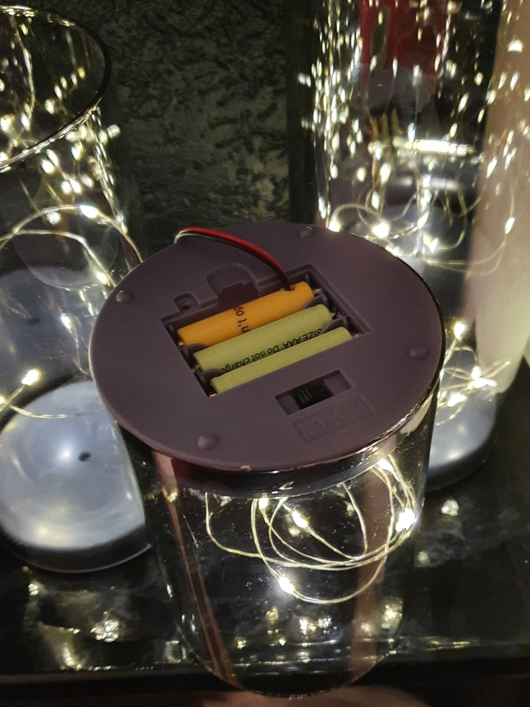
</a>

We also have a lot of **battery powered** decorations.
I could use rechargeable batteries, but then I still have to turn all the decorations on and off manually every day to enjoy it.
As a result, during the season they are only a few times on. And if you forgot one, it ends up with empty batteries after Santa was singing and dancing all night long.

Some of mine **Christmas paper stars** have a normal bulb and powered via the main power. 
This limits the places where to place them, they need to be closed to a wall socket and preferably hide the cable behind some curtains or closet to make it look nice. 
Other stars are battery powered but the button to turn them on is inside the star itself. Not easy to reach when it hangs on the ceiling!

The **plug powered lights** are easy to automate. 
Plug them into a good old-fashioned timers, everybody had already automated it in the previous century like in Home Alone! Every day on exact the same time.

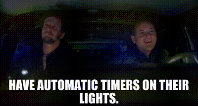

Two decades later, we can use "smarter" solutions. 
Like control them more dynamically based on the daylight level or motion and occupancy detection.
</details>

---

## My smart hardware solutions

As mentioned, I have multiple types of Christmas decorations.\
Which results at the end in five different type of power types to automate:

<a href="images_christmas_decorations/random_plugs.jpg">
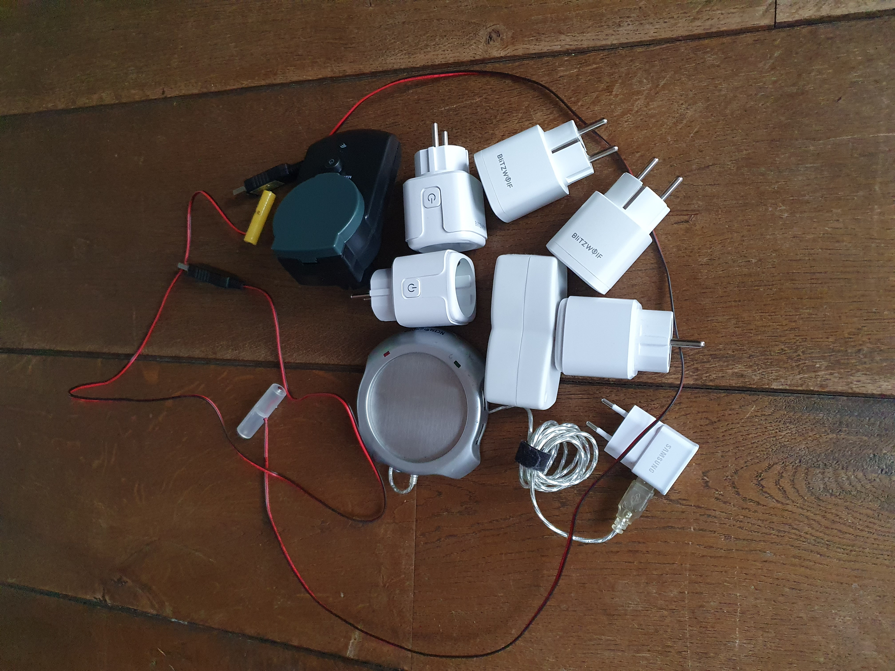
</a>

* [Battery powered decorations](#battery-powered-decorations), 15+ pieces, now controlled with dummy batteries which are connected now to the main power.
* [Infrared controlled LEDs / candles / tea lights](#infrared-wireless-lights) now automatic controlled now by a programmable infrared remote.
* [Christmas tree lights](#christmas-tree-lights) now with a replaced adapter, without a switch button which requires a manual to activate it first.
* [Decoration/lights powered with a power plug](#decorationlights-powered-with-a-power-plug), 10+ pieces, now controlled with a smart socket between it.
* [Outdoor lights](#outdoor-lights) now controlled with outdoor smart sockets.
<br>

In the next chapters I'll describe how I automated each type.

---

### Battery powered decorations

There are multiple smart hardware device combinations possible to change battery powered decorations, so you don't need any battery at all anymore!

Here are some examples how-to accomplish this:

#### Example 1: battery-to-USB + smart USB adapter/switch + 5V-adapter

An example of a battery powered light is a garland with lights above the door.\
I Automated it with a battery-to-usb set (a.k.a. battery eliminator/replacement), a smart usb adapter/switch and a 5V-adapter.
This smart (Zigbee or WiFi) USB-adapter/switch can be remote controlled and each port can be activated individually.

<a href="../buy/batteries#battery-eliminators" target="_blank">
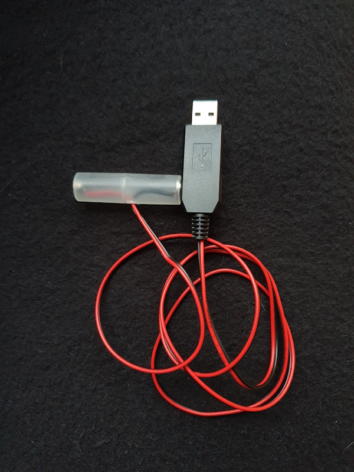
</a>
 &nbsp;
<a href="../buy/smart_home_best_buy_tips#usb-adapter-switch" target="_blank">

</a>
&nbsp;
<a href="../buy/smart_home_best_buy_tips#power" target="_blank">

</a>

This original battery-powered garland is now powered via the main power and controlled automatically.
<br>
<a href="images_christmas_decorations/door_deco_lights.jpg">
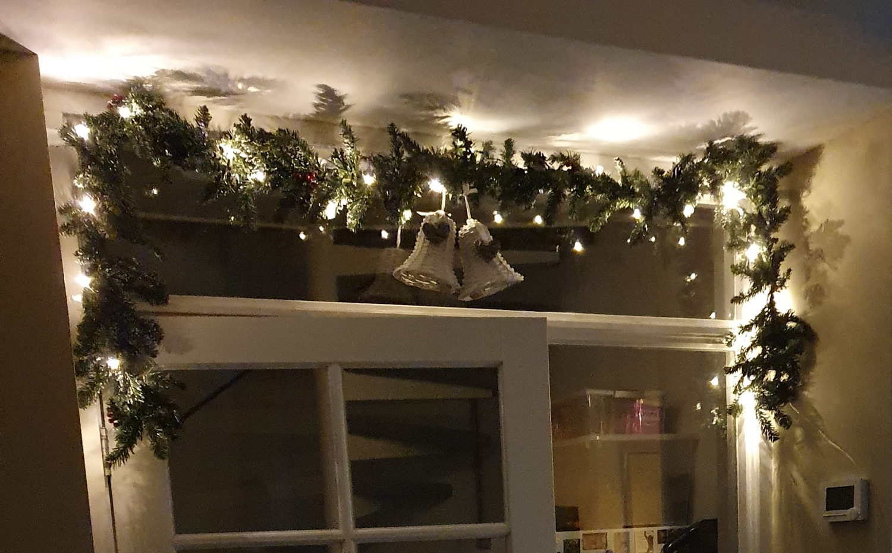
</a>

These battery-powered light string is now powered via the main power and controlled automatically. 
<br>
<a href="images_christmas_decorations/christmas_lights.jpg">
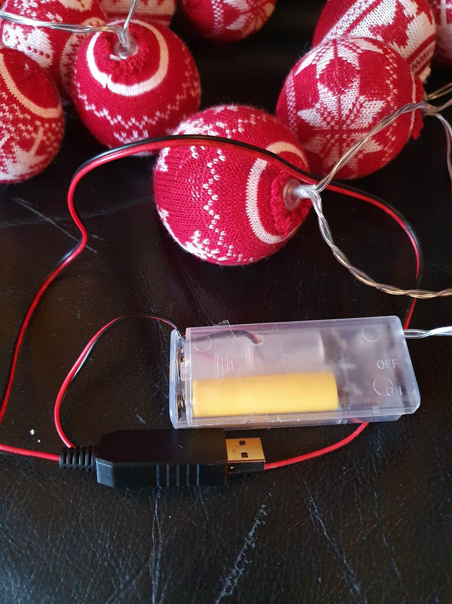
</a>

#### Example 2: battery-to-plug + smart socket

Another example is a battery powered light in a bottle. 

I use for this a battery-to-plug set and a smart socket.
Place the dummy batteries in the original battery case and connect the power adapter to the smart socket to control is via an automation.

<a href="../buy/batteries#battery-eliminators" target="_blank">
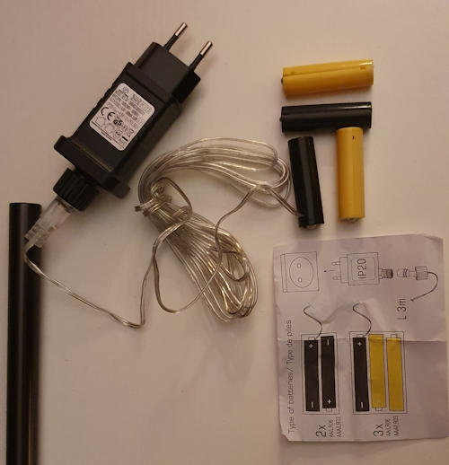
</a>
&nbsp;
<a href="../buy/smart_home_best_buy_tips#smart-socket" target="_blank">
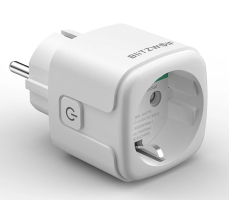
</a>
<br>
<a href="images_christmas_decorations/lights_in_a_bottle.jpg">
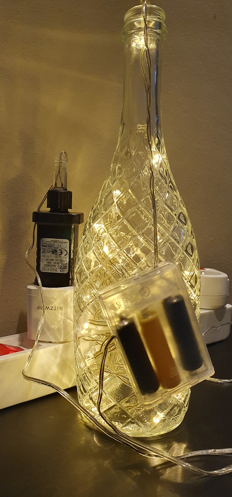
</a>
<a href="images_christmas_decorations/battery_powered_deco.jpg">
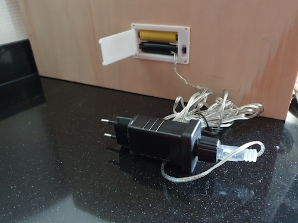
</a>

#### Example 3: battery-to-USB + USB hub + smart socket

If you have multiple battery power devices close to each other, and you want to automate them the same way, you can also use an active powered USB-hub.\
This hub can be powered with a smart socket to control all the connected devices at once.

<a href="../buy/esphome_diy#usb-hub" target="_blank">

</a>
&nbsp;
<a href="../buy/smart_home_best_buy_tips#smart-socket" target="_blank">

</a>

<a href="images_christmas_decorations/battery_powered_decorations.jpg">
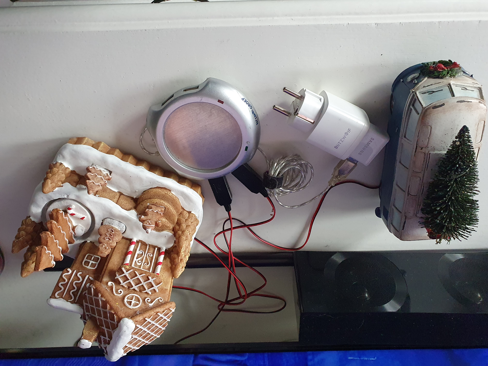
</a>

#### Hardware suggestions

As you could read, there are multiple combinations possible to control battery powered devices.\
It really depends on how many devices you want to control at once and how close they are to each other, which is the best combination in your case.

* {{imgBasket}}[Battery to USB / battery eliminator](../buy/batteries#battery-eliminators) They are available for AA and AAA batteries and with multiple "dummy" batteries. 
Those extra dummy batteries are only needed to make contact between the ends of the battery holder. You can also use a electronic wire to connect the ends.
   
   <a href="../buy/batteries#battery-eliminators" target="_blank">
        
   </a>

* {{imgBasket}}[5V EU USB power adapter](../buy/smart_home_best_buy_tips#power) to power the USB battery eliminators.

    <a href="../buy/smart_home_best_buy_tips#power" target="_blank">
        
    </a>

* {{imgBasket}}[EU Smart power socket. I use the Zigbee BlitzWolf EU SHP-15](../buy/smart_home_best_buy_tips#smart-socket) or any other [WiFi / Zigbee socket](https://s.click.aliexpress.com/e/_DluyKLX) for your country to automate the devices.

    <a href="../buy/smart_home_best_buy_tips#smart-socket" target="_blank">
        
    </a>

* {{imgBasket}}[Active USB hub](../buy/esphome_diy#usb-hub) to power multiple USB battery eliminators at once. 
In combination with the socket, you can automate them.

    <a href="../buy/esphome_diy#usb-hub" target="_blank">
        
    </a>

* {{imgBasket}}[Zigbee USB adapter](../buy/smart_home_best_buy_tips#usb-adapter-switch) to control and power maximal 3 USB devices individual. You can choose for an adapter with 1, 2 or 3 ports.

    <a href="../buy/smart_home_best_buy_tips#usb-adapter-switch" target="_blank">
    </a>

---

### Infrared lights

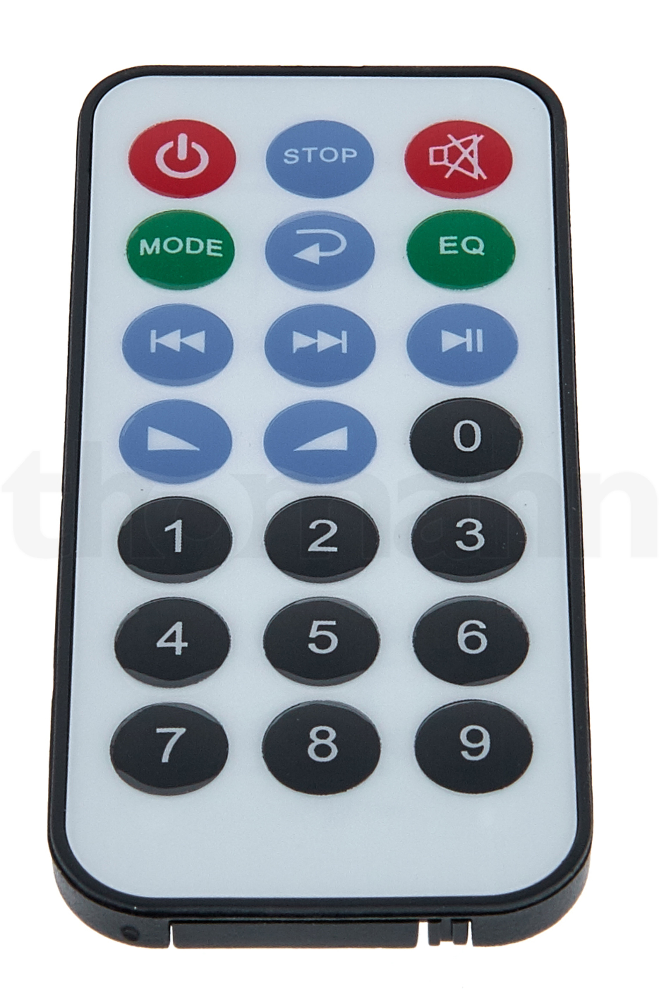
There are these different kinds of infrared controlled device available like LEDs, fake candles or fake tea lights.

I had before Christmas paper stars that contain a regular light bulb.
This reduces the positions where I could place them, 
they must be in reach of a power socket and somewhere where I could keep the power cable out of sight, guide them behind a curtain or so.

  

I solved this by using battery powered LED lights, which are controllable via an infrared remote. 
I used a Zigbee programmable infrared receiver and transmitter which can learn from the original remote.\
This transmitter is a WiFi or Zigbee, battery powered, device that can be placed in the sight of multiple infrared devices. \
I have it at a distance of five meters, and still it works great as long as the star is made of thin carton/paper otherwise the signal can't get through the paper to reach the LED.

#### Video

In this video, you see my programmable infrared remote replacement device in action.
I can control the lights via the original remote and also from my Home Assistant dashboard.

<video controls height="400px">
    <source src="/zigbee/images_infrared/ir_reel_720p.mp4" type="video/mp4">
    Your browser does not support the video tag.
</video>

#### The programmable infrared remote

I used myself the Zigbee [Moes UFO-R11](https://www.zigbee2mqtt.io/devices/UFO-R11.html){{imgZ2M}}, (there are also [WiFi models](../buy/smart_home_best_buy_tips#infrared-remote-control)) a battery powered (wireless) programmable infrared receiver and transmitter to replace the original LED light remote. 
This device can store multiple different signals.
Also, the original remote can be used to control them!

Check my dedicated page about this [Zigbee infrared transmitter / receiver](../zigbee/smart_infrared_transmitter_receiver) for more information on how to program and use this device to replace and automate the original remote.
Also, how to send infrared event signals from the Home Assistant dashboard.

Now you can automate these devices also!

#### Used hardware

There are all kinds of battery-powered lights available which can be controlled via infrared.
With this project, all these lights can now be automated as well!

##### Infrared signal transmitter

{{imgBasket}}<a href="/buy/smart_home_best_buy_tips#infrared-remote-control" target="_blank">An programmable infrared remote</a>
  It can learn signals from the original remote, and via WiFi or Zigbee you can resend the copied signal to simulate the press on the button via an automation.

  <a href="/buy/smart_home_best_buy_tips#infrared-remote-control" target="_blank">
    
  </a>

<br>

##### LED lights

Wireless, battery-powered colored LED lights.

{{imgBasket}}<a href="https://s.click.aliexpress.com/e/_EIwZk97" target="_blank">(1 - 6) LED lights, with different colors and brightness, controlled by a remote</a>

  <a href="https://s.click.aliexpress.com/e/_EIwZk97" target="_blank">
    
  </a>

##### Tea lights

I created a [Dedicate page](/zigbee/smart_infrared_transmitter_receiver) how I automate my tea lights from Home Assistant.

{{imgBasket}}<a href="https://s.click.aliexpress.com/e/_DFWJ9gH" target="_blank">Tea lights controlled by an infrared remote</a>

  <a href="https://s.click.aliexpress.com/e/_DFWJ9gH" target="_blank">
    
  </a>

##### Candle lights

{{imgBasket}}<a href="https://s.click.aliexpress.com/e/_EwbMZuk" target="_blank">Candle lights controlled by an infrared remote</a>

  <a href="https://s.click.aliexpress.com/e/_EwbMZuk" target="_blank">
    
  </a>

<br>

{{imgBasket}}<a href="https://s.click.aliexpress.com/e/_ooQUAjv" target="_blank">Other candle lights controlled by an infrared remote</a>

  <a href="https://s.click.aliexpress.com/e/_ooQUAjv" target="_blank">
    
  </a>

##### Long candle lights

{{imgBasket}}<a href="https://s.click.aliexpress.com/e/_oDcngfL" target="_blank">Long candle lights controlled by an infrared remote</a>

  <a href="https://s.click.aliexpress.com/e/_oDcngfL" target="_blank">
    
  </a>

##### Paper stars

* {{imgBasket}}<a href="https://s.click.aliexpress.com/e/_c3yOiSxD" target="_blank">A Christmas paper star - example 1</a>
* {{imgBasket}}<a href="https://s.click.aliexpress.com/e/_c4KlgroP" target="_blank">A Christmas paper star - example 2</a>
* {{imgBasket}}<a href="https://s.click.aliexpress.com/e/_DdrBmRR" target="_blank">A Christmas paper star - example 3</a>

  <a href="https://s.click.aliexpress.com/e/_c3yOiSxD" target="_blank">
    
  </a>

---

### Christmas tree lights

My Christmas tree has a specific EU outlet plug with the output of 31V and 3.6W. But when I was looking at AliExpress, I found this exact same plug but without a power button and without switching the disco modes, just always on.

<a href="https://s.click.aliexpress.com/e/_c45CWcjp" target="_blank">
  
  
</a>

{{imgBasket}}<a href="https://s.click.aliexpress.com/e/_c45CWcjp" target="_blank">Christmas light string plug 31V/3.6W</a>

<a href="images_christmas_decorations/christmas_tree.jpg">
  
</a>

If you also have a plug with a button, you can always try to find a similar plug without a button.\
Please, let me know if you use another one which fits for your light string.

Or if your familiar with soldering and electronics, you can modify the current button and make it always on, but only advised for professionals!!

---

### Decorations powered with a power plug

* {{imgBasket}}[Smart power socket. I use the Zigbee BlitzWolf EU SHP-15](../buy/smart_home_best_buy_tips#smart-socket) or look for a smart socket that fits your country.

  <a href="../buy/smart_home_best_buy_tips#smart-socket" target="_blank">
    
    </a>

---

### Outdoor lights

I have in my garden several waterproof power sockets. Here I use outdoor water-resistant Zigbee power sockets to automate the outdoor decorations and lights.\
In the front yard I put the light string wire through the mailbox to plug it inside.

<a href="images_christmas_decorations/outside_tree_light.jpg">

</a>
&nbsp;
<a href="images_christmas_decorations/front_door_light.jpg">
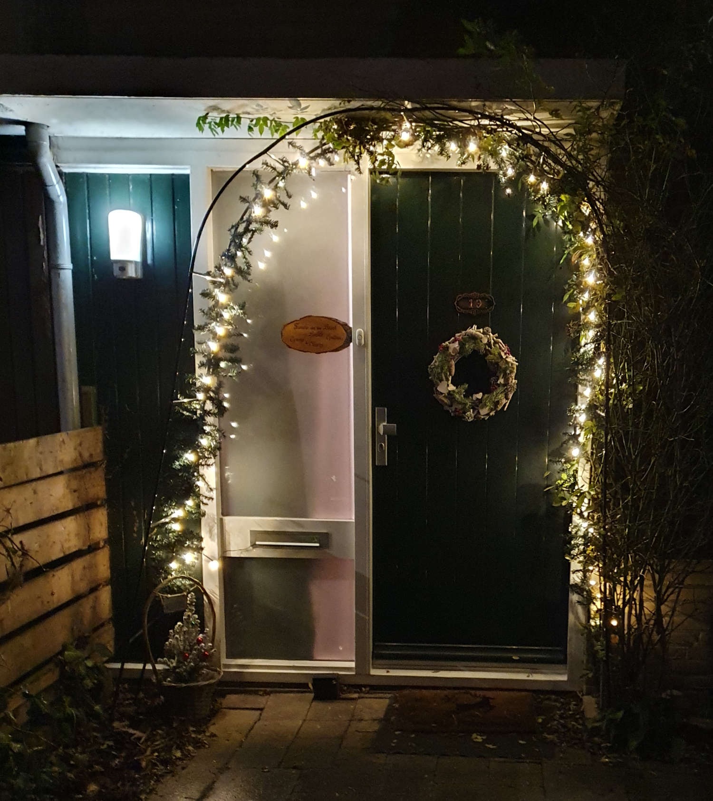
</a>

<br>
The number of these socket models are limited. 
If you have a suggestion for a Zigbee outdoor socket, please let me know!

* An outdoor Zigbee EU power socket with two ports, where each socket can be controlled individual, and it has power consumption measurements.
 
  {{imgBasket}}<a href="https://amzn.to/40SVJoc#ad" target="_blank">Zigbee dual port power outdoor socket with power measurement - Nous (Amazon).

  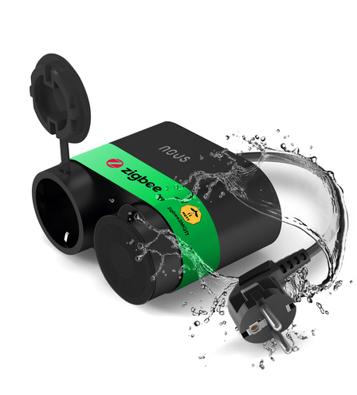</a>

<br>

* Innr Zigbee power socket can handle 2300 W and has an IP44 rating, without power measurement.

  {{imgBasket}}<a href="https://amzn.to/3Vt83Ip#ad" target="_blank">Zigbee outdoor power socket - Innr (Dual Pack) (Amazon)</a>

  <a href="https://amzn.to/3Vt83Ip#ad" target="_blank">
   </a>

---

## Home Assistant

Because all lights are now connected via a Zigbee smart socket or Zigbee smart USB adapter, 
I can control everything also from Home Assistant.

This is how my dashboard looks like.
Normally everything works by automations, but it can also be controlled from my Home Assistant dashboard. 

<i>Click to see a video of this dashboard in action.</i>\
<a href="https://www.facebook.com/reel/841128491664565">

</a>

---

## Automations

I use Node-RED myself to control all the decoration and light automations.\
If you have such automations in Home Assistant, I can add those here also if you share them.

### Activate a light on motion detection

```yaml

[{"id":"e4c9ffe6e9ebc89e","type":"mqtt in","z":"fc546c6ffaa0d24f","name":"","topic":"zigbee2mqtt/motion1","qos":"0","datatype":"json","broker":"7527d055.ed7e2","nl":false,"rap":false,"inputs":0,"x":130,"y":40,"wires":[["283a54355d600404"]]},{"id":"7527d055.ed7e2","type":"mqtt-broker","name":"","broker":"mosquitto","port":"1883","tls":"bbaa4676.58e4c8","clientid":"node-red-client","autoConnect":true,"usetls":false,"protocolVersion":"5","keepalive":"60","cleansession":false,"autoUnsubscribe":true,"birthTopic":"","birthQos":"0","birthPayload":"","birthMsg":{},"closeTopic":"","closePayload":"","closeMsg":{},"willTopic":"","willQos":"0","willPayload":"","willMsg":{},"userProps":"","sessionExpiry":""},{"id":"bbaa4676.58e4c8","type":"tls-config","name":"","cert":"","key":"","ca":"","certname":"m2mqtt_srv.crt","keyname":"m2mqtt_srv.key","caname":"m2mqtt_ca.crt","servername":"","verifyservercert":false}]

```

#### Disable a socket after a period of inactivity

```yaml

[{"id":"fc546c6ffaa0d24f","type":"tab","label":"Flow 3","disabled":false,"info":"","env":[]},{"id":"95857193e1d3014e","type":"mqtt out","z":"fc546c6ffaa0d24f","name":"plug1","topic":"zigbee2mqtt/plug1/set","qos":"0","retain":"false","respTopic":"","contentType":"","userProps":"","correl":"","expiry":"","broker":"7527d055.ed7e2","x":1110,"y":94,"wires":[]},{"id":"283a54355d600404","type":"switch","z":"fc546c6ffaa0d24f","name":"occupancy = true","property":"payload.occupancy","propertyType":"msg","rules":[{"t":"true"},{"t":"else"}],"checkall":"true","repair":false,"outputs":2,"x":350,"y":100,"wires":[["4bd8838f5b3148e6","9234488c505f1034"],["f02e50b55cb46eaa"]]},{"id":"e4c9ffe6e9ebc89e","type":"mqtt in","z":"fc546c6ffaa0d24f","name":"","topic":"zigbee2mqtt/motion1","qos":"0","datatype":"json","broker":"7527d055.ed7e2","nl":false,"rap":false,"inputs":0,"x":130,"y":100,"wires":[["283a54355d600404"]]},{"id":"32d13518d26f4f38","type":"template","z":"fc546c6ffaa0d24f","name":"OFF","field":"payload","fieldType":"msg","format":"handlebars","syntax":"mustache","template":"OFF","output":"str","x":770,"y":134,"wires":[["1b0aafefe85d17b3"]]},{"id":"1b0aafefe85d17b3","type":"rbe","z":"fc546c6ffaa0d24f","name":"","func":"rbe","gap":"","start":"","inout":"out","septopics":true,"property":"payload","x":970,"y":94,"wires":[["95857193e1d3014e"]]},{"id":"4bd8838f5b3148e6","type":"template","z":"fc546c6ffaa0d24f","name":"ON","field":"payload","fieldType":"msg","format":"handlebars","syntax":"mustache","template":"ON","output":"str","x":770,"y":94,"wires":[["1b0aafefe85d17b3"]]},{"id":"f02e50b55cb46eaa","type":"delay","z":"fc546c6ffaa0d24f","name":"","pauseType":"delay","timeout":"30","timeoutUnits":"seconds","rate":"1","nbRateUnits":"1","rateUnits":"second","randomFirst":"1","randomLast":"5","randomUnits":"seconds","drop":false,"allowrate":false,"outputs":1,"x":640,"y":134,"wires":[["32d13518d26f4f38"]]},{"id":"9234488c505f1034","type":"change","z":"fc546c6ffaa0d24f","name":"reset","rules":[{"t":"set","p":"reset","pt":"msg","to":"1","tot":"num"}],"action":"","property":"","from":"","to":"","reg":false,"x":510,"y":60,"wires":[["f02e50b55cb46eaa"]]},{"id":"17481e8d3a375fed","type":"comment","z":"fc546c6ffaa0d24f","name":"vdbrink.github.io","info":"","x":120,"y":40,"wires":[]},{"id":"7527d055.ed7e2","type":"mqtt-broker","name":"","broker":"mosquitto","port":"1883","tls":"bbaa4676.58e4c8","clientid":"node-red-client","autoConnect":true,"usetls":false,"protocolVersion":"5","keepalive":"60","cleansession":false,"autoUnsubscribe":true,"birthTopic":"","birthQos":"0","birthPayload":"","birthMsg":{},"closeTopic":"","closePayload":"","closeMsg":{},"willTopic":"","willQos":"0","willPayload":"","willMsg":{},"userProps":"","sessionExpiry":""},{"id":"bbaa4676.58e4c8","type":"tls-config","name":"","cert":"","key":"","ca":"","certname":"m2mqtt_srv.crt","keyname":"m2mqtt_srv.key","caname":"m2mqtt_ca.crt","servername":"","verifyservercert":false}]

```

### Activate a socket based on outside lux

```yaml

[{"id":"fc546c6ffaa0d24f","type":"tab","label":"Flow 3","disabled":false,"info":"","env":[]},{"id":"95857193e1d3014e","type":"mqtt out","z":"fc546c6ffaa0d24f","name":"plug1","topic":"zigbee2mqtt/plug1/set","qos":"0","retain":"false","respTopic":"","contentType":"","userProps":"","correl":"","expiry":"","broker":"7527d055.ed7e2","x":890,"y":100,"wires":[]},{"id":"17481e8d3a375fed","type":"comment","z":"fc546c6ffaa0d24f","name":"vdbrink.github.io","info":"","x":120,"y":40,"wires":[]},{"id":"4887e36795501543","type":"mqtt in","z":"fc546c6ffaa0d24f","name":"","topic":"zigbee2mqtt/lux1","qos":"0","datatype":"json","broker":"7527d055.ed7e2","nl":false,"rap":false,"inputs":0,"x":120,"y":100,"wires":[["7e9d2015c86738a5"]]},{"id":"c3cfddf246fe13bb","type":"template","z":"fc546c6ffaa0d24f","name":"ON","field":"payload","fieldType":"msg","format":"handlebars","syntax":"mustache","template":"ON","output":"str","x":610,"y":80,"wires":[["e51d8f56add45b05"]]},{"id":"abd3f54563749818","type":"template","z":"fc546c6ffaa0d24f","name":"OFF","field":"payload","fieldType":"msg","format":"handlebars","syntax":"mustache","template":"OFF","output":"str","x":610,"y":120,"wires":[["e51d8f56add45b05"]]},{"id":"e51d8f56add45b05","type":"rbe","z":"fc546c6ffaa0d24f","name":"","func":"rbe","gap":"","start":"","inout":"out","septopics":true,"property":"payload","topi":"topic","x":750,"y":100,"wires":[["95857193e1d3014e","7f32ace694a0666d"]]},{"id":"afcd6d623fd01433","type":"falling-edge","z":"fc546c6ffaa0d24f","name":"160","threshold":"160","x":490,"y":80,"wires":[["c3cfddf246fe13bb"]]},{"id":"dde843e60d0762fe","type":"rising-edge","z":"fc546c6ffaa0d24f","name":"1000","threshold":"1000","x":490,"y":120,"wires":[["abd3f54563749818"]]},{"id":"7e9d2015c86738a5","type":"change","z":"fc546c6ffaa0d24f","name":"","rules":[{"t":"set","p":"payload","pt":"msg","to":"payload.illuminance_lux","tot":"msg"}],"action":"","property":"","from":"","to":"","reg":false,"x":320,"y":100,"wires":[["afcd6d623fd01433","dde843e60d0762fe"]]},{"id":"fe23de1883877205","type":"inject","z":"fc546c6ffaa0d24f","name":"800","props":[{"p":"payload"},{"p":"topic","vt":"str"}],"repeat":"","crontab":"","once":false,"onceDelay":0.1,"topic":"","payload":"{ \"illuminance_lux\": 800}","payloadType":"json","x":110,"y":200,"wires":[["7e9d2015c86738a5"]]},{"id":"7f32ace694a0666d","type":"debug","z":"fc546c6ffaa0d24f","name":"debug 105","active":true,"tosidebar":true,"console":false,"tostatus":false,"complete":"false","statusVal":"","statusType":"auto","x":910,"y":60,"wires":[]},{"id":"30de2de1673e6490","type":"inject","z":"fc546c6ffaa0d24f","name":"100","props":[{"p":"payload"},{"p":"topic","vt":"str"}],"repeat":"","crontab":"","once":false,"onceDelay":0.1,"topic":"","payload":"{ \"illuminance_lux\": 100}","payloadType":"json","x":110,"y":240,"wires":[["7e9d2015c86738a5"]]},{"id":"a995a4bfd8f4d4e7","type":"inject","z":"fc546c6ffaa0d24f","name":"1001","props":[{"p":"payload"},{"p":"topic","vt":"str"}],"repeat":"","crontab":"","once":false,"onceDelay":0.1,"topic":"","payload":"{ \"illuminance_lux\": 1001}","payloadType":"json","x":110,"y":160,"wires":[["7e9d2015c86738a5"]]},{"id":"7527d055.ed7e2","type":"mqtt-broker","name":"","broker":"mosquitto","port":"1883","tls":"bbaa4676.58e4c8","clientid":"node-red-client","autoConnect":true,"usetls":false,"protocolVersion":"5","keepalive":"60","cleansession":false,"autoUnsubscribe":true,"birthTopic":"","birthQos":"0","birthPayload":"","birthMsg":{},"closeTopic":"","closePayload":"","closeMsg":{},"willTopic":"","willQos":"0","willPayload":"","willMsg":{},"userProps":"","sessionExpiry":""},{"id":"bbaa4676.58e4c8","type":"tls-config","name":"","cert":"","key":"","ca":"","certname":"m2mqtt_srv.crt","keyname":"m2mqtt_srv.key","caname":"m2mqtt_ca.crt","servername":"","verifyservercert":false}]

```

### Activate a socket based on someone entering the house

```yaml

[{"id":"fc546c6ffaa0d24f","type":"tab","label":"Flow 3","disabled":false,"info":"","env":[]},{"id":"95857193e1d3014e","type":"mqtt out","z":"fc546c6ffaa0d24f","name":"plug1","topic":"zigbee2mqtt/plug1/set","qos":"0","retain":"false","respTopic":"","contentType":"","userProps":"","correl":"","expiry":"","broker":"7527d055.ed7e2","x":730,"y":80,"wires":[]},{"id":"17481e8d3a375fed","type":"comment","z":"fc546c6ffaa0d24f","name":"vdbrink.github.io","info":"","x":120,"y":40,"wires":[]},{"id":"e51d8f56add45b05","type":"rbe","z":"fc546c6ffaa0d24f","name":"","func":"rbe","gap":"","start":"","inout":"out","septopics":true,"property":"payload","topi":"topic","x":590,"y":80,"wires":[["95857193e1d3014e"]]},{"id":"7aeac0d65eb31c24","type":"mqtt in","z":"fc546c6ffaa0d24f","name":"","topic":"frigate/camera_1/person/snapshot","qos":"2","datatype":"buffer","broker":"7527d055.ed7e2","nl":false,"rap":false,"rh":"2","inputs":0,"x":180,"y":80,"wires":[["3738a583e0135c76"]]},{"id":"3738a583e0135c76","type":"trigger","z":"fc546c6ffaa0d24f","name":"","op1":"ON","op2":"OFF","op1type":"str","op2type":"str","duration":"3","extend":true,"overrideDelay":false,"units":"min","reset":"","bytopic":"all","topic":"topic","outputs":1,"x":430,"y":80,"wires":[["e51d8f56add45b05"]]},{"id":"7527d055.ed7e2","type":"mqtt-broker","name":"","broker":"mosquitto","port":"1883","tls":"bbaa4676.58e4c8","clientid":"node-red-client","autoConnect":true,"usetls":false,"protocolVersion":"5","keepalive":"60","cleansession":false,"autoUnsubscribe":true,"birthTopic":"","birthQos":"0","birthPayload":"","birthMsg":{},"closeTopic":"","closePayload":"","closeMsg":{},"willTopic":"","willQos":"0","willPayload":"","willMsg":{},"userProps":"","sessionExpiry":""},{"id":"bbaa4676.58e4c8","type":"tls-config","name":"","cert":"","key":"","ca":"","certname":"m2mqtt_srv.crt","keyname":"m2mqtt_srv.key","caname":"m2mqtt_ca.crt","servername":"","verifyservercert":false}]

```
---

## Do you have other solutions?

Do you have other solutions or ideas to automate your Christmas decorations? 
Please let me know!

---

I hope you enjoyed reading this blog post and found it useful!
If you have any questions or comments, please post them below my social media posts, in the comment section.

---

Links to other sections of this blog site.

[Main page](../index) | [Other projects](index) | [Home Assistant](../homeassistant/index) | [ESPHome](../esphome/index) | [Node-RED](../node-red/index)