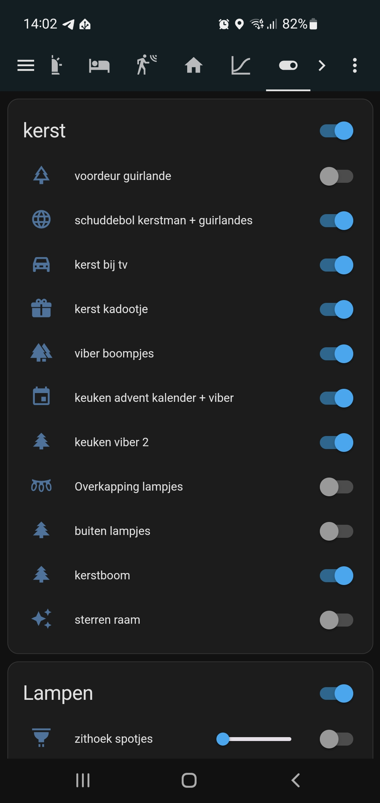

# Automate Christmas decorations

## Introduction

During the Christmas season, we have a lot of extra lights and other powered decorations in and around our house. 
**Christmas trees**, **battery powered decorations** and **outside lights** to cheer up the dark days.

It's a lot of work to control them manually every day. 
I've made my life easier by automating them all.
On this page, you can read how I did this to enjoy the Christmas season even more in a more relaxed way!

> **_NOTE:_** I used here Christmas as my example project, but these tips can be used for any kind of (battery/plug/outside) powered projects like Halloween automations.

---
## Table of Contents

<!-- TOC -->
  * [Advantages](#advantages)
  * [My old situation](#my-old-situation)
  * [My solutions](#my-solutions)
    * [Battery powered decorations](#battery-powered-decorations)
    * [Christmas tree lights string](#christmas-tree-lights-string)
    * [Lights with a power plug](#lights-with-a-power-plug)
    * [Outdoor lights](#outdoor-lights)
  * [Other solutions](#other-solutions)
<!-- TOC -->

---
## Advantages

There are a lot of advantages to automate all the lights and electric decorations. 
It's not only about turning them on and off.
It's more than you can think of, like:
* Don't start every day turning on all the (battery powered) decorations one-by-one manually and at the end of the day turning them off again;
    * _No use of batteries, no useless power usage, more time for other things, more comfort_
    * _Only downside: No morning gymnastics to switch all the buttons in each corner_
* Come downstairs, and all the cozy lights are (just) on;
    * _More joy, quicker to the coffee!_
* Outside lights only on when it becomes dark;
    * _On a sunny day it doesn't make sense to put also all outside lights on_
* Activate something (like playing Christmas music, or a dancing Santa) when someone shows up at your doorstep;
    * _A smile on their face_     
* No lights on when there is nobody around for a while;
    * _No useless power usage, which saves money_
* Spend more time in bed and sleep like a baby;
    * _More rest, more energy, less coffee_
* Fellow house members have no one to blame when the cozy lights are off because you were in a hurry to go to work;
    * _More harmonie, for a better Christmas spirit_
* Less energy consumption, no batteries that need to be replaced which saves money. You still need to buy once the hardware to automate it, but in the end it earns itself back very fast;
    * _Save money to spend on Christmas presents or extra [home automation hardware](/buy/smart_home_best_buy_tips)_
 
  
These advantages must be enough excuses to automate these decorations. I even convinced myself again!

---
## My old situation

Before I automated it, there were a lot of frustrations I had to deal with.

For example, my biggest **Christmas tree** lights have two light strings, and each has a power socket with a button which controls seven different flash modes. 
Each time you press the button, it switches from mode. 
And the normal required non-disco mode is the last mode! So I had to press every day that button seven times. 
And that for two strings of light. For only one tree.
Those sockets are also out of sight under the tree, so you need to dive under the tree to reach them.
And when you press one time too much, you can start all over again! Aargh!

We also have a lot of **battery powered** decorations.
I could use rechargeable batteries, but then I still have to turn all the decorations on and off manually every day to enjoy it.
As a result, during the season they are only a few times on. And if you forgot one, it ends up with empty batteries after Santa was singing and dancing all night long.

The **plug powered lights** are easy to automate. 
Plug them into a good old-fashioned timers, everybody had already automated it in the previous century like in Home Alone! Every day on exact the same time.

Two decades later, we can use "smarter" solutions. 
Like control them more dynamically based on the daylight level or motion and occupancy detection.

I, as a home automation geek, I was (previous year) looking for solutions and found them for all my decorations and lights! 
Read along how I did that.

---

## My solutions

As mentioned, I have multiple types of Christmas decorations.\
Which result in four power types to automate:

* [Battery powered decorations](#battery-powered-decorations), 15+ pieces
* [Christmas tree lights](#christmas-tree-lights-string) with a button to turn it on and change light mode to get to the right mode.
* [Decoration/lights powered with a power plug](#lights-with-a-outlet-plug)
* [Outdoor lights](#outdoor-lights)
 

In the next chapters I'll describe how I automated each type.

Now I also can control all my Christmas decorations from my phone.

---

### Battery powered decorations

There are multiple smart hardware device combinations possible to change battery powered decorations . Here are some examples.

#### Examples

An example of a battery powered light is a garland with lights above the door. 
Automated with a battery-to-usb set (a.k.a. battery eliminator/replacement), a smart usb adapter and a 5V-adapter. With the smart USB-adapter you can activate each port individually.

 &nbsp;

&nbsp;

 

Another example is a battery powered light in a bottle. I use for this a battery-to-plug set and a smart socket.

&nbsp;

 

If you have multiple battery power devices close to each other, and you want to automate them the same way, you can use an active powered USB-hub.
This hub can be powered with a smart socket to control all the connected devices at once.

&nbsp;

#### Hardware suggestions

As you could read, there are multiple combinations possible.

* [Battery to USB / battery eliminator](../buy/smart_home_best_buy_tips#battery-eliminators)
   
   

* [5V EU USB power adapter](../buy/smart_home_best_buy_tips#power)

    

* [EU Smart power socket. I use the Zigbee BlitzWolf EU SHP-15](../buy/smart_home_best_buy_tips#smart-socket)

    

* [Active USB hub](../buy/esphome_diy#usb-hub)

    

* [USB adapter](../buy/smart_home_best_buy_tips#usb-adapter-switch)

    

    This actuator can toggle the power state of each USB port individual.

    {{imgBasket}}<a href="../buy/smart_home_best_buy_tips#usb-adapter-switch" target="_blank">Zigbee USB adapter switch - Tuya (AliExpress)</a>

---

### Christmas tree lights

A two-pin EU outlet plug WITHOUT any button to select a mode, it's just always on, for a Christmas light string with the specs 31V and 3.6W.

{{imgBasket}}<a href="https://s.click.aliexpress.com/e/_mstDarg" target="_blank">link 1</a>

---

### Decoration/lights powered with a power plug

* [Smart power socket. I use the Zigbee BlitzWolf EU SHP-15](../buy/smart_home_best_buy_tips#smart-socket)

  

---

### Outdoor lights

For outdoor wall sockets, there are also water-resistant Zigbee smart sockets.

 

* Nous outdoor Zigbee EU power socket has two ports, where each socket can be controlled individual and has power consumption measurements.
 
  {{imgBasket}}<a href="https://www.amazon.de/dp/B0CN8FDSKP" target="_blank">Zigbee dual port power outdoor socket with power measurement - Nous (Amazon.de)

  </a>

* Silvercrest has an outdoor Zigbee EU power socket without power consumption measurements.

  {{imgBasket}}<a href="https://www.amazon.de/dp/B0BG8HSPTJ" target="_blank">Zigbee outdoor socket - Silvercrest SWSA (Amazon.de)

  </a>

---

## Other solutions

Do you have other solutions to automate your Christmas decorations? 
Please let me know!

---

Links to other sections of this blog site.

[Main page](../index) | [Other projects](index) | [Home Assistant](../homeassistant/index) | [ESPHome](../esphome/index) | [Node-RED](../node-red/index)