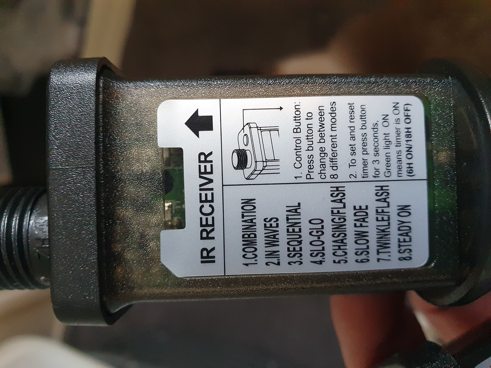

# Automate Christmas decorations

## Introduction

During the Christmas season, we have a lot of extra lights around the house. Like Christmas trees, battery powered decorations and outside lights to cheer up the dark days.

 

As an automation geek, Last year I was looking for solutions to automate all these extra season lights. 
Not start the day by turning on all the lights manually and end the day with turning them off again manually. 
And when there is no one around for a while, why should the lights be on? 
A waste of energy!

We also have a lot of **battery powered** decorations. I could use rechargeable batteries, but then I still have to turn them all the decorations on and off manually every day to enjoy it. This could be done better in an automated way!

My **Christmas tree** lights have a power socket with a button and with seven different modes. Each time you press the button, it switches from mode. 
And the normal required non-disco mode is the last mode! So I had to press every day that button seven times. 
And that for two strings of light. 
When you press one time too much, you can start all over again! Aargh!

The **plug powered lights** are easy to automate. 
Plug them into a good old fashioned timer like everybody had already in Home Alone in the previous century!

Two decades later, we can use "smarter" solutions. 
Like control them more dynamically based on the daylight level or motion detection.

There should be a better ways to automate all these lights!\
Yes, there are! 
On this page you can read how I achieved this.

Enjoy the Christmas season even more by automate it all!

 

---
## Table of Contents
<!-- TOC -->
  * [My types of Christmas decoration power](#my-types-of-christmas-decoration-power)
    * [Battery powered decorations](#battery-powered-decorations)
    * [Christmas tree lights plug and a button](#christmas-tree-lights-plug-and-a-button)
    * [Lights with a outlet plug](#lights-with-a-outlet-plug)
    * [Outdoor lights](#outdoor-lights)
<!-- TOC -->

---

## My types of Christmas decoration power

As described in the introduction, I have multiple types of Christmas decorations.
These results in four power types to automate:

* [Battery powered decorations](#battery-powered-decorations), 15+ pieces\
 

* [Christmas tree lights](#christmas-tree-lights-string) with a button to turn it on and change light mode to get to the right mode\
  

* [Decoration lights powered with a 230V plug](#lights-with-a-outlet-plug)\

* [Outdoor lights](#outdoor-lights)\
  

In the next chapters I'll describe how I automated these types of decorations.

---

### Battery powered decorations

#### Approach

If you have multiple battery power devices close together, and you want to automate them the same you can also use an active powered USB-hub.
You can power this hub with a wall plug and use a smart socket to control all the connected devices.

#### Hardware Requirements

* [Battery to USB / battery eliminator](../buy/smart_home_best_buy_tips#battery-eliminators)

* [5V USB power adapter](../buy/smart_home_best_buy_tips#power)

* [Smart power socket. I use the Zigbee BlitzWolf SHP-15](../buy/smart_home_best_buy_tips#smart-socket)

* [Active USB hub](../buy/esphome_diy#usb-hu)

This actuator can toggle the power state of each USB port individual.

{{imgBasket}}<a href="../buy/esphome_diy#usb-adapter-switch" target="_blank">Zigbee USB adapter switch - Tuya (AliExpress)</a>

---

### Christmas tree lights string

A two-pin adapter WITHOUT any button to select a mode, it's just always on, for a Christmas light string with the specs 31V and 3.6W.

{{imgBasket}}<a href="https://s.click.aliexpress.com/e/_mstDarg" target="_blank">link 1</a>

---

### Lights with a power plug

* [Smart power socket. I use the Zigbee BlitzWolf SHP-15](../buy/smart_home_best_buy_tips#smart-socket)

---

### Outdoor lights

This outdoor Zigbee power socket, where each socket can be controlled individual and has power consumption measurements.

{{imgBasket}}<a href="https://www.amazon.de/dp/B0CN8FDSKP" target="_blank">Zigbee dual port power socket with power measurement - Nous (Amazon.de)</a>

---

Links to other sections of this blog site.

[Main page](../index) | [Other projects](index) | [Home Assistant](../homeassistant/index) | [ESPHome](../esphome/index) | [Node RED](../node-red/index)