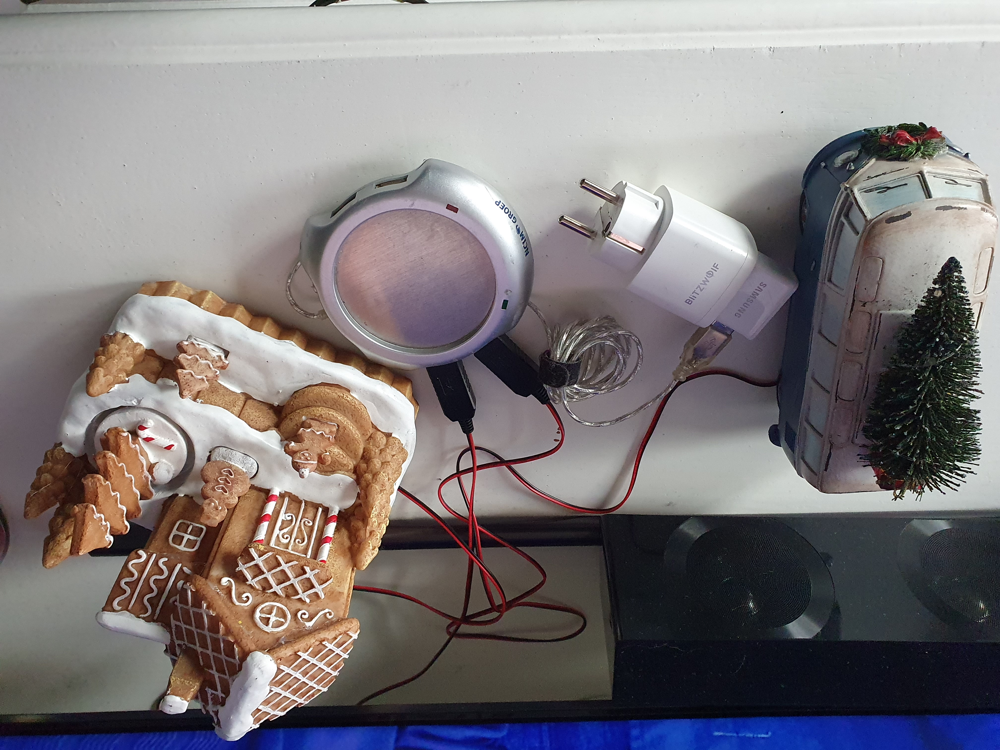
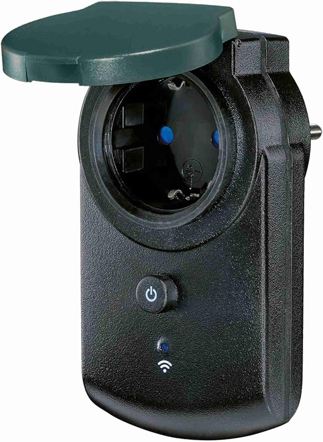

# Automate Christmas decorations

## Introduction

During the Christmas season, we have a lot of extra lights and powered decorations in and around our house. 
**Christmas trees**, **battery powered decorations** and **outside lights** to cheer up the dark days.

A lot of work to control them manually, but we don't go that way. Let's automate it.

On this blog page, you can read how I automate all of it to enjoy the Christmas season even more!

---
## Table of Contents
<!-- TOC -->
  * [Advantages](#advantages)
  * [My old situation](#my-old-situation)
  * [My solutions](#my-solutions)
    * [Battery powered decorations](#battery-powered-decorations)
    * [Christmas tree lights string](#christmas-tree-lights-string)
    * [Lights with a power plug](#lights-with-a-power-plug)
    * [Outdoor lights](#outdoor-lights)
  * [Other solutions](#other-solutions)
<!-- TOC -->

---
## Advantages

There are a lot of advantages to automate all the lights and electric decorations. More than you can think of, like:
* Don't start every day turning on all the (battery powered) decorations one-by-one manually and at the end of the day turning them off again;
    * _No use of batteries, no useless power usage, more time for other things, more comfort._
    * _Only downside: No morning gymnastics to switch all the buttons in each corner._
* Come downstairs, and all the cozy lights are (just) on;
    * _More joy, quicker to the coffee!_
* Outside lights only on when it becomes dark;
    * _On a sunny day it doesn't make sense to put also all outside lights on_
* No light on when there is nobody around for a while;
    * _No useless power usage_
* Spend more time in bed and sleep like a baby;
    * _More rest, more energy, less coffee_
* Fellow house members have no one to blame when it's complete dark because you were in a hurry to go to work;
    * _More harmonie, for a better Christmas spirit_
* Save money. You still need to buy once the stuff to automate it, but in the end it earns itself back very fast;
    * _Less energy consumption, no batteries that need to be replaced every few days._

These advantages must be enough excuses to buy even more home automation hardware. I convinced even myself!

---
## My old situation

My big **Christmas tree** lights have two light strings, and each has a power socket with a button on it and which controls seven different modes. 
Each time you press the button, it switches from mode. 
And the normal required non-disco mode is the last mode! So I had to press every day that button seven times. 
And that for two strings of light. 
When you press one time too much, you can start all over again! Aargh!

We also have a lot of **battery powered** decorations.
I could use rechargeable batteries, but then I still have to turn all the decorations on and off manually every day to enjoy it.
Now we only put them on only a few times during the season. And sometimes we forgot one which ends up with empty battery after Santa was dancing rounds all night long.

The **plug powered lights** are easy to automate. 
Plug them into a good old-fashioned timer like everybody had already in the previous century like in Home Alone!
Totally nothing wrong with the 90s!

Two decades later, we can use "smarter" solutions. 
Like control them more dynamically based on the daylight level or motion and occupancy detection.
I, as an automation geek, I was (previous years) looking for such solutions and found them!

---

## My solutions

As described in the introduction, I have multiple types of Christmas decorations.\
Which result in four power types to automate:

* [Battery powered decorations](#battery-powered-decorations), 15+ pieces
* [Christmas tree lights](#christmas-tree-lights-string) with a button to turn it on and change light mode to get to the right mode.
* [Decoration lights powered with a 230V plug](#lights-with-a-outlet-plug)
* [Outdoor lights](#outdoor-lights)
 

In the next chapters I'll describe how I automated each type of decoration.

---

### Battery powered decorations

Example of a battery powered light string above the door. 
Automated with a battery-to-usb set and a smart plug.

#### Approach

If you have multiple battery power devices close to each other, and you want to automate them the same way, you can also use an active powered USB-hub.
You can power this hub with a wall plug and use a smart socket to control all the connected devices.
 
 &nbsp;

 

#### Hardware Requirements

* [Battery to USB / battery eliminator](../buy/smart_home_best_buy_tips#battery-eliminators)

* [5V EU USB power adapter](../buy/smart_home_best_buy_tips#power)

* [EU Smart power socket. I use the Zigbee BlitzWolf EU SHP-15](../buy/smart_home_best_buy_tips#smart-socket)

* [Active USB hub](../buy/esphome_diy#usb-hub)

This actuator can toggle the power state of each USB port individual.

{{imgBasket}}<a href="../buy/esphome_diy#usb-adapter-switch" target="_blank">Zigbee USB adapter switch - Tuya (AliExpress)</a>

---

### Christmas tree lights string

A two-pin EU outlet plug WITHOUT any button to select a mode, it's just always on, for a Christmas light string with the specs 31V and 3.6W.

{{imgBasket}}<a href="https://s.click.aliexpress.com/e/_mstDarg" target="_blank">link 1</a>

---

### Lights with a power plug

* [Smart power socket. I use the Zigbee BlitzWolf EU SHP-15](../buy/smart_home_best_buy_tips#smart-socket)

---

### Outdoor lights

For outdoor wall sockets, there are also water-resistant Zigbee smart sockets.

 

* Nous outdoor Zigbee EU power socket has two ports, where each socket can be controlled individual and has power consumption measurements.
 
  {{imgBasket}}<a href="https://www.amazon.de/dp/B0CN8FDSKP" target="_blank">Zigbee dual port power outdoor socket with power measurement - Nous (Amazon.de)

  </a>

* Silvercrest has an outdoor Zigbee EU power socket without power consumption measurements.

  {{imgBasket}}<a href="https://www.amazon.de/dp/B0BG8HSPTJ" target="_blank">Zigbee outdoor socket - Silvercrest SWSA (Amazon.de)

  </a>

---

## Other solutions

Do you have other solutions to automate your Christmas decorations? 
Please let me know!

---

Links to other sections of this blog site.

[Main page](../index) | [Other projects](index) | [Home Assistant](../homeassistant/index) | [ESPHome](../esphome/index) | [Node-RED](../node-red/index)