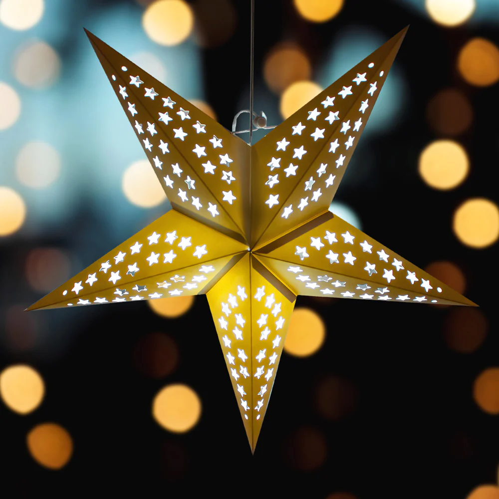

# Automate Christmas decorations


## Introduction

<a href="images_christmas_decorations/christmas_tree.jpg">
</a>

During the Christmas season, we have a lot of extra lights and other powered decorations in and around our house. 
**Christmas trees**, **battery powered decorations** and **outside lights** to cheer up the dark days.

It's a lot of work to control them manually every day. 
I've made my life easier by automating them all.
On this page, you can read how I did this to enjoy the Christmas season even more in a more relaxed way!

> **_NOTE:_** I used here Christmas as my example project, but these tips can be used for any kind of (battery/plug/outside) powered projects like Halloween automations.

---
## Table of Contents
<a href="images_christmas_decorations/door_deco_lights2.jpg">
</a>

<!-- TOC -->
  * [Advantages](#advantages)
  * [My old situation](#my-old-situation)
  * [My smart hardware solutions](#my-smart-hardware-solutions)
    * [Battery powered decorations](#battery-powered-decorations)
    * [Christmas tree lights](#christmas-tree-lights)
    * [Decoration/lights powered with a power plug](#decorationlights-powered-with-a-power-plug)
    * [Outdoor lights](#outdoor-lights)
  * [Upcoming projects](#upcoming-projects)
  * [Automations](#automations)
  * [Do you have other solutions?](#do-you-have-other-solutions)
<!-- TOC -->

---
## Advantages

<a href="images_christmas_decorations/ani_snow_globe.gif">
</a>

There are a lot of advantages to automate all the lights and electric decorations. 
It's not only about turning them on and off.
It's more than you can think of, like:
* Don't start every day turning on all the (battery powered) decorations one-by-one manually and at the end of the day turning them off again; [Node-RED automation](#activate-a-socket-on-motion-detection)
    * _No use of batteries, no useless power usage, more time for other things, more comfort_
    * _Only downside: No morning gymnastics to switch all the buttons in each corner_
* Come downstairs, and all the cozy lights are (just) on;
    * _More joy, quicker to the coffee!_
* Outside lights only on when it becomes dark;
    * _On a sunny day it doesn't make sense to put also all outside lights on_
* Activate something (like playing Christmas music, or a dancing Santa) when someone shows up at your doorstep;
    * _A smile on their face_     
* No lights on when there is nobody around for a while;
    * _No useless power usage, which saves money_
<a href="images_christmas_decorations/outside_tree_light.jpg">
</a>
* Spend more time in bed and sleep like a baby;
    * _More rest, more energy, less coffee_
* Fellow house members have no one to blame when the cozy lights are off because you were in a hurry to go to work;
    * _More harmonie, for a better Christmas spirit_
* Less energy consumption, no batteries that need to be replaced which saves money. You still need to buy once the hardware to automate it, but in the end it earns itself back very fast;
    * _Save money to spend on Christmas presents or extra [home automation hardware](/buy/smart_home_best_buy_tips)_
<br>
  
These advantages must be enough excuses to automate these decorations. I even convinced myself again!

---
## My old situation

<a href="images_christmas_decorations/tree_light_plug_button.jpg">
</a>

Before I automated it, there were a lot of frustrations I had to deal with.

For example, my biggest **Christmas tree** lights have two light strings, and each has a power socket with a button which controls seven different flash modes. 
Each time you press the button, it switches from mode. 
And the normal required non-disco mode is the last mode! So I had to press every day that button seven times. 
And that for two strings of light. For only one tree.
Those sockets are also out of sight under the tree, so you need to dive under the tree to reach them.
And when you press one time too much, you can start all over again! Aargh!

<a href="images_christmas_decorations/dummy_battery_example.jpg">
</a>

We also have a lot of **battery powered** decorations.
I could use rechargeable batteries, but then I still have to turn all the decorations on and off manually every day to enjoy it.
As a result, during the season they are only a few times on. And if you forgot one, it ends up with empty batteries after Santa was singing and dancing all night long.

The **plug powered lights** are easy to automate. 
Plug them into a good old-fashioned timers, everybody had already automated it in the previous century like in Home Alone! Every day on exact the same time.


Two decades later, we can use "smarter" solutions. 
Like control them more dynamically based on the daylight level or motion and occupancy detection.

I, as a home automation geek, I was (previous year) looking for solutions and found them for all my decorations and lights! 
Read along how I did that.

---

## My smart hardware solutions

As mentioned, I have multiple types of Christmas decorations.\
Which result in four power types to automate:

<a href="images_christmas_decorations/random_plugs.jpg">
</a>

* [Battery powered decorations](#battery-powered-decorations), 15+ pieces
* [Christmas tree lights](#christmas-tree-lights) with a button to turn it on and change light mode to get to the right mode.
* [Decoration/lights powered with a power plug](#decorationlights-powered-with-a-power-plug), 10+ pieces
* [Outdoor lights](#outdoor-lights)
<br>

In the next chapters I'll describe how I automated each type.

<a href="images_christmas_decorations/home_assistant_switches.jpg">
</a>

Now I also can control all my Christmas decorations from my phone.

---

### Battery powered decorations

There are multiple smart hardware device combinations possible to change battery powered decorations. 
Here are some examples.

#### Example 1: battery-to-USB + smart USB adapter + 5V-adapter

An example of a battery powered light is a garland with lights above the door. 
Automated with a battery-to-usb set (a.k.a. battery eliminator/replacement), a smart usb adapter and a 5V-adapter. With the smart USB-adapter you can activate each port individually.

<a href="../buy/smart_home_best_buy_tips#battery-eliminators" target="_blank">
</a>
 &nbsp;
<a href="../buy/smart_home_best_buy_tips#usb-adapter-switch" target="_blank">
</a>
&nbsp;
<a href="../buy/smart_home_best_buy_tips#power" target="_blank">
    
</a>
<br>


<a href="images_christmas_decorations/christmas_lights.jpg">
</a>

#### Example 2: battery-to-plug + smart socket

Another example is a battery powered light in a bottle. I use for this a battery-to-plug set and a smart socket.

<a href="../buy/smart_home_best_buy_tips#battery-eliminators" target="_blank">
</a>
&nbsp;
<a href="../buy/smart_home_best_buy_tips#usb-adapter-switch" target="_blank">
</a>
<br>

<a href="images_christmas_decorations/battery_powered_deco.jpg">
</a>

#### Example 3: battery-to-USB + USB hub + smart socket

If you have multiple battery power devices close to each other, and you want to automate them the same way, you can use an active powered USB-hub.
This hub can be powered with a smart socket to control all the connected devices at once.

<a href="images_christmas_decorations/usb_hub.jpg">

</a>
&nbsp;
<a href="../buy/smart_home_best_buy_tips#usb-adapter-switch" target="_blank">

</a>

<a href="images_christmas_decorations/battery_powered_decorations.jpg">

</a>

#### Hardware suggestions

As you could read, there are multiple combinations possible.

* [Battery to USB / battery eliminator](../buy/smart_home_best_buy_tips#battery-eliminators) They are available for AA and AAA batteries and with multiple "dummy" batteries.
   
   <a href="../buy/smart_home_best_buy_tips#battery-eliminators" target="_blank">
        
   </a>

* [5V EU USB power adapter](../buy/smart_home_best_buy_tips#power) to power the USB battery eliminators.

    <a href="../buy/smart_home_best_buy_tips#power" target="_blank">
        
    </a>

* [EU Smart power socket. I use the Zigbee BlitzWolf EU SHP-15](../buy/smart_home_best_buy_tips#smart-socket) or the correct socket for your country.

    <a href="../buy/smart_home_best_buy_tips#smart-socket" target="_blank">
        
    </a>

* [Active USB hub](../buy/esphome_diy#usb-hub) to power and control multiple battery eliminators at once.

    <a href="../buy/esphome_diy#usb-hub" target="_blank">
        
    </a>

* [USB adapter](../buy/smart_home_best_buy_tips#usb-adapter-switch) to control and power maximal 3 USB devices individual.

    <a href="../buy/smart_home_best_buy_tips#usb-adapter-switch" target="_blank">
    </a>

    This actuator can toggle the power state of each USB port individual. You can choose for an adapter with 1, 2 or 3 ports.

    {{imgBasket}}<a href="../buy/smart_home_best_buy_tips#usb-adapter-switch" target="_blank">Zigbee USB adapter switch - Tuya (AliExpress)</a>

---

### Christmas tree lights

My Christmas tree have a specific EU outlet plug with the output of 31V and 3.6W. But when I was looking at AliExpress I found this exact same plug but without a power button and without switching the disco modes, just always on.
If you have also a plug with a button you can always try to find a similar plug without a button.
Or if your familiar with soldering and electronics you can modify the current button and make it always on, but only advised for Professionals!!

<a href="https://s.click.aliexpress.com/e/_mstDarg" target="_blank">
</a>

{{imgBasket}}<a href="https://s.click.aliexpress.com/e/_mstDarg" target="_blank">link 1</a>

---

### Decoration/lights powered with a power plug

* [Smart power socket. I use the Zigbee BlitzWolf EU SHP-15](../buy/smart_home_best_buy_tips#smart-socket) or look for a smart socket that fits your country.

  <a href="../buy/smart_home_best_buy_tips#smart-socket" target="_blank">
    
    </a>

---

### Outdoor lights

I have in my garden several waterproof power sockets. Here I use outdoor water-resistant Zigbee power sockets to automate the outdoor decorations and lights.\
In the front yard I put the light string wire through the mailbox to plug it inside.

<a href="images_christmas_decorations/outside_tree_light.jpg">
</a>
&nbsp;
<a href="images_christmas_decorations/front_door_light.jpg">
</a>

<br>
The number of these socket models are limited. 
If you have a suggestion for a Zigbee outdoor socket, please let me know!

* Nous outdoor Zigbee EU power socket has two ports, where each socket can be controlled individual and has power consumption measurements.
 
  {{imgBasket}}<a href="https://www.amazon.de/dp/B0CN8FDSKP" target="_blank">Zigbee dual port power outdoor socket with power measurement - Nous (Amazon.de)

  </a>

* Silvercrest has an outdoor Zigbee EU power socket without power consumption measurements.

  {{imgBasket}}<a href="https://www.amazon.de/dp/B0BG8HSPTJ" target="_blank">Zigbee outdoor socket - Silvercrest SWSA (Amazon.de)\
  {{imgBasket}}I bought mine at the local Lidl store, but they are not always available there (also not online), only once in a while.

  </a>

---

## Upcoming projects

For this year I have an additional project I will work on. 
Here are already the specs of this project.
I will use wireless lights, with different colors and brightness and controlled by a remote.
I want to put the lights in a paper star and use a Zigbee IR remote control to replace the original remote so this can be automated.

  

* {{imgBasket}}<a href="https://s.click.aliexpress.com/e/_EIwZk97" target="_blank">LED lights, with different colors and brightness, controlled by a remote</a>

  <a href="https://s.click.aliexpress.com/e/_EIwZk97" target="_blank">
    
  </a>

* An infrared remote control. 
  It can learn signals from a remote, and via Zigbee you can resend it via this device again. \
 {{imgBasket}}<a href="/buy/smart_home_best_buy_tips#infrared-remote-control" target="_blank">IR remote control - Moes</a>

  <a href="/buy/smart_home_best_buy_tips#infrared-remote-control" target="_blank">
    
  </a>

More details about this project will follow after I realized it!

---

## Automations

I use Node-RED myself to control all the decoration and light automations.\
If you have such automations in Home Assistant I can add those here also if you share them.

### Activate a light on motion detection

```yaml

[{"id":"e4c9ffe6e9ebc89e","type":"mqtt in","z":"fc546c6ffaa0d24f","name":"","topic":"zigbee2mqtt/motion1","qos":"0","datatype":"json","broker":"7527d055.ed7e2","nl":false,"rap":false,"inputs":0,"x":130,"y":40,"wires":[["283a54355d600404"]]},{"id":"7527d055.ed7e2","type":"mqtt-broker","name":"","broker":"mosquitto","port":"1883","tls":"bbaa4676.58e4c8","clientid":"node-red-client","autoConnect":true,"usetls":false,"protocolVersion":"5","keepalive":"60","cleansession":false,"autoUnsubscribe":true,"birthTopic":"","birthQos":"0","birthPayload":"","birthMsg":{},"closeTopic":"","closePayload":"","closeMsg":{},"willTopic":"","willQos":"0","willPayload":"","willMsg":{},"userProps":"","sessionExpiry":""},{"id":"bbaa4676.58e4c8","type":"tls-config","name":"","cert":"","key":"","ca":"","certname":"m2mqtt_srv.crt","keyname":"m2mqtt_srv.key","caname":"m2mqtt_ca.crt","servername":"","verifyservercert":false}]

```

#### Disable a socket after a period of inactivity

```yaml

[{"id":"fc546c6ffaa0d24f","type":"tab","label":"Flow 3","disabled":false,"info":"","env":[]},{"id":"95857193e1d3014e","type":"mqtt out","z":"fc546c6ffaa0d24f","name":"plug1","topic":"zigbee2mqtt/plug1/set","qos":"0","retain":"false","respTopic":"","contentType":"","userProps":"","correl":"","expiry":"","broker":"7527d055.ed7e2","x":1110,"y":94,"wires":[]},{"id":"283a54355d600404","type":"switch","z":"fc546c6ffaa0d24f","name":"occupancy = true","property":"payload.occupancy","propertyType":"msg","rules":[{"t":"true"},{"t":"else"}],"checkall":"true","repair":false,"outputs":2,"x":350,"y":100,"wires":[["4bd8838f5b3148e6","9234488c505f1034"],["f02e50b55cb46eaa"]]},{"id":"e4c9ffe6e9ebc89e","type":"mqtt in","z":"fc546c6ffaa0d24f","name":"","topic":"zigbee2mqtt/motion1","qos":"0","datatype":"json","broker":"7527d055.ed7e2","nl":false,"rap":false,"inputs":0,"x":130,"y":100,"wires":[["283a54355d600404"]]},{"id":"32d13518d26f4f38","type":"template","z":"fc546c6ffaa0d24f","name":"OFF","field":"payload","fieldType":"msg","format":"handlebars","syntax":"mustache","template":"OFF","output":"str","x":770,"y":134,"wires":[["1b0aafefe85d17b3"]]},{"id":"1b0aafefe85d17b3","type":"rbe","z":"fc546c6ffaa0d24f","name":"","func":"rbe","gap":"","start":"","inout":"out","septopics":true,"property":"payload","x":970,"y":94,"wires":[["95857193e1d3014e"]]},{"id":"4bd8838f5b3148e6","type":"template","z":"fc546c6ffaa0d24f","name":"ON","field":"payload","fieldType":"msg","format":"handlebars","syntax":"mustache","template":"ON","output":"str","x":770,"y":94,"wires":[["1b0aafefe85d17b3"]]},{"id":"f02e50b55cb46eaa","type":"delay","z":"fc546c6ffaa0d24f","name":"","pauseType":"delay","timeout":"30","timeoutUnits":"seconds","rate":"1","nbRateUnits":"1","rateUnits":"second","randomFirst":"1","randomLast":"5","randomUnits":"seconds","drop":false,"allowrate":false,"outputs":1,"x":640,"y":134,"wires":[["32d13518d26f4f38"]]},{"id":"9234488c505f1034","type":"change","z":"fc546c6ffaa0d24f","name":"reset","rules":[{"t":"set","p":"reset","pt":"msg","to":"1","tot":"num"}],"action":"","property":"","from":"","to":"","reg":false,"x":510,"y":60,"wires":[["f02e50b55cb46eaa"]]},{"id":"17481e8d3a375fed","type":"comment","z":"fc546c6ffaa0d24f","name":"vdbrink.github.io","info":"","x":120,"y":40,"wires":[]},{"id":"7527d055.ed7e2","type":"mqtt-broker","name":"","broker":"mosquitto","port":"1883","tls":"bbaa4676.58e4c8","clientid":"node-red-client","autoConnect":true,"usetls":false,"protocolVersion":"5","keepalive":"60","cleansession":false,"autoUnsubscribe":true,"birthTopic":"","birthQos":"0","birthPayload":"","birthMsg":{},"closeTopic":"","closePayload":"","closeMsg":{},"willTopic":"","willQos":"0","willPayload":"","willMsg":{},"userProps":"","sessionExpiry":""},{"id":"bbaa4676.58e4c8","type":"tls-config","name":"","cert":"","key":"","ca":"","certname":"m2mqtt_srv.crt","keyname":"m2mqtt_srv.key","caname":"m2mqtt_ca.crt","servername":"","verifyservercert":false}]

```

### Activate a socket based on outside lux

```yaml

[{"id":"fc546c6ffaa0d24f","type":"tab","label":"Flow 3","disabled":false,"info":"","env":[]},{"id":"95857193e1d3014e","type":"mqtt out","z":"fc546c6ffaa0d24f","name":"plug1","topic":"zigbee2mqtt/plug1/set","qos":"0","retain":"false","respTopic":"","contentType":"","userProps":"","correl":"","expiry":"","broker":"7527d055.ed7e2","x":890,"y":100,"wires":[]},{"id":"17481e8d3a375fed","type":"comment","z":"fc546c6ffaa0d24f","name":"vdbrink.github.io","info":"","x":120,"y":40,"wires":[]},{"id":"4887e36795501543","type":"mqtt in","z":"fc546c6ffaa0d24f","name":"","topic":"zigbee2mqtt/lux1","qos":"0","datatype":"json","broker":"7527d055.ed7e2","nl":false,"rap":false,"inputs":0,"x":120,"y":100,"wires":[["7e9d2015c86738a5"]]},{"id":"c3cfddf246fe13bb","type":"template","z":"fc546c6ffaa0d24f","name":"ON","field":"payload","fieldType":"msg","format":"handlebars","syntax":"mustache","template":"ON","output":"str","x":610,"y":80,"wires":[["e51d8f56add45b05"]]},{"id":"abd3f54563749818","type":"template","z":"fc546c6ffaa0d24f","name":"OFF","field":"payload","fieldType":"msg","format":"handlebars","syntax":"mustache","template":"OFF","output":"str","x":610,"y":120,"wires":[["e51d8f56add45b05"]]},{"id":"e51d8f56add45b05","type":"rbe","z":"fc546c6ffaa0d24f","name":"","func":"rbe","gap":"","start":"","inout":"out","septopics":true,"property":"payload","topi":"topic","x":750,"y":100,"wires":[["95857193e1d3014e","7f32ace694a0666d"]]},{"id":"afcd6d623fd01433","type":"falling-edge","z":"fc546c6ffaa0d24f","name":"160","threshold":"160","x":490,"y":80,"wires":[["c3cfddf246fe13bb"]]},{"id":"dde843e60d0762fe","type":"rising-edge","z":"fc546c6ffaa0d24f","name":"1000","threshold":"1000","x":490,"y":120,"wires":[["abd3f54563749818"]]},{"id":"7e9d2015c86738a5","type":"change","z":"fc546c6ffaa0d24f","name":"","rules":[{"t":"set","p":"payload","pt":"msg","to":"payload.illuminance_lux","tot":"msg"}],"action":"","property":"","from":"","to":"","reg":false,"x":320,"y":100,"wires":[["afcd6d623fd01433","dde843e60d0762fe"]]},{"id":"fe23de1883877205","type":"inject","z":"fc546c6ffaa0d24f","name":"800","props":[{"p":"payload"},{"p":"topic","vt":"str"}],"repeat":"","crontab":"","once":false,"onceDelay":0.1,"topic":"","payload":"{ \"illuminance_lux\": 800}","payloadType":"json","x":110,"y":200,"wires":[["7e9d2015c86738a5"]]},{"id":"7f32ace694a0666d","type":"debug","z":"fc546c6ffaa0d24f","name":"debug 105","active":true,"tosidebar":true,"console":false,"tostatus":false,"complete":"false","statusVal":"","statusType":"auto","x":910,"y":60,"wires":[]},{"id":"30de2de1673e6490","type":"inject","z":"fc546c6ffaa0d24f","name":"100","props":[{"p":"payload"},{"p":"topic","vt":"str"}],"repeat":"","crontab":"","once":false,"onceDelay":0.1,"topic":"","payload":"{ \"illuminance_lux\": 100}","payloadType":"json","x":110,"y":240,"wires":[["7e9d2015c86738a5"]]},{"id":"a995a4bfd8f4d4e7","type":"inject","z":"fc546c6ffaa0d24f","name":"1001","props":[{"p":"payload"},{"p":"topic","vt":"str"}],"repeat":"","crontab":"","once":false,"onceDelay":0.1,"topic":"","payload":"{ \"illuminance_lux\": 1001}","payloadType":"json","x":110,"y":160,"wires":[["7e9d2015c86738a5"]]},{"id":"7527d055.ed7e2","type":"mqtt-broker","name":"","broker":"mosquitto","port":"1883","tls":"bbaa4676.58e4c8","clientid":"node-red-client","autoConnect":true,"usetls":false,"protocolVersion":"5","keepalive":"60","cleansession":false,"autoUnsubscribe":true,"birthTopic":"","birthQos":"0","birthPayload":"","birthMsg":{},"closeTopic":"","closePayload":"","closeMsg":{},"willTopic":"","willQos":"0","willPayload":"","willMsg":{},"userProps":"","sessionExpiry":""},{"id":"bbaa4676.58e4c8","type":"tls-config","name":"","cert":"","key":"","ca":"","certname":"m2mqtt_srv.crt","keyname":"m2mqtt_srv.key","caname":"m2mqtt_ca.crt","servername":"","verifyservercert":false}]

```

### Activate a socket based on someone entering the house

```yaml

[{"id":"fc546c6ffaa0d24f","type":"tab","label":"Flow 3","disabled":false,"info":"","env":[]},{"id":"95857193e1d3014e","type":"mqtt out","z":"fc546c6ffaa0d24f","name":"plug1","topic":"zigbee2mqtt/plug1/set","qos":"0","retain":"false","respTopic":"","contentType":"","userProps":"","correl":"","expiry":"","broker":"7527d055.ed7e2","x":730,"y":80,"wires":[]},{"id":"17481e8d3a375fed","type":"comment","z":"fc546c6ffaa0d24f","name":"vdbrink.github.io","info":"","x":120,"y":40,"wires":[]},{"id":"e51d8f56add45b05","type":"rbe","z":"fc546c6ffaa0d24f","name":"","func":"rbe","gap":"","start":"","inout":"out","septopics":true,"property":"payload","topi":"topic","x":590,"y":80,"wires":[["95857193e1d3014e"]]},{"id":"7aeac0d65eb31c24","type":"mqtt in","z":"fc546c6ffaa0d24f","name":"","topic":"frigate/camera_1/person/snapshot","qos":"2","datatype":"buffer","broker":"7527d055.ed7e2","nl":false,"rap":false,"rh":"2","inputs":0,"x":180,"y":80,"wires":[["3738a583e0135c76"]]},{"id":"3738a583e0135c76","type":"trigger","z":"fc546c6ffaa0d24f","name":"","op1":"ON","op2":"OFF","op1type":"str","op2type":"str","duration":"3","extend":true,"overrideDelay":false,"units":"min","reset":"","bytopic":"all","topic":"topic","outputs":1,"x":430,"y":80,"wires":[["e51d8f56add45b05"]]},{"id":"7527d055.ed7e2","type":"mqtt-broker","name":"","broker":"mosquitto","port":"1883","tls":"bbaa4676.58e4c8","clientid":"node-red-client","autoConnect":true,"usetls":false,"protocolVersion":"5","keepalive":"60","cleansession":false,"autoUnsubscribe":true,"birthTopic":"","birthQos":"0","birthPayload":"","birthMsg":{},"closeTopic":"","closePayload":"","closeMsg":{},"willTopic":"","willQos":"0","willPayload":"","willMsg":{},"userProps":"","sessionExpiry":""},{"id":"bbaa4676.58e4c8","type":"tls-config","name":"","cert":"","key":"","ca":"","certname":"m2mqtt_srv.crt","keyname":"m2mqtt_srv.key","caname":"m2mqtt_ca.crt","servername":"","verifyservercert":false}]

```
---

## Do you have other solutions?

Do you have other solutions or idea's to automate your Christmas decorations? 
Please let me know!

---

I hope you enjoyed reading this blog post and found it useful!
If you have any questions or comments, please post them below my social media posts, in the comment section.

---

Links to other sections of this blog site.

[Main page](../index) | [Other projects](index) | [Home Assistant](../homeassistant/index) | [ESPHome](../esphome/index) | [Node-RED](../node-red/index)