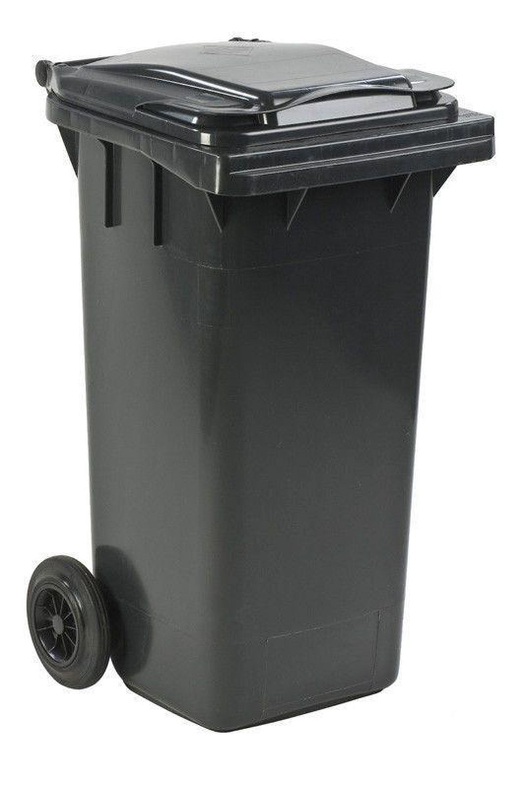
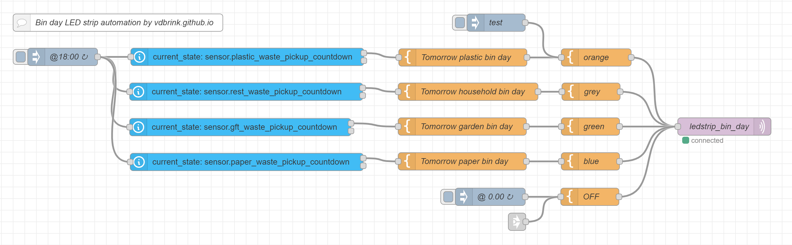

# Bin day - LED strip reminder



I was looking for a way to reminder me about the waste collection schedule.
We have four trash bins and every bin has different recurring schedules. With bank holidays it also changes to another day. 
A single notification was not enough, it can easily be swiped away. So I was looking for another nice subtle automation.

I came up with a RBG LED strip under my French antique dresser which indicates which trash bin must be put outside.


An animation with the four different bin type colors.

---

## Table of Contents
<!-- TOC -->
* [Hardware requirements](#hardware-requirements)
* [Software requirements](#software-requirements)
* [Installation](#installation)
  * [Waste collection schedule](#waste-collection-schedule)
  * [Node-RED flow to turn the LED strip on, on bin day](#node-red-flow-to-turn-the-led-strip-on-on-bin-day)
    * [RGB LED strip colors](#rgb-led-strip-colors)
  * [FAQ](#faq)
<!-- TOC -->

---

## Hardware requirements

I have already a running home server with a Zigbee network, that's why I choose for a Zigbee LED strip. This will also
work for a Wifi/bluetooth/other network type, but then the control will also be different.

Affiliate links are used here. Same price, and you sponsor this blog.

[Zigbee RGB 5m LED strip](https://s.click.aliexpress.com/e/_ookcWte) it's available in different versions:
  * Indoor no waterproof (IP20) / Outdoor waterproof (IP65)
  * 5 / 10 meter
  * RGB White or RGB Warm White

    <a href="https://s.click.aliexpress.com/e/_ookcWte" target="_blank">
    </a>

It's also possible to use an E27 bulb lamp to create the same light effects.\
[Zigbee dimmable colored LED E27 bulb](https://s.click.aliexpress.com/e/_oFxRuUw)
  * 15/18 Watt version

    <a href="https://s.click.aliexpress.com/e/_oFxRuUw" target="_blank">
    </a>

---

## Software requirements

* Home Assistant
  * HACS [Afvalbeheer](../homeassistant/homeassistant_hacs_afvalbeheer) integration or other bin day schedule which applies for your city.
  * Add the [custom days countdown helper entities](../homeassistant/homeassistant_hacs_afvalbeheer#custom-helper-entities-days-count-down)
  * LED strip entity
* Node-RED (for the automations)
  * Add and setup the Home Assistant integration in Node-RED [node-red-contrib-home-assistant-websocket](../node-red/node-red_home-assistant#initial-setup)
  * Load the [Node-RED script](#node-red-script) from this page.
    * Choose to use the HA entity (or Zigbee2MQTT) node, enable the correct one.
    * [Optional] Add to the flow to send a notification (to a phone and/or speaker).
    * [Optional] Add a condition to the flow to turn the light off.

---

## Installation

### Waste collection schedule

I live in The Netherlands and we have a HACS integration called Afvalbeheer.\
This integration downloads the waste collection schedule from most of the collection companies, in the Netherlands, and
generates entities in Home Assistant with the next pick-up date for each type of bin.

I created a [separated blog post page](../homeassistant/homeassistant_hacs_afvalbeheer) about this integration and how I
implemented it. Also with extra missing functionality for me, I have the number of days and sorted by the pickup date with the help of custom countdown helper entities.

---

### Node-RED flow to turn the LED strip on, on bin day

I use for all my automations Node-RED. Here used with the [Home Assistant integration](../node-red/node-red_home-assistant) to read and control the Home Assistant LED-strip entity.

> **_NOTE:_** If you share the Home Assistant equivalent code with me, I can add it also here.

This is my Node-RED flow which you can use.\
I normally control my Zigbee devices via Zigbee2MQTT myself, but disabled this node in this example and use the HA nodes. 
I also added the same Home Assistant light entity `ledstrip_bin_day` here. Choose which way of integration you want to use, and set the correct entity name, both methods will work.

As addition, I added an inject-node where you can click on to test if the lights goes on.

Another addition is the node to send the text also to your phone. Check [here](../node-red/node-red_home-assistant_notifications) how to send this message to you Home Assistant companion app.

At the bottom, there is an inject-node which get triggered at 0:00 to disable the light again.
There is also a link-node with the value `ledstrip_bin_day trigger off`. You can trigger this when you have another trigger to turn off the light. In my case: \
WHEN the light is on AND the garden gate is opened THEN this LED strip light goes off again. (This is not in this Node-RED example added.)\
Everybody has his own off-condition, you can also turn if off with a light toggle on your dashboard.
For example, in my case when the garden gate is opened, after a specific time, in the evening to put the bin outside the lights turn off again. In case I skip one time I set it off via my dashboard.

<a href="images_bin_day/bin_day_node_red_flow.png">

</a>

<a name="node-red-script"></a>

```yaml

[{"id":"fc4e52ba0fd37927","type":"tab","label":"Bin day","disabled":false,"info":"","env":[]},{"id":"9ab30526aa1b3a0b","type":"junction","z":"fc4e52ba0fd37927","x":1213,"y":236,"wires":[["a631b9d84c3fc7e5","37ef856290750e57"]]},{"id":"1f9950b8b250926b","type":"junction","z":"fc4e52ba0fd37927","x":1022,"y":56,"wires":[["b342dd131ef54b1b"]]},{"id":"e3786b816eed4c0a","type":"comment","z":"fc4e52ba0fd37927","name":"Bin day LED strip automation by vdbrink.github.io","info":"","x":220,"y":57,"wires":[]},{"id":"31dd9a158d5fd251","type":"template","z":"fc4e52ba0fd37927","name":"Tomorrow plastic bin day","field":"payload","fieldType":"msg","format":"handlebars","syntax":"mustache","template":"Tomorrow plastic bin day","output":"str","x":812,"y":117,"wires":[["5c13a68ef2a01034","1f9950b8b250926b"]]},{"id":"4c2db0f9d2a8d3c5","type":"inject","z":"fc4e52ba0fd37927","name":"@18:00","props":[{"p":"payload"},{"p":"topic","vt":"str"}],"repeat":"","crontab":"00 18 * * *","once":false,"onceDelay":0.1,"topic":"","payload":"","payloadType":"date","x":125,"y":116,"wires":[["8d61c5da0ffd8ba0","c467b33c0e9eccb3","ee2e5b086d92bb03","c9dcedb72852fd42"]]},{"id":"8d61c5da0ffd8ba0","type":"api-current-state","z":"fc4e52ba0fd37927","name":"","server":"969e9e50.88897","version":3,"outputs":2,"halt_if":"2","halt_if_type":"num","halt_if_compare":"lt","entity_id":"sensor.rest_waste_pickup_countdown","state_type":"str","blockInputOverrides":false,"outputProperties":[{"property":"payload","propertyType":"msg","value":"","valueType":"entityState"},{"property":"data","propertyType":"msg","value":"","valueType":"entity"}],"for":"0","forType":"num","forUnits":"minutes","override_topic":false,"state_location":"payload","override_payload":"msg","entity_location":"data","override_data":"msg","x":440,"y":176,"wires":[["2fb90f2d8e97561a"],[]]},{"id":"2fb90f2d8e97561a","type":"template","z":"fc4e52ba0fd37927","name":"Tomorrow household bin day","field":"payload","fieldType":"msg","format":"handlebars","syntax":"mustache","template":"Tomorrow household bin day","output":"str","x":821,"y":176,"wires":[["a64dc81fde8e9413","1f9950b8b250926b"]]},{"id":"ee2e5b086d92bb03","type":"api-current-state","z":"fc4e52ba0fd37927","name":"","server":"969e9e50.88897","version":3,"outputs":2,"halt_if":"2","halt_if_type":"num","halt_if_compare":"lt","entity_id":"sensor.gft_waste_pickup_countdown","state_type":"str","blockInputOverrides":false,"outputProperties":[{"property":"payload","propertyType":"msg","value":"","valueType":"entityState"},{"property":"data","propertyType":"msg","value":"","valueType":"entity"}],"for":"0","forType":"num","forUnits":"minutes","override_topic":false,"state_location":"payload","override_payload":"msg","entity_location":"data","override_data":"msg","x":430,"y":237,"wires":[["16e3a70fa22a1cb2"],[]]},{"id":"16e3a70fa22a1cb2","type":"template","z":"fc4e52ba0fd37927","name":"Tomorrow garden bin day","field":"payload","fieldType":"msg","format":"handlebars","syntax":"mustache","template":"Tomorrow garden bin day","output":"str","x":811,"y":236,"wires":[["12468fdfeaf547d1","1f9950b8b250926b"]]},{"id":"c9dcedb72852fd42","type":"api-current-state","z":"fc4e52ba0fd37927","name":"","server":"969e9e50.88897","version":3,"outputs":2,"halt_if":"2","halt_if_type":"num","halt_if_compare":"lt","entity_id":"sensor.paper_waste_pickup_countdown","state_type":"str","blockInputOverrides":false,"outputProperties":[{"property":"payload","propertyType":"msg","value":"","valueType":"entityState"},{"property":"data","propertyType":"msg","value":"","valueType":"entity"}],"for":"0","forType":"num","forUnits":"minutes","override_topic":false,"state_location":"payload","override_payload":"msg","entity_location":"data","override_data":"msg","x":441,"y":297,"wires":[["6e83f87c97a7230f"],[]]},{"id":"6e83f87c97a7230f","type":"template","z":"fc4e52ba0fd37927","name":"Tomorrow paper bin day","field":"payload","fieldType":"msg","format":"handlebars","syntax":"mustache","template":"Tomorrow paper bin day","output":"str","x":811,"y":296,"wires":[["2f5494f5c3a5aba0","1f9950b8b250926b"]]},{"id":"a631b9d84c3fc7e5","type":"mqtt out","z":"fc4e52ba0fd37927","d":true,"name":"ledstrip_bin_day","topic":"zigbee2mqtt/ledstrip_bin_day/set","qos":"0","retain":"false","respTopic":"","contentType":"","userProps":"","correl":"","expiry":"","broker":"7527d055.ed7e2","x":1341,"y":200,"wires":[]},{"id":"2f5494f5c3a5aba0","type":"template","z":"fc4e52ba0fd37927","name":"blue","field":"payload","fieldType":"msg","format":"handlebars","syntax":"mustache","template":"{\"color\":{\"hex\":\"#0000F9\",\"rgb\": [0, 0, 249]},\"state\": \"ON\"}","output":"json","x":1072,"y":296,"wires":[["9ab30526aa1b3a0b"]]},{"id":"12468fdfeaf547d1","type":"template","z":"fc4e52ba0fd37927","name":"green","field":"payload","fieldType":"msg","format":"handlebars","syntax":"mustache","template":"{\"color\":{\"hex\":\"#008018\",\"rgb\": [0, 128, 24]},\"state\": \"ON\"}","output":"json","x":1072,"y":236,"wires":[["9ab30526aa1b3a0b"]]},{"id":"a64dc81fde8e9413","type":"template","z":"fc4e52ba0fd37927","name":"grey","field":"payload","fieldType":"msg","format":"handlebars","syntax":"mustache","template":"{\"color\":{\"hex\":\"#959595\",\"rgb\": [149, 149, 149]},\"state\": \"ON\"}","output":"json","x":1073,"y":176,"wires":[["9ab30526aa1b3a0b"]]},{"id":"5c13a68ef2a01034","type":"template","z":"fc4e52ba0fd37927","name":"orange","field":"payload","fieldType":"msg","format":"handlebars","syntax":"mustache","template":"{\"color\":{\"hex\":\"#FFA52C\",\"rgb\": [255, 165, 44]}, \"state\": \"ON\"}","output":"json","x":1082,"y":117,"wires":[["9ab30526aa1b3a0b"]]},{"id":"15dd3111d2397762","type":"template","z":"fc4e52ba0fd37927","name":"OFF","field":"payload","fieldType":"msg","format":"handlebars","syntax":"mustache","template":"{\"state\": \"OFF\"}","output":"json","x":1071,"y":357,"wires":[["9ab30526aa1b3a0b"]]},{"id":"f77f773c86c1e577","type":"inject","z":"fc4e52ba0fd37927","name":"@ 0.00","props":[{"p":"payload"},{"p":"topic","vt":"str"}],"repeat":"","crontab":"00 00 * * *","once":false,"onceDelay":0.1,"topic":"","payload":"","payloadType":"date","x":859,"y":357,"wires":[["15dd3111d2397762"]]},{"id":"d194c54c1adfc2f5","type":"inject","z":"fc4e52ba0fd37927","name":"test","props":[{"p":"payload"},{"p":"topic","vt":"str"}],"repeat":"","crontab":"","once":false,"onceDelay":0.1,"topic":"","payload":"","payloadType":"date","x":869,"y":57,"wires":[["5c13a68ef2a01034"]]},{"id":"a4517022c3ccc6fb","type":"link in","z":"fc4e52ba0fd37927","name":"ledstrip_bin_day trigger off","links":[],"x":905,"y":400,"wires":[["15dd3111d2397762"]]},{"id":"c467b33c0e9eccb3","type":"api-current-state","z":"fc4e52ba0fd37927","name":"","server":"969e9e50.88897","version":3,"outputs":2,"halt_if":"1","halt_if_type":"num","halt_if_compare":"is","entity_id":"sensor.plastic_waste_pickup_countdown","state_type":"str","blockInputOverrides":false,"outputProperties":[{"property":"payload","propertyType":"msg","value":"","valueType":"entityState"},{"property":"data","propertyType":"msg","value":"","valueType":"entity"}],"for":"0","forType":"num","forUnits":"minutes","override_topic":false,"state_location":"payload","override_payload":"msg","entity_location":"data","override_data":"msg","x":450,"y":116,"wires":[["31dd9a158d5fd251"],[]]},{"id":"11bbdcaa841ea5c5","type":"api-call-service","z":"fc4e52ba0fd37927","name":"","server":"969e9e50.88897","version":5,"debugenabled":false,"domain":"homeassistant","service":"turn_on","areaId":[],"deviceId":[],"entityId":[],"data":"{}","dataType":"json","mergeContext":"","mustacheAltTags":false,"outputProperties":[],"queue":"none","x":1521,"y":300,"wires":[[]]},{"id":"a59dbe9fc5b20f3b","type":"comment","z":"fc4e52ba0fd37927","name":"Zigbee2MQTT [disabled]","info":"","x":1371,"y":160,"wires":[]},{"id":"6c76a40a756275d9","type":"comment","z":"fc4e52ba0fd37927","name":"HA entity [enabled]","info":"","x":1351,"y":260,"wires":[]},{"id":"37ef856290750e57","type":"change","z":"fc4e52ba0fd37927","name":"set color","rules":[{"t":"set","p":"payload","pt":"msg","to":"{\t    \"domain\": \"homeassistant\",\t    \"service\": $lowercase($join([\"turn_\", payload.state])),\t    \"target\": {\t        \"entity_id\": [\"light.ledstrip_bin_day\"]\t        },\t    \"data\": {\t        \"rgb_color\": payload.color.rgb\t    }\t}","tot":"jsonata"}],"action":"","property":"","from":"","to":"","reg":false,"x":1321,"y":300,"wires":[["11bbdcaa841ea5c5"]]},{"id":"b342dd131ef54b1b","type":"link out","z":"fc4e52ba0fd37927","name":"today bin day notification","mode":"link","links":[],"x":1084,"y":56,"wires":[]},{"id":"12417354a6857616","type":"comment","z":"fc4e52ba0fd37927","name":"[link] ledstrip_bin_day trigger off","info":"","x":750,"y":400,"wires":[]},{"id":"c3d8030e440980d1","type":"comment","z":"fc4e52ba0fd37927","name":"[link] today bin day notification","info":"","x":1232,"y":56,"wires":[]},{"id":"969e9e50.88897","type":"server","name":"Home Assistant","version":5,"addon":false,"rejectUnauthorizedCerts":true,"ha_boolean":"y|yes|true|on|home|open","connectionDelay":false,"cacheJson":true,"heartbeat":false,"heartbeatInterval":"30","areaSelector":"friendlyName","deviceSelector":"friendlyName","entitySelector":"friendlyName","statusSeparator":"at: ","statusYear":"hidden","statusMonth":"short","statusDay":"numeric","statusHourCycle":"h23","statusTimeFormat":"h:m","enableGlobalContextStore":true},{"id":"7527d055.ed7e2","type":"mqtt-broker","name":"","broker":"mosquitto","port":"1883","tls":"bbaa4676.58e4c8","clientid":"node-red-client","autoConnect":true,"usetls":false,"protocolVersion":"5","keepalive":"60","cleansession":false,"autoUnsubscribe":true,"birthTopic":"","birthQos":"0","birthPayload":"","birthMsg":{},"closeTopic":"","closePayload":"","closeMsg":{},"willTopic":"","willQos":"0","willPayload":"","willMsg":{},"userProps":"","sessionExpiry":""},{"id":"bbaa4676.58e4c8","type":"tls-config","name":"","cert":"","key":"","ca":"","certname":"m2mqtt_srv.crt","keyname":"m2mqtt_srv.key","caname":"m2mqtt_ca.crt","servername":"","verifyservercert":false}]

```

#### RGB LED strip colors

I have four bin types, and each bin has his own color.\
I tried to use the same color to light up.

These are my bin types and the RGB and HEX color codes I used in this flow. See the animation how this looks like.

| Bin type  | Bin color | RGB color     | HEX color code |
|-----------|-----------|---------------|----------------|
| Garden    | green     | 0,   128,  24 | #008018        |
| Household | gray      | 149, 149, 149 | #959595        |   
| Paper     | blue      | 0,     0, 249 | #0000F9        |
| Plastic   | orange    | 255, 165,  44 | #FFA52C        |

---

### FAQ

Q: What if two bin has to put outside on the same day?\
A: For me this was never the case yet. In the current situation one color overrules the other one. 
If you implemented also a notification to your phone you get both messages. 
Or if you present the [days countdown](../homeassistant/homeassistant_hacs_afvalbeheer) on your dashboard you know already you have to put multiple outside. 

---

<br>
I hope you like this project and get inspiration for your own home automation projects!

Related link: [Home Assistant - HACS Afvalbeheer](../homeassistant/homeassistant_hacs_afvalbeheer)

---

Links to other sections of this blog site.

[Main page](../index) | [Other projects](index) | [Home Assistant](../homeassistant/index) | [ESPHome](../esphome/index) | [Node RED](../node-red/index)