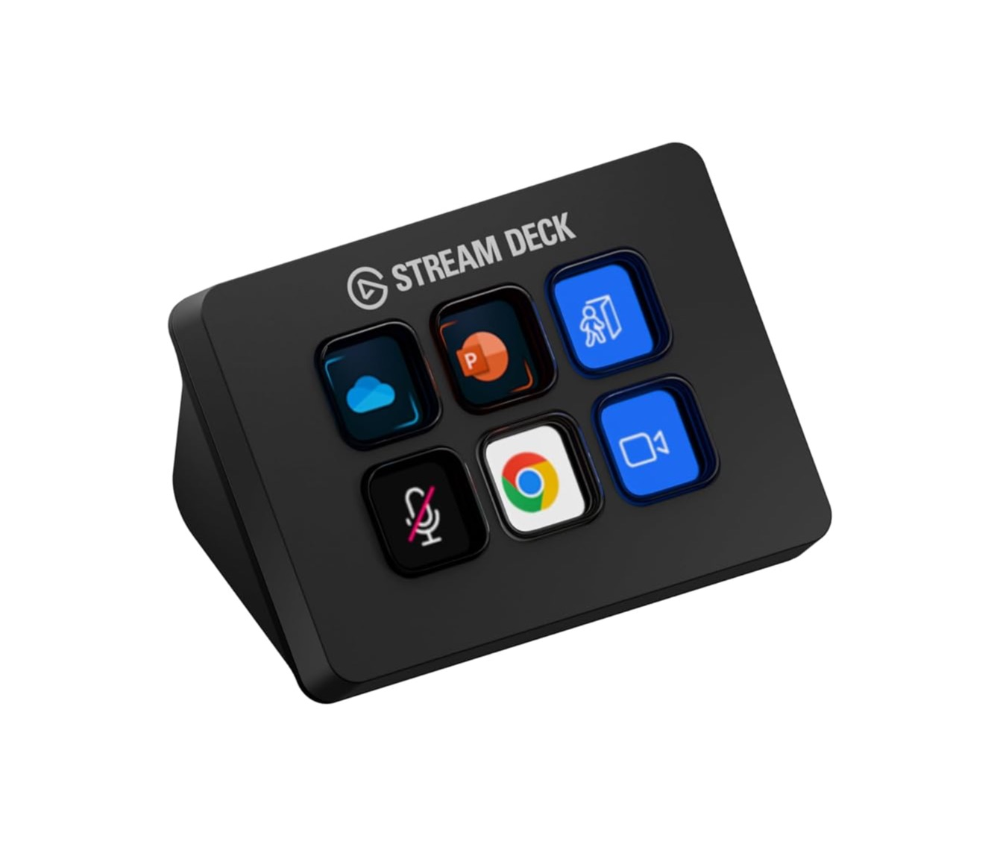
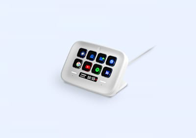
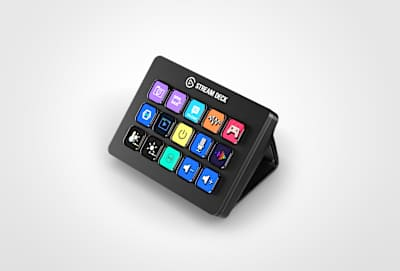
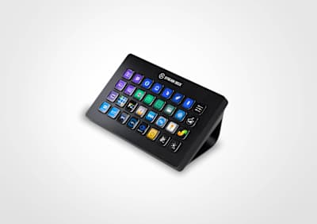
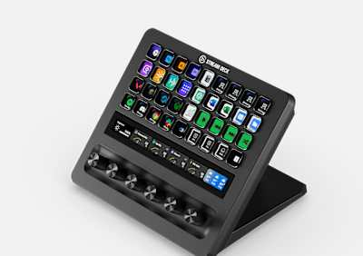
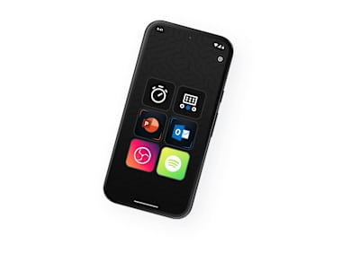
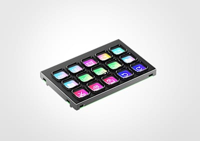

# Elgato Stream Deck

*For a software developer*

## Introduction

For all my years as a developer, a nice keyboard was good enough for my daily work.

I've always enjoyed creating scripts to automate tasks on my PC, phone, and at home, so this device is a small step for
me. I don't know why it took me so long to find it!

Read on this page to see how I use it and whether it is something you did not know you wanted too.

---

## Table of Contents

<!-- TOC -->

* [My introduction with a Stream Deck](#my-introduction-with-a-stream-deck)
* [What is a Stream Deck?](#what-is-a-stream-deck)
* [Button actions](#button-actions)
    * [Browser](#browser)
    * [Chat](#chat)
    * [Claude Code](#claude-code)
    * [Days countdown](#days-countdown)
    * [GitLab](#gitlab)
    * [Google Mail](#google-mail)
    * [Google Meet](#google-meet)
    * [Home Assistant](#home-assistant)
    * [IntelliJ Idea](#intellij)
    * [Mac OS](#mac-os)
    * [Spotify](#spotify)
* [Stream Deck models comparison](#stream-deck-models-comparison)
    * [My advice for a software developer](#my-advice-for-a-software-developer)
    * [My personal ideal model](#my-personal-ideal-model)

<!-- TOC -->

---

## My introduction with a Stream Deck

Recently, I looked at the keypads available on the market for triggering frequently used scripts.
They connect via Bluetooth or USB and have between 3 and 32 buttons.
Some devices have an additional touch display or dial knobs.
I also found the wide range of Elgato Stream Deck devices. They are mainly used by streamers to quickly switch scenes and trigger actions during live streams, but they also work well for other computer users, like me.
The big advantage of these devices is that each button has its own display, which can be completely customised.
You do not have to remember what each button does.
You can also browse different action pages, multiplying the actions you can trigger with the same number of buttons.
I found many integrations and SDK features for building your own actions.
This makes it a cool gadget to play with.

I liked the new scissor keys on the [new MK.2 15-button version](#stream-deck-comparison), but the 32-button version
gave me more direct controls without switching between pages, so I ordered it!

<em style="display:block; text-align:center">Stream Deck MK.2, 15 buttons</em>

<em style="display:block; text-align:center">Stream Deck XL, 32 buttons</em>

## What is a Stream Deck?

A Stream Deck is a small keypad that you put next to your keyboard and connect over USB. The special part is that every
button has its own little LCD screen behind it, so instead of a blank key you see an icon, a label, a color or even a
live value. One press runs whatever you linked to that button: a keyboard shortcut, a script, a macro of multiple steps,
an API call or an action from one of the many plugins.

Elgato (nowadays part of Corsair) originally built it for live streamers, who need to switch scenes, mute their
microphone and fire a sound effect without ever leaving their game. But the device itself doesn't know anything about
streaming, it triggers whatever you configure, and that makes it just as useful for everybody else who repeats the same
actions all day: software developers, video editors, photographers, musicians, people in endless video calls, and home
automation tinkerers.

The problem it solves is that shortcuts don't scale. You can remember five or ten key combinations, but not fifty, and
half of your tools use a different combination for the same thing. On top of that a lot of daily actions aren't a
shortcut at all but a small chore: open this dashboard, run that script, join the standup, set the lights for a call.
Because each button shows what it does, you don't have to remember anything, you just look and press. And with pages and
profiles you can give every application its own set of buttons, so the same hardware turns into a different control
panel depending on what you're working in.

---

## Button actions

In this chapter I describe different examples of how you can use the Stream Deck to automate task in your daily work as
software developer.

This section will constantly be updated with new plugins and integrations. \
I already place some placeholders of features I have already running and will describe them here to upcoming months. Bookmark this page and come back after a while for extra possibilities.

If you can't wait to know more about a specific integration let me know then I can see if I can give creating that description more prio.

If you know cool and usefully actions, I'm always looking for new once, please let me know via an GitHub issue or comment on my socials.

> **_NOTE:_** All actions on this page are specific for macOS.
> The same solutions are probably also possible on Windows, but with different plugins.

---
### Installation

you can use the download button by clicking on the link or key definition.
This file contains the action and icon. You can use the ["Import Action..."](#import-action) feature to load it direct on your own Stream Deck.

If you like to use your own icon and set it up yourself I added as well the used field values.



---

## Export and Import data

There are multiple ways and levels to import and export settings and share the actions and profiles between different Stream Decks.
You can download here my examples and direct load it into yours!

### Drag and Drop

If you have the macOS Application folder open in Finder, next to the Elgato Stream Deck app you can drag apps direct on a button position.
This also works for (bash) scripts.

### Export all data

`.streamDeckProfilesBackup` file

### Export Profile

### Export Action

### Import Action

---

## Stream Deck models comparison

Elgato (part of Corsair) sells a whole family of Stream Decks. They all run on the same Stream Deck software. They
mainly differ in the number of buttons, dials, and displays.

This table provides an overview of the different models.

| Stream Deck          | Mini                                                                                                                                          | Neo                                                                                                                                        | MK.2                                                                                                                                        | MK.2 Scissor Keys                                                                                                                                                | +                                                                                                                                          | XL                                                                                                                                      | + XL                                                                                                                                                | Mobile                                                                                                                                                             | Modules                                                                                                                                             |
|----------------------|-----------------------------------------------------------------------------------------------------------------------------------------------|--------------------------------------------------------------------------------------------------------------------------------------------|---------------------------------------------------------------------------------------------------------------------------------------------|------------------------------------------------------------------------------------------------------------------------------------------------------------------|--------------------------------------------------------------------------------------------------------------------------------------------|-----------------------------------------------------------------------------------------------------------------------------------------|-----------------------------------------------------------------------------------------------------------------------------------------------------|--------------------------------------------------------------------------------------------------------------------------------------------------------------------|-----------------------------------------------------------------------------------------------------------------------------------------------------|
| **Image**            |  |  |  |  |  |  |  |                 |  |
| **Buttons**          | 6                                                                                                                                             | 8 + 2 touch points                                                                                                                         | 15                                                                                                                                          | 15                                                                                                                                                               | 8                                                                                                                                          | 32                                                                                                                                      | 36                                                                                                                                                  | 15 or 32 (virtual)                                                                                                                                                 | 6 or 15                                                                                                                                             |
| **Button display**   | Yes, LCD per key                                                                                                                              | Yes, LCD per key                                                                                                                           | Yes, LCD per key                                                                                                                            | Yes, LCD per key                                                                                                                                                 | Yes, LCD per key                                                                                                                           | Yes, LCD per key                                                                                                                        | Yes, LCD per key                                                                                                                                    | Yes, on the phone screen                                                                                                                                           | Yes, LCD per key                                                                                                                                    |
| **Extra display**    | No                                                                                                                                            | Yes, "info bar" between the keys (clock, page indicator)                                                                                   | No                                                                                                                                          | No                                                                                                                                                               | Yes, LCD Infobar touch strip above the dials                                                                                               | No                                                                                                                                      | Yes, LCD Infobar touch strip (161 × 14 mm)                                                                                                          | n/a                                                                                                                                                                | No                                                                                                                                                  |
| **Dials**            | 0                                                                                                                                             | 0                                                                                                                                          | 0                                                                                                                                           | 0                                                                                                                                                                | 4 (rotate + push, interchangeable)                                                                                                         | 0                                                                                                                                       | 6 (rotate + push, interchangeable)                                                                                                                  | 0                                                                                                                                                                  | 0                                                                                                                                                   |
| **Size (D × W × H)** | 84 × 60 × 58 mm                                                                                                                               | 107 × 78 × 26 mm                                                                                                                           | 118 × 84 × 25 mm (without stand)                                                                                                            | 118 × 84 × 25 mm (without stand)                                                                                                                                 | 140 × 138 × 110 mm                                                                                                                         | 34 × 182 × 112 mm (without stand)                                                                                                       | 205 × 147 × 175 mm                                                                                                                                  | Your phone                                                                                                                                                         | Depends on the enclosure                                                                                                                            |
| **Purpose**          | Cheapest entry model, for a handful of fixed actions                                                                                          | Budget mid-range with a built-in stand, page switching via the two touch points                                                            | The classic all-rounder with the original clicky keys                                                                                       | Same board as the MK.2 but with low-travel scissor keys: quieter and softer to press                                                                             | Best choice when you need analog control: volume, brightness, EQ, timeline scrubbing, light dimming                                        | Maximum direct controls without switching pages, my choice for development shortcuts                                                    | The 2026 flagship, "pro control surface" for broadcast studios and editing bays, 1085 g                                                             | Subscription app for iOS/Android, handy to try out the software before buying hardware                                                                             | OEM/DIY boards to build the keypad into your own desk or panel                                                                                      |
| **Product page**     | [Elgato](https://www.elgato.com/ww/en/p/stream-deck-mini)                                                                                     | [Elgato](https://www.elgato.com/ww/en/p/stream-deck-neo)                                                                                   | [Elgato](https://www.elgato.com/ww/en/p/stream-deck-mk2-black)                                                                              | [Elgato]([https://www.elgato.com/ww/en/p/stream-deck-mk2-scissor-keys-black](https://www.elgato.com/ww/en/p/stream-deck-scissor-keys))                           | [Elgato](https://www.elgato.com/ww/en/p/stream-deck-plus-black)                                                                            | [Elgato](https://www.elgato.com/ww/en/p/stream-deck-xl)                                                                                 | [Elgato](https://www.elgato.com/ww/en/p/stream-deck-plus-xl)                                                                                        | [Elgato](https://www.elgato.com/ww/en/s/stream-deck-mobile)                                                                                                        | [Elgato](https://www.elgato.com/ww/en/p/stream-deck-module-15-keys)                                                                                 |
| **Buy**\*            | [Amazon](https://amzn.to/4xlUk6F#ad)                                                                                                          | [Amazon](https://amzn.to/4fOxVrA#ad)                                                                                                       | [Amazon](https://amzn.to/4xAME0z#ad)                                                                                                        | [Amazon](https://amzn.to/4h5Q3iM#ad)                                                                                                                             | [Amazon](https://amzn.to/3RrBEmN#ad)                                                                                                       | [Amazon](https://amzn.to/4ySoxvD#ad)                                                                                                    | [Amazon](https://amzn.to/4fV0q70#ad)                                                                                                                | [Android](https://play.google.com/store/apps/details?id=com.corsair.android.streamdeck) / [iOS](https://apps.apple.com/app/elgato-stream-deck-mobile/id1440014184) | [Amazon](https://amzn.to/TODO-module-us#ad)                                                                                                         |

See all these models together on this [Amazon](https://amzn.to/4wESUUS)* page.

\* Links on this page may be affiliate links. You pay the normal price while supporting my blog.

### My advice for a software developer

The 15-button MK.2 and the 32-button XL are the most interesting models for a software developer: they have enough
buttons for a full set of shortcuts without switching pages for every action. If you mainly want to control values
instead of triggering actions, the Stream Deck + with its 4 dials is the better fit, and the Stream Deck + XL combines
both with 36 keys and 6 dials (at a price to match).

### My personal ideal model

If I could create my ideal Elgato Stream Deck, it would use the 32-button XL as its base, with the following
modifications:

* Scissor keys: silent, with a consistent click across each button.
* Matte button finish: the current buttons reflect light.
* A brighter backlit screen: images can look a little pale.
* A walnut-look surround for the buttons to match my other [desk accessories](/desk/office_accessories).
