# Packages mailbox - Allux 600

I was looking for a packages-mailbox where 80% of my ordered packages should fit in, so I don't have to wait at home for the delivery guy to arrive, but still I can receive my package.

<p>
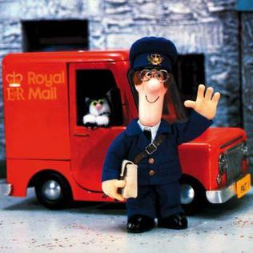

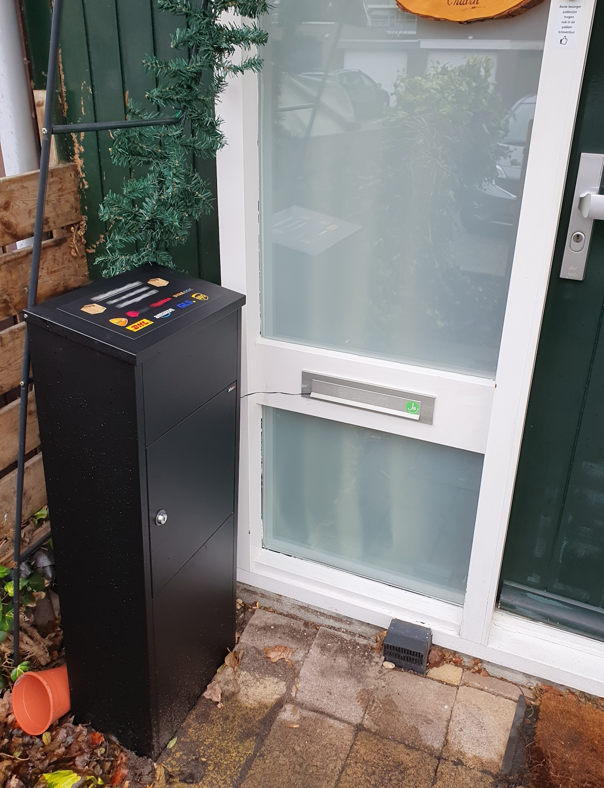

<br>
<em>My final automated packages mailbox</em>
</p>

---
## Table of Contents
<!-- TOC -->
* [My requirements](#my-requirements)
* [Product specs](#product-specs)
* [Mounting to the ground](#mounting-to-the-ground)
  * [Used parts for my DIY ground mount](#used-parts-for-my-diy-ground-mount)
  * [Assembling the ground mount](#assembling-the-ground-mount)
* [Stickers](#stickers)
* [Automations](#automations)
  * [Notification when a package is delivered](#notification-when-a-package-is-delivered)
  * [Node-RED flow](#node-red-flow)
  * [Notification on my phone](#notification-on-my-phone)
  * [Home Assistant](#home-assistant)
    * [How MQTT works](#how-mqtt-works)
    * [MQTT entity](#mqtt-entity)
    * [Mushroom icon](#mushroom-icon)
    * [Conditional row](#conditional-row)
    * [Entities card](#entities-card)
* [PostNL set package box a default deliver location](#postnl-set-package-box-a-default-deliver-location)
* [Where to buy](#where-to-buy)
  * [Firework protection](#firework-protection)
* [Alternatives package boxes](#alternatives-package-boxes)
<!-- TOC -->

---

## My requirements

I was looking for a package mailbox with the next specifications:
* All weatherproof;
* A shoebox-package-size should fit in it (so it covers 80% of my package sizes);
* It could contain multiple packages;
* Not possible to grab delivered packages out of it;
* A discrete design;
* A maximum price of &euro; 200,- ;
  * I found &euro; 200,- already a lot of money for such a box, but in my search I found out this was at the bottom prices in the market. Those boxes, for what I was looking for, reach to prices like &euro; 500,-!
<br>
In my search I found the Allux 600 box, which match almost all my criteria, but only the price at that moment was &euro; 250,-.
It's made for outside usage. I's made of coated steel, it has a 10-year guarantee against rust. That's also why the price is so high.

A shoebox can fit in it.
And multiple packages can be dropped in it, but it isn't possible to grab one out of it afterward.\
The design is a tight mat black box that doesn't attract too much attention when you see it from the street. 

Because the price was a bit high, and I didn't need it direct, I decided to put it on my wishlist and created a rule in my [Node-RED daily-check-for-good-offers list](../node-red/node-red_pricewatch), next to the laundry detergents and wait if it will be cheaper at a later moment.\
I forgot about it until on Black Friday I received a notification it was now on sale for &euro; 189,-, so now it matches all my criteria and I ordered it! Also, in the meanwhile, I didn't find any other box one with better specs.

---

## Product specs

The box is made of coated steel, so it's strong and won't rust because they give 10-year guaranty against rust. It should stand for years outside in all weather conditions. 


Total outside sizes of the mailbox:
```
Height: 105 cm
Width: 38 cm
Depth: 23 cm
Weight: 11.5 kg
```

The maximum size of the packages to fit in:
```
Height: 15 cm
Width: 32 cm
Depth: 29 cm
```

The top view when opening the lid.


It has some bump cushions, so it doesn't close with a lot of noise.

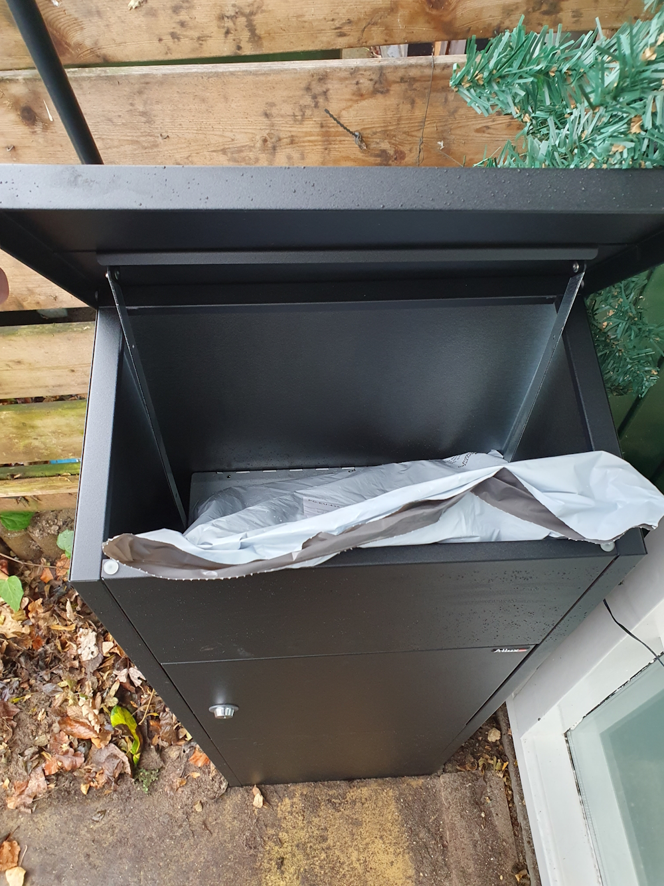

In front there is a locked door to get the packages out of the box.

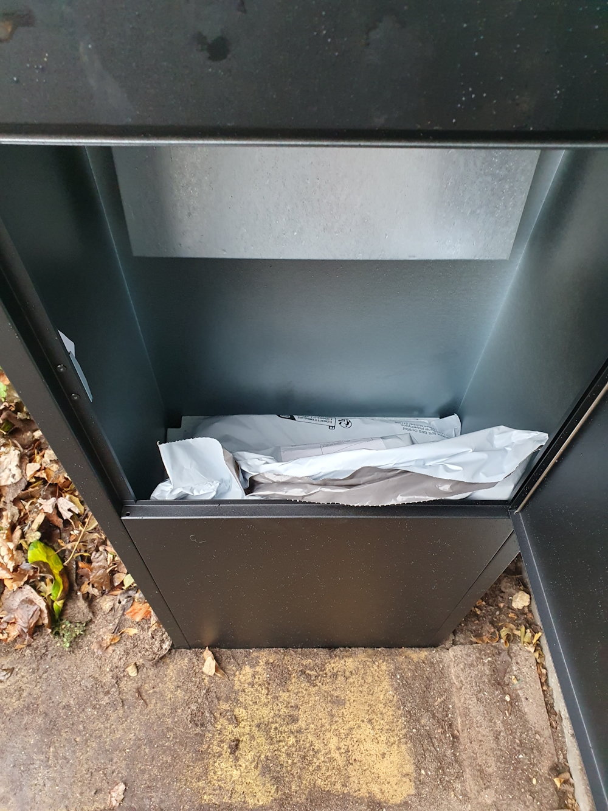

This is how the systems works to prevent picking previous delivered package out of the box.

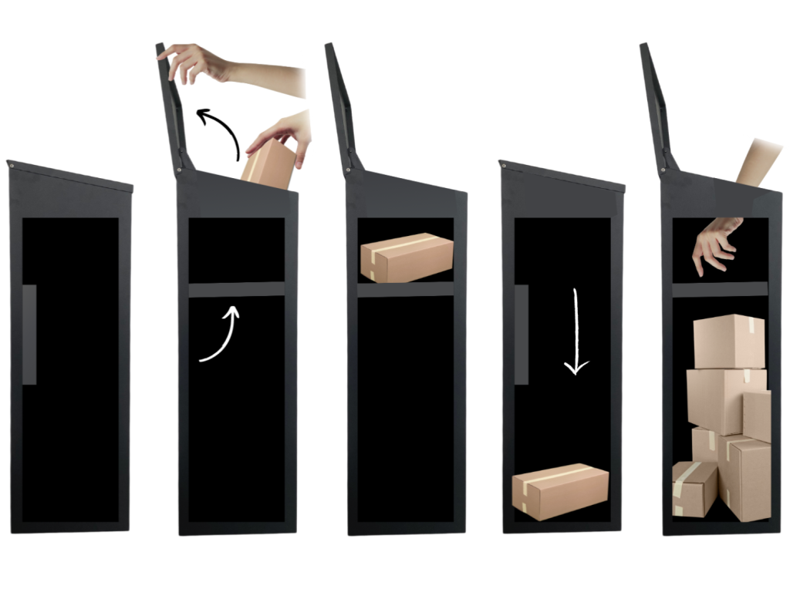

An instruction video about how the Allux 600 works:

[](http://www.youtube.com/watch?v=9A3NI7MjIkA "Allux 600 usage")

Click on the above image to see the video.

---

## Mounting to the ground

The regular Allux 600 is without any mounting materials.
The only provided solution to mount the box on the ground is a ~&euro; 90,- steel frame. 
In my opinion, way too expensive, and it should also be possible to solve this for way less, but that needs a creative solution.

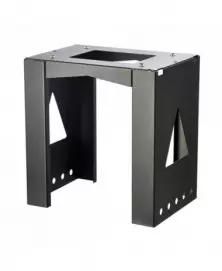

The Allux has already in the bottom, in each corner and in the center, pre-drilled holes. If you have tiles, you can also drill holes in it and mount it direct to it.


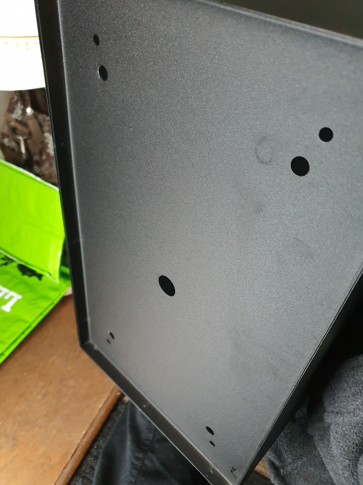

### Used parts for my DIY ground mount

I came up with a DIY solution that would work for me.\
My box is placed on soil. So I decided to dig a hole under the box, and place something heavy in the ground, and this should be mounted to the box. 
So you can't pick it up and walk away with it.

This was my shopping list for my DIY ground mount: 

* A heavy flower box, it was in the sales at the local garden shop [&euro; 7,-]
  * The flower box already had a hole in the middle.

  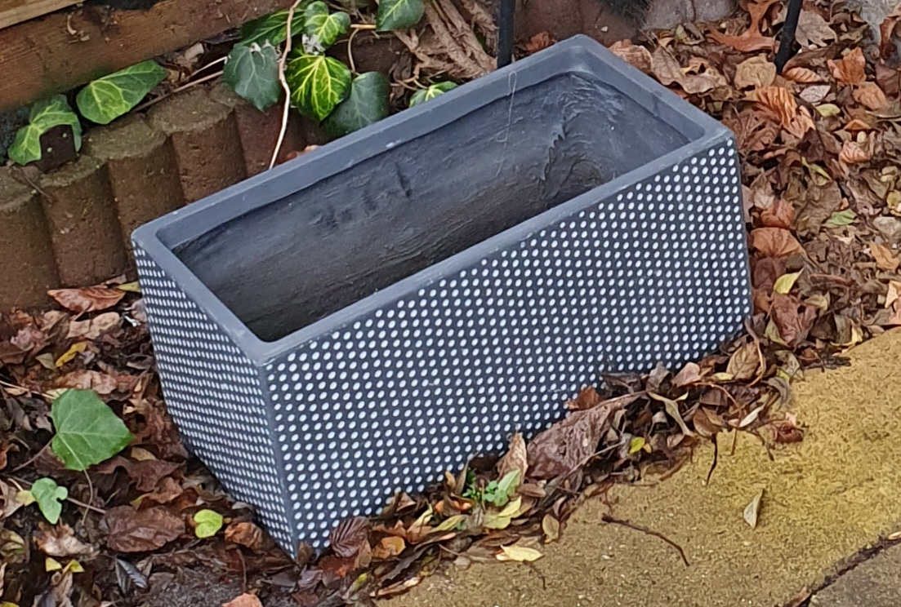

* [1x Stainless Steel Threaded End Pipes 12mm x 100 cm](https://www.gamma.nl/assortiment/gamma-draadeind-rvs-m12-x-1000-mm/p/B451457) [&euro; 13,79 at Gamma]

  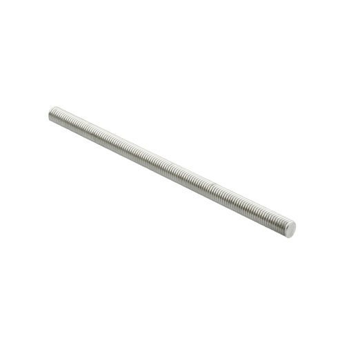

* [A box with 4x galvanized metal plate 40x40mm](https://www.gamma.nl/assortiment/gamma-zeskantmoer-m12-verzinkt-4-stuks/p/B458313) [&euro; 5,59 at Gamma]

  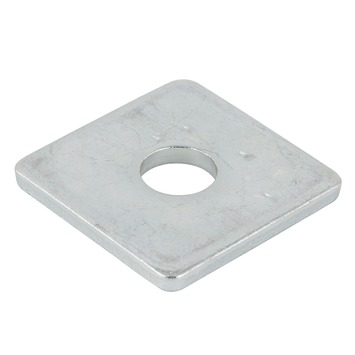

* [A box with 4x galvanized 12mm bolts](https://www.gamma.nl/assortiment/gamma-zeskantmoer-m12-verzinkt-4-stuks/p/B458313) [&euro; 2,59 at Gamma]

  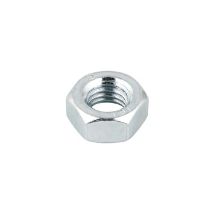

Which make the total costs for my DIY ground mount &euro; 28,97. This saves me ~&euro; 60,-

### Assembling the ground mount

I screw a bolt and plate on each side of the hole in the flower box so the pipe is strongly attached to the flower box. The pipe must stick only 15 cm above street level, and the rest will be in the ground underneath the flower box.

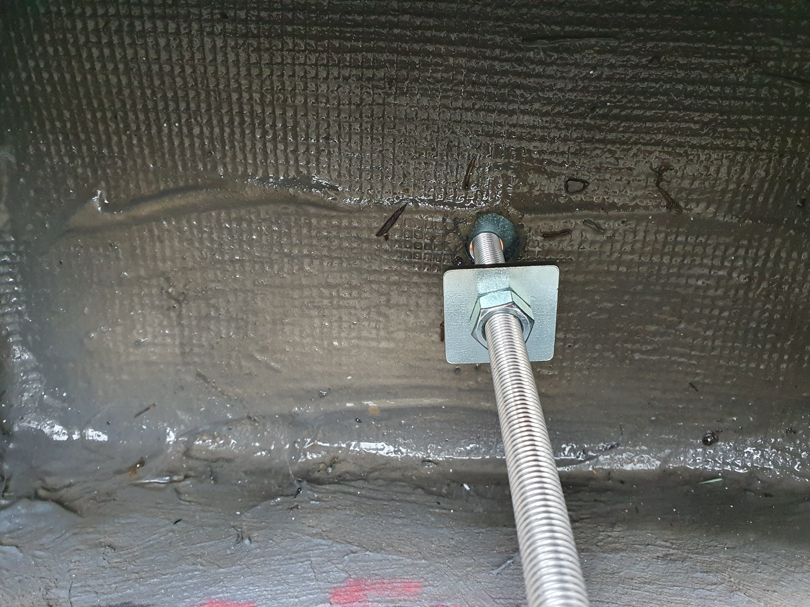

I grave a hole under the place where the box will stand and which match the size of the flower box, put it in the ground and fill it again with sand and stones for extra weight. 


Now only the pipe is above the ground.\
I screw the bold on the pipe, almost to the ground and add a plate above it.

Now I placed the box over the pipe and see if the plate touches the bottom of the box when the corners of the package box touch the ground.
Now add the plate inside the box over the pipe and screw the bold also from inside. Now the bolts and plates are strong together to each other on each side of the bottom of the box. 


Now the box isn't easy to move anymore!
And it isn't visible at all how it's mount on the ground.

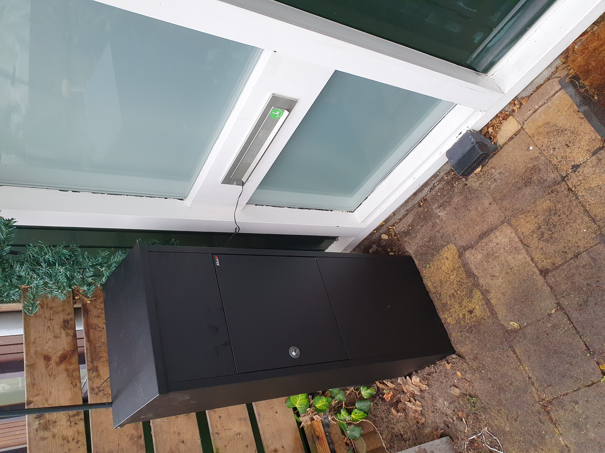

---

## Stickers

Because the box has a discrete design it's maybe not direct clear for a delivery guy that this is meant for his packages.

On the Dutch forum Tweakers.net I found <a href="https://gathering.tweakers.net/forum/list_message/72034534#72034534" target="_blank">this</a> thread about these kind of package boxes and someone had good experience with making and ordering outdoor stickers from [stickermaster.nl](https://stickermaster.nl/stickers-maken/stickers-eigen-ontwerp.html).
This sticker is one which is also used on cars, so it's weatherproof. Exactly what I need!

So I designed two stickers:

* One to place on the lid of the box.
  * I gathered some delivery company logo's, created an image and placed the text that this is a package mailbox, my name and street name with house number on it (blurred on the photo).

 <a href="images_allux-600/pakketbrievenbussticker_template.pdn">Download here the Paint.net PDN file of this sticker.</a> Download <a href="https://www.getpaint.net" target="_blank">Paint.net</a>

 <a href="images_allux-600/pakketbrievenbussticker_template.psd">Download here the Photoshop PSD file of this sticker.</a>

 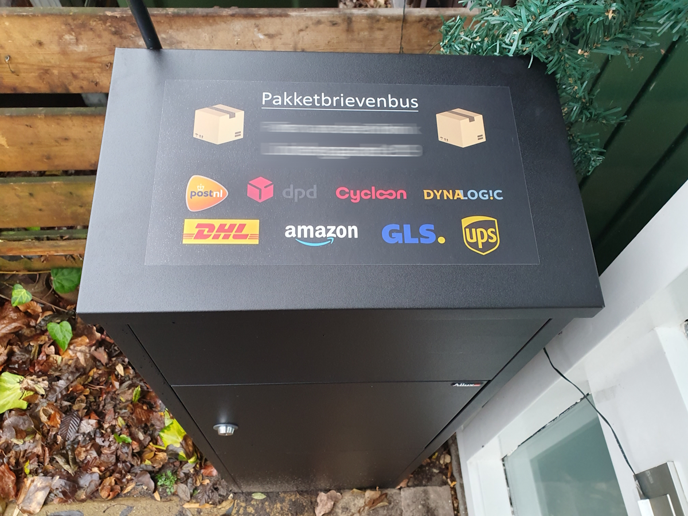

* And I placed the other one direct under the doorbell with a reference there is also a package box.

  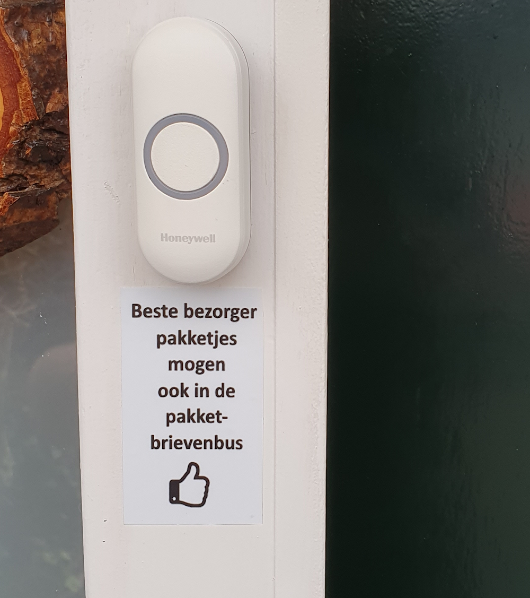

---

## Automations

This package box is not smart by itself, but it was easy to make it smart.\
I have already a Zigbee network up and running, so I added two contact sensors (you can use any brand) inside the box. 
I created automations for notifications and added the status to my Home Assistant dashboard.

### Notification when a package is delivered

* The first [Zigbee contact sensor](../buy/smart_home_best_buy_tips#contact-sensor) is mounted under the inner metal plate where the packages are place on when the lid is opened. 
When the lid is opened, the contact breaks and a trigger is sent. 
This location is also nice because the sensor isn't visible from outside and don't get in contact with weather conditions. 
The signal is strong enough to get through the steel.
I have at 1.5m, inside the house, a [smart socket](../buy/smart_home_best_buy_tips#smart-socket) installed to receive the Zigbee signals.

  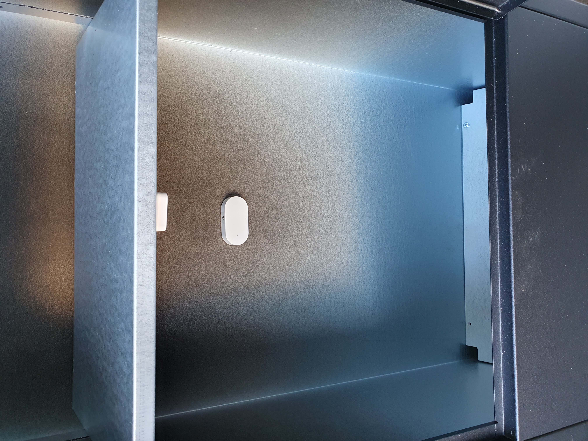

* The second contact sensor is placed in the front door. So when the box is opened with the key, this contact breaks, and a trigger is sent by this other sensor.

  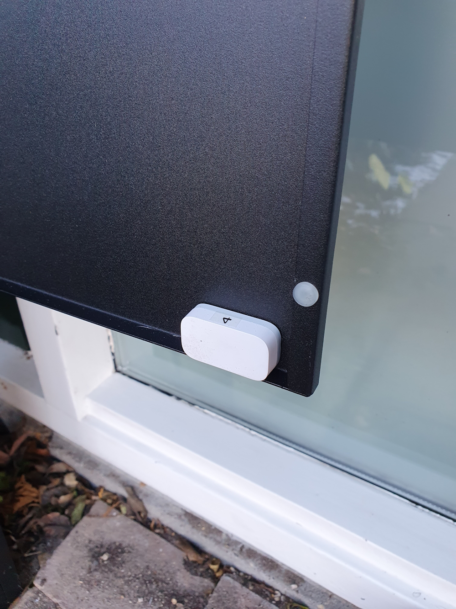

Is this full-proof? No, everybody who opens the lid triggers that there is a package inside. 
It can be improved by adding a camera inside the box, make a photo when a new package arrived and compare it with the previous photo. 
But for me this is now good enough. 

### Node-RED flow

For creating all my automations around the house I have a home server running and use the software [Node-RED](../node-red) to make automations based on all my sensors input.

In Node-RED I defined a custom [MQTT topic](#how-mqtt-works) to indicate if there is a package in the box.
I named it `homeassistant/packagebox`.
If the lid Zigbee contact sensor sent a message to my server, the contact value is `false` (open), this flow sets the value of my custom topic to `true`. 
When the front door is opened, the door sensor sent then `false`, then the custom topic is set to `false`. 
This topic now indicates if there is a package inside.

I also send a notification to the phones and speaker in the living room when a package is arrived.

This is how my Node-RED flow looks like.
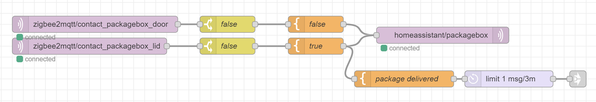

<details>
  <summary><b>> Click here to see the corresponding Node-RED flow code >></b></summary>

```json
[
    {
        "id": "a53024c24cc27d45",
        "type": "tab",
        "label": "Flow 2",
        "disabled": false,
        "info": "",
        "env": []
    },
    {
        "id": "31bb94a252a5b949",
        "type": "link out",
        "z": "a53024c24cc27d45",
        "name": "",
        "mode": "link",
        "links": [
            "d2c82c3.f526fd"
        ],
        "x": 1065,
        "y": 240,
        "wires": []
    },
    {
        "id": "0bfe1c92b7b611c0",
        "type": "mqtt in",
        "z": "a53024c24cc27d45",
        "name": "",
        "topic": "zigbee2mqtt/contact_packagebox_lid",
        "qos": "0",
        "datatype": "json",
        "broker": "7527d055.ed7e2",
        "nl": false,
        "rap": false,
        "inputs": 0,
        "x": 180,
        "y": 180,
        "wires": [
            [
                "9e3b3412c84df26b"
            ]
        ]
    },
    {
        "id": "7dc4f7d852e74e71",
        "type": "mqtt out",
        "z": "a53024c24cc27d45",
        "name": "",
        "topic": "homeassistant/packagebox",
        "qos": "",
        "retain": "",
        "respTopic": "",
        "contentType": "",
        "userProps": "",
        "correl": "",
        "expiry": "",
        "broker": "7527d055.ed7e2",
        "x": 820,
        "y": 160,
        "wires": []
    },
    {
        "id": "6cccfb30fd5ceb8b",
        "type": "switch",
        "z": "a53024c24cc27d45",
        "name": " false",
        "property": "payload.contact",
        "propertyType": "msg",
        "rules": [
            {
                "t": "false"
            }
        ],
        "checkall": "true",
        "repair": false,
        "outputs": 1,
        "x": 430,
        "y": 140,
        "wires": [
            [
                "b6983093fd18c3d9"
            ]
        ]
    },
    {
        "id": "b6983093fd18c3d9",
        "type": "template",
        "z": "a53024c24cc27d45",
        "name": "false",
        "field": "payload",
        "fieldType": "msg",
        "format": "handlebars",
        "syntax": "plain",
        "template": "false",
        "output": "str",
        "x": 590,
        "y": 140,
        "wires": [
            [
                "7dc4f7d852e74e71"
            ]
        ]
    },
    {
        "id": "0f9c67ba6465cf62",
        "type": "template",
        "z": "a53024c24cc27d45",
        "name": "true",
        "field": "payload",
        "fieldType": "msg",
        "format": "handlebars",
        "syntax": "plain",
        "template": "true",
        "output": "str",
        "x": 590,
        "y": 180,
        "wires": [
            [
                "7dc4f7d852e74e71",
                "e44b23317f3dad73"
            ]
        ]
    },
    {
        "id": "9e3b3412c84df26b",
        "type": "switch",
        "z": "a53024c24cc27d45",
        "name": " false",
        "property": "payload.contact",
        "propertyType": "msg",
        "rules": [
            {
                "t": "false"
            }
        ],
        "checkall": "true",
        "repair": false,
        "outputs": 1,
        "x": 430,
        "y": 180,
        "wires": [
            [
                "0f9c67ba6465cf62"
            ]
        ]
    },
    {
        "id": "36951a27de045d9e",
        "type": "delay",
        "z": "a53024c24cc27d45",
        "name": "",
        "pauseType": "rate",
        "timeout": "5",
        "timeoutUnits": "seconds",
        "rate": "1",
        "nbRateUnits": "3",
        "rateUnits": "minute",
        "randomFirst": "1",
        "randomLast": "5",
        "randomUnits": "seconds",
        "drop": true,
        "outputs": 1,
        "x": 940,
        "y": 240,
        "wires": [
            [
                "31bb94a252a5b949"
            ]
        ]
    },
    {
        "id": "e44b23317f3dad73",
        "type": "template",
        "z": "a53024c24cc27d45",
        "name": "package delivered",
        "field": "payload",
        "fieldType": "msg",
        "format": "handlebars",
        "syntax": "mustache",
        "template": "Er is een pakketje geleverd",
        "output": "str",
        "x": 750,
        "y": 240,
        "wires": [
            [
                "36951a27de045d9e"
            ]
        ]
    },
    {
        "id": "a4e7e663ab8bcff5",
        "type": "mqtt in",
        "z": "a53024c24cc27d45",
        "name": "",
        "topic": "zigbee2mqtt/contact_packagebox_door",
        "qos": "0",
        "datatype": "json",
        "broker": "7527d055.ed7e2",
        "nl": false,
        "rap": false,
        "inputs": 0,
        "x": 190,
        "y": 140,
        "wires": [
            [
                "6cccfb30fd5ceb8b"
            ]
        ]
    },
    {
        "id": "7527d055.ed7e2",
        "type": "mqtt-broker",
        "name": "",
        "broker": "mosquitto",
        "port": "1883",
        "tls": "bbaa4676.58e4c8",
        "clientid": "node-red-client",
        "autoConnect": true,
        "usetls": false,
        "protocolVersion": "5",
        "keepalive": "60",
        "cleansession": false,
        "birthTopic": "",
        "birthQos": "0",
        "birthPayload": "",
        "birthMsg": {},
        "closeTopic": "",
        "closePayload": "",
        "closeMsg": {},
        "willTopic": "",
        "willQos": "0",
        "willPayload": "",
        "willMsg": {},
        "userProps": "",
        "sessionExpiry": ""
    },
    {
        "id": "bbaa4676.58e4c8",
        "type": "tls-config",
        "name": "",
        "cert": "",
        "key": "",
        "ca": "",
        "certname": "m2mqtt_srv.crt",
        "keyname": "m2mqtt_srv.key",
        "caname": "m2mqtt_ca.crt",
        "servername": "",
        "verifyservercert": false
    }
]
```
</details>

### Notification on my phone

I have already a separated Node-RED flow to [send messages to my phone](../node-red/node-red_home-assistant_notifications). 
I use a `link out node` (most right bottom block in the screenshot) to connect to that flow. 
And every message it received will be sent to my phone to notify me there is a package.

You can use your own preferred notification app here, like the Home Assistant Companion app, Whatsapp, Xabber, Telegram, Pushbullet, etc  

  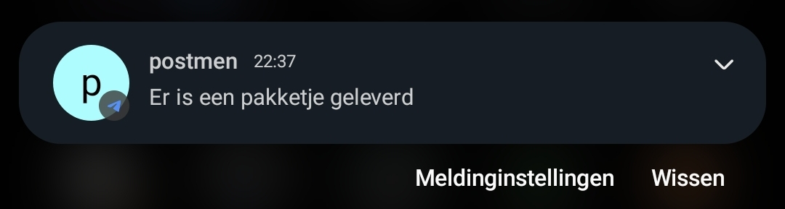


### Home Assistant

#### How MQTT works 

The advantage of MQTT is that multiple applications can send and received messages on a topic. 
A topic is some kind of channel. 
The messages are in standard json format. 
So in my case Node-RED updates the status of topic `homeassistant/packagebox` and Home Assistant also listen to it and use it for its own automations and dashboard. 
Check online tutorials for all ins and outs about MQTT.

#### MQTT entity

In Home Assistant I added YAML code in configuration.yaml. 
I defined a sensor for a MQTT topic to listen to. 
It becomes a binary sensor in Home Assistant. When on the topic `homeassistant/packagebox` a payload `true` is received the Home Assistant sensor sets the status to `ON` and with topic value `false` the state will be `OFF`.
```yaml

# Sourcecode by vdbrink.github.io
# configuration.yaml
binary_sensor:
  - unique_id: packagebox
    name: "packagebox"
    state_topic: homeassistant/packagebox
    payload_on: "true"
    payload_off: "false"

```

#### Mushroom icon

In my Home Assistant dashboard, there will be an orange box icon visible if there is a package inside the box.

  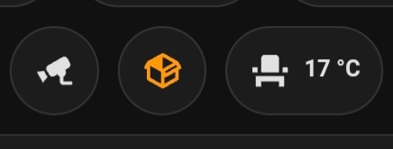

This conditional mushroom box icon is visible based on the previous defined binary sensor.\
This is the corresponding dashboard code for this icon:

```yaml

# Sourcecode by vdbrink.github.io
# Dashboard card code
type: custom:mushroom-chips-card
chips:
  - type: conditional
    conditions:
      - entity: binary_sensor.packagebox
        state: 'on'
    chip:
      type: template
      icon_color: orange
      icon: mdi:package-variant
      entity: binary_sensor.packagebox
      content: ''

```

#### Conditional row

In my Home Assistant dashboard I have a list of conditional items which are only visible if it's relevant or any action is required.
Like in this case it's only visible when you need to empty the package box.

To show the package box entity like this:

  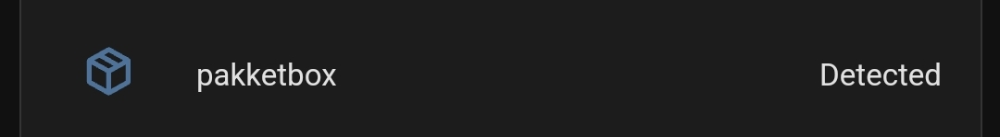

I used a Vertical Stack card in my dashboard with this code:
```yaml

# Sourcecode by vdbrink.github.io
# Dashboard card code
type: vertical-stack
cards:
  - type: entities
    entities:
      - type: conditional
        conditions:
          - entity: binary_sensor.packagebox
            state: 'on'
        row:
          entity: binary_sensor.packagebox
 
```

#### Entities card

To show the package box entity like this:

  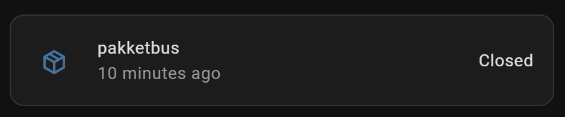

This is the time when the lid was (opened and) closed for the last time.

Use this entities card yaml:
```yaml

# Sourcecode by vdbrink.github.io
# Dashboard card code
type: entities
entities:
  - entity: binary_sensor.contact_packagebox_lid_contact
    secondary_info: last-changed

```
The same code, with the other sensor, can be used to show when the last time was when it's emptied.

---

## PostNL set package box a default deliver location

For the Dutch delivery company PostNL you can define that you have a package box at home where you want to receive your package in.

Login with your PostNL account and go to
https://jouw.postnl.nl/account/nl-NL/ontvangstvoorkeur/standaard-bezorging to set this up.

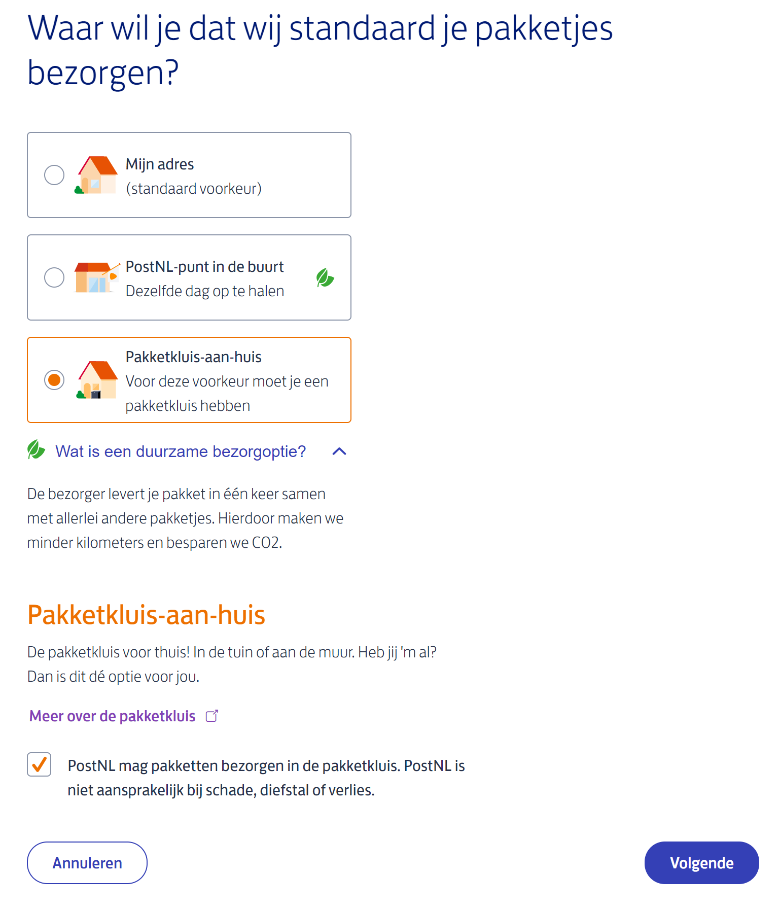

---

## Where to buy

Here are some links where you can find actual prices for the Allux 600.

* [iBOOD has it in a daily offer for &euro; 159,-](https://www.ibood.com/nl/s-nl/o/allux-pakketbrievenbus-600/934182)
* [Bol.com](https://www.bol.com/nl/nl/s/?searchtext=allux+600)
* [Google Shopping](https://www.google.com/search?q=allux+600&tbm=shop)

### Firework protection

You can also buy a small additional metal plate you can block the lid from opening to prevent throwing firework in the box at the end of the year.

[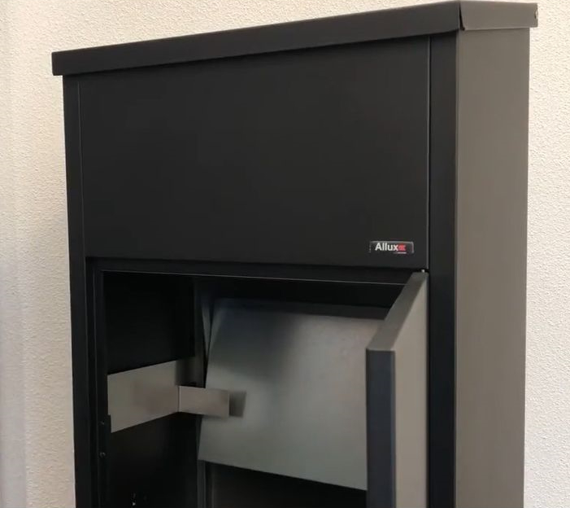](http://www.youtube.com/watch?v=gc52z0xg0Og "Firework protection metal")

Did you create one yourself? Let me know!

---

## Alternatives package boxes

I found some alternative package boxes:

* [Veehaus - Lucas Plus Statief 1000](https://www.bol.com/nl/nl/p/veehaus-lucas-plus-statief-1000-achteruitname-pakketbrievenbus-met-statief-pakketbrievenbus-brievenbus-pakketbox-metaal-26-x-41-x-109-cm-zwart/9300000108153838/) (Exact the same model as the Allux 600)
* Allux 800 - bigger version
* [PakketPanda Classic – XXL Pakketbrievenbus](https://pakketpanda.nl/product/pakketpanda-classic-pakketbrievenbus/)
* [PostNL advertise with a GePro Box](https://www.postnl.nl/campagnes/pakketkluis/)
* [Logixbox Multibox-S](https://www.logixbox.nl/pakjes-brievenbus-multibox-s.html)

Do you have another interesting package box [share it with me](#remarks-or-suggestions)
or share it public on the Dutch Tweakers forum in this thread https://gathering.tweakers.net/forum/list_messages/1663741

---

Links to other sections of this blog site.

[Main page](../index) | [Other projects](index) | [Home Assistant](../homeassistant/index) | [ESPHome](../esphome/index) | [Node RED](../node-red/index)