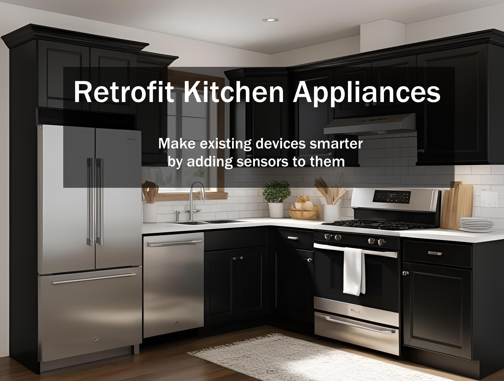
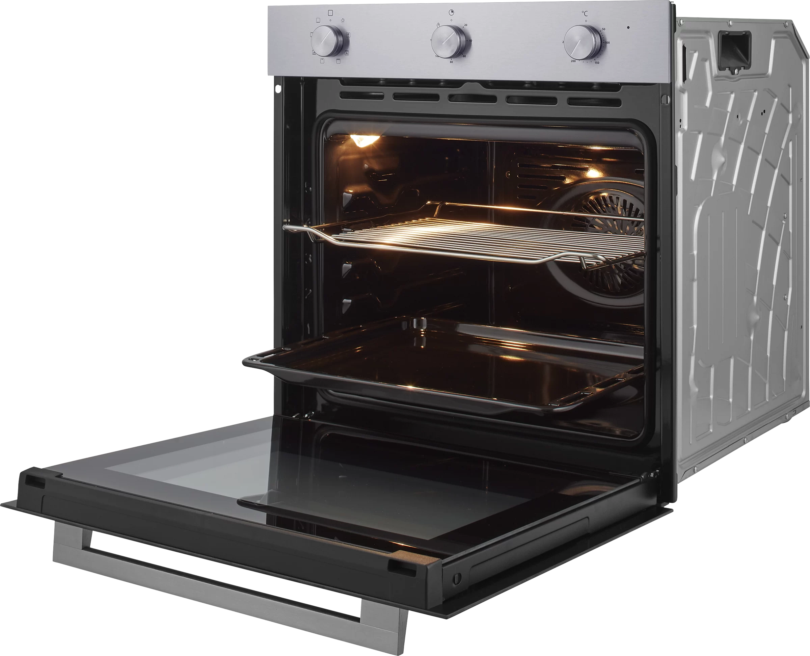
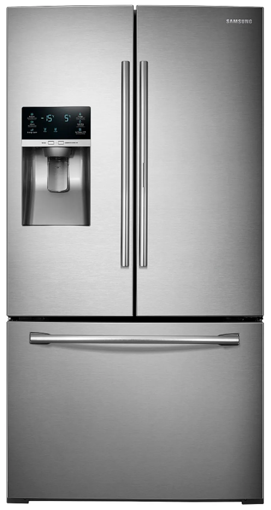
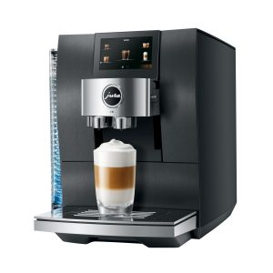
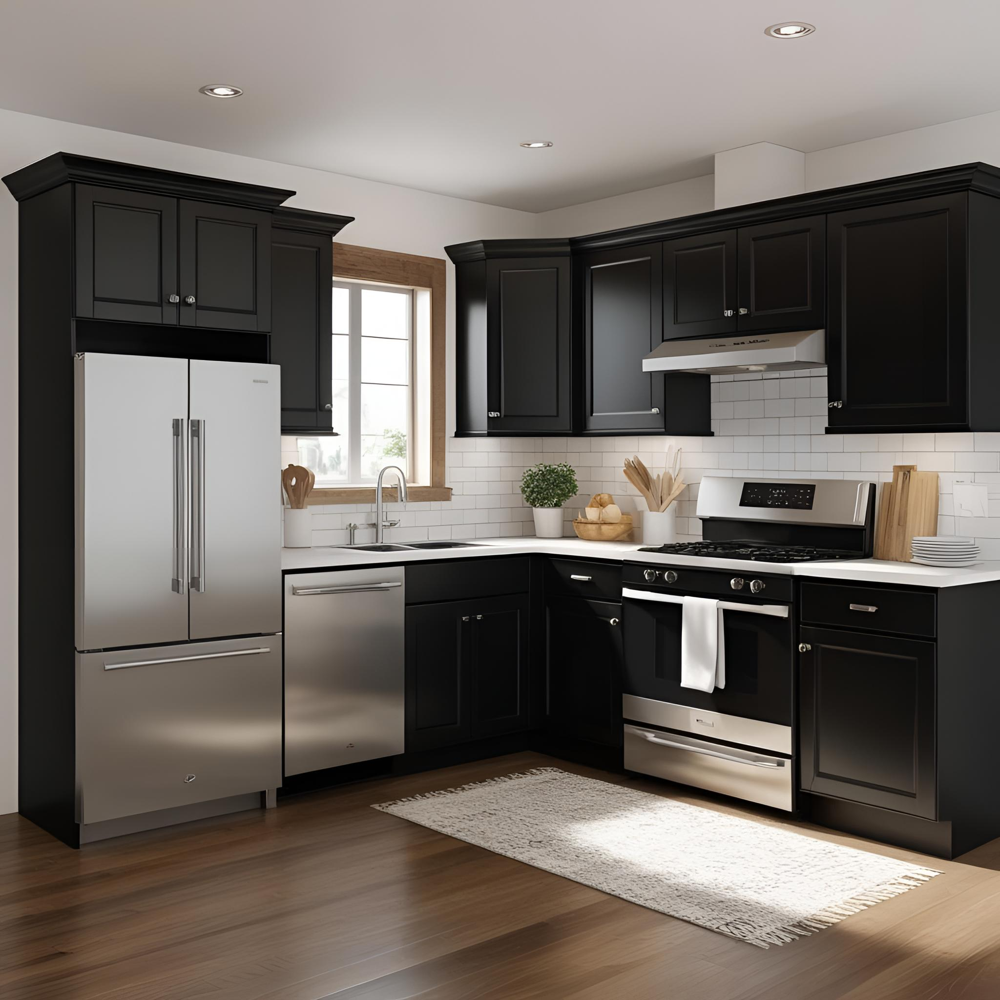

style="margin-left:15px;float:right"

# Retrofit Kitchen Appliances
*Make your kitchen smarter*

## Introduction

As a home automation enthusiast, I try to make as many appliances "smarter".
Not only by buying smart appliances, but also by making my existing appliances smart by adding sensors to a "dumb" appliance.
With kitchen appliances, this is very easy to do.

The **advantage** of this approach is: 
* that you can get started right away;
* Smart appliances are often connected to the cloud and come with security and privacy risks;
* The selection of models is limited, also they are usually much more expensive.

 

The **downside** is that you don’t get all the advanced smart features, only some basic ones.
In most cases, this is not a reason to upgrade the appliance, and in the meanwhile, this is a good enough (for me at least).

What matters most for a smart device really depends on individual preferences: 
is it it's features, privacy, price, or durability?

For me, it’s privacy (running everything locally) and durability.

On this page, I describe how I’ve added basic out-of-the-box sensors to each of my "dumb" kitchen appliances to make them a bit smarter.

>Note: If you add ESPs inside these appliances and overrule the buttons and read the display from intern, 
you can make them even smarter, but that has an impact on the safety and assurance of it. 
This is out of scope here. 
If you've done it yourself, please let me know. 
I'm still very interested in it!

---

## Table of Contents
<!-- TOC -->
  * [Dishwasher](#dishwasher)
  * [Oven](#oven)
  * [Refrigerator](#refrigerator)
  * [Stove](#stove)
  * [Ventilation system](#ventilation-system)
  * [Sink](#sink)
  * [Coffee machine](#coffee-machine)
  * [Lights](#lights)
  * [Temperature and humidity](#temperature-and-humidity)
  * [Smoke detector](#smoke-detector)
  * [Conclusion](#conclusion)
<!-- TOC -->

---

I'll describe one by one how an appliance can be made smarter with sensors, actuators and automations.

## Dishwasher

A dishwasher can be made smarter with automations that notify you when cycles finish, 
remind you to empty it, or track usage. 

**Sensors and automations**

* With a [smart plug](/buy/smart_home_best_buy_tips#smart-socket) with energy consumption monitoring: you can track if it (still) running.
* With a [contact sensor](/buy/smart_home_best_buy_tips#contact-sensor) on the door: you can check if the door is opened (and probably emptied).
* With a [lux sensor](/buy/smart_home_best_buy_tips#lux-sensor) next to the light underneath it: you can check if it indicates it's still running.

 

 

**Notifications**

With these automations you can make the next notifications and/or announcements when the dishwasher is ...
* finished.
* not emptied yet after X time after it's finished.
* not started yet today when the time is after Y.

 

**Not possible**

Automations which you **can't** make this way:
* Start it at a specific moment, like when the energy price is low or just during the night. Then you need a real smart dishwasher. 

---

## Oven

An oven can be made smarter with automations that notify you when it's on it set temperature.

**Sensors and automations**

* With a [smart plug](/buy/smart_home_best_buy_tips#smart-socket) with energy consumption monitoring: 
when the power consumption drops, it reached his preset temperature.
* With a [contact sensor](/buy/smart_home_best_buy_tips#contact-sensor) on the door: you can check if the door is opened and start a timer on a dashboard.

 

**Notifications**

With these automations you can make the next notifications and/or announcements when the oven ...

* reaches his preset temperature.

 
 

**Dashboard additions**

* When the oven is on.
 

* Timer when the last time was that the oven door was opened.
    * The use case to link the opened door to a countdown timer isn't always reliable, sometimes you open the door to check the food in between.

---

## Refrigerator

A refrigerator can be made smarter with automations that notify you when it's too hot or cold in side or when the door is too long open.

**Sensors and automations**

* With a [temperature sensor](../buy/smart_home_best_buy_tips#temperature-sensor) inside the refrigerator and freezer: you can monitor the temperature.
* With a door [contact sensor](/buy/smart_home_best_buy_tips#contact-sensor) attached to the doors: you can monitor if the doors are opened or closed (in a certain time range).
* With a [smart plug](/buy/smart_home_best_buy_tips#smart-socket) with energy consumption monitoring: you can monitor the flow of the energy consumption.

 

**Notifications**

With these automations you can make the next notifications and/or announcements when the refrigerator ...

* the door is open too long (also when it isn't correct closed).
    * The linked Aqara temperature sensor works still fine with temperatures of -20 degrees Celsius.
* the door isn't opened in the evening to get some meat/fish from the freezer for the meal of the next day.
* doesn't use the expected energy which indicates a broken functioning compressor.

 

Check my [Mealie](/homeassistant/homeassistant_dashboard_mealie) page for the implementation.

---

## Stove

A stove can be made smarter with automations that can activate the ventilation or warn you of too much bad air.

**Sensors and automations**

* With a [temperature sensor](../buy/smart_home_best_buy_tips#temperature-sensor) inside the extractor hood: you can monitor the temperature and humidity of steam from the cooked meals.
* With a [smart plug](/buy/smart_home_best_buy_tips#smart-socket) with energy consumption monitoring: you can monitor if the extraction fan is activated.
* With an gas sensor: you can detect is the gas is still open while you're not cooking anymore.

 

**Notifications**

With these automations you can make the next notifications and/or announcements when the stove ...

* detects if someone is cooking.
* know that the extraction fan must be activated based on the temperature/humidity.
* detect too much gas in the air.

 

Actions when cooking-mode is detected ....

* turn on the [automated ventilation system](#ventilation-system).
* turn on the light above the stove.

 

**Dashboard additions**

* When the stove is on.

---

## Ventilation system

A ventilation system can be made smarter by automating a remote control, 
then you can control it based on other sensors. 
Like if someone is cooking.

**Actuators and automations**

* With an automated ventilation system, you can decide when to turn it on or off.\
I realized this by using an ESP-board to control an extra remote of the ventilation system via MQTT and Home Assistant.
Check out my [dedicated page](/esphome/orcon_mechanic_ventilation) about this project.

* With a [CO2 sensor](/esphome/co2_senseair_s8_sensor) you can: monitor the air quality.\
You can create one [yourself](/esphome/co2_senseair_s8_sensor) with a ESP board and CO2 sensor, see the project page for all info. 
* With a [temperature and humidity sensor](/buy/smart_home_best_buy_tips#temperature-sensor) in the cooker hood above the stove: you can detect if someone is cooking.
 

It depends where your ventilation system is used for. 
In my case for the stove, shower, and kitchen.
I have these automations also in place:

* With a [temperature and humidity sensor](/buy/smart_home_best_buy_tips#temperature-sensor) in the ventilation tube above the shower: you can detect if someone is showering.

* With a extra [temperature and humidity sensor](/buy/smart_home_best_buy_tips#temperature-sensor) also somewhere else in the kitchen you can compare if the kitchen air is too humid or high and decide to activate the ventilation system.
I use this extra sensor as a reference to the humidity in the stove. 
The humidity in the summer can be very low, but in autumn very high for the whole day. 
In my experience, if you use fixed values, to control the system, it can be that it will never drop below the 60%.

---

## Sink

A sink can be made smarter with automations like a notification when there is a leak.

**Sensors and automations**

* With a [leak sensor](/buy/smart_home_best_buy_tips#leak-sensor) (or a modified [contact sensor](/zigbee/zigbee_water_leak_sensor)) under the sink: you can detect leaks.
* With a [automatic and handsfree soap dispenser](/buy/smart_home_best_buy_tips#automatic-soap-dispenser): you can wash your hands quicker (the soap is already foam) and without touching the dispenser.

 

**Notifications**

With these automations you can make the next notifications and/or announcements when the sink ...

* has a leak detected under it.\
  I have a [dedicated page](/zigbee/zigbee_water_leak_sensor) about how I created a diy leak sensor based on contact sensor.
   
  

---

## Coffee machine

A coffee machine can be made a bit smarter and notify you when it's time to order new beans or cups, or when it needs descaling.

**Sensors and automations**

With a [vibration sensor](/buy/smart_home_best_buy_tips#vibration-sensor) attached to the machine: you can detect when the coffee machine is used.

 

**Notifications**

With these automations you can make the next notifications and/or announcements when the coffee machine ...

* to order new beans or cups (count the brewed coffees).
* to descale the machine after it's used X times.

---

## Lights

Lights in the kitchen can be made smarter by automating them based on presence or daylight.

**Sensors/Actuators**

* With a [motion sensor](/buy/smart_home_best_buy_tips#motion-sensor) or [presence detection sensor](/buy/smart_home_best_buy_tips#presence-detection-sensor) in the kitchen: you can detect if someone is in the kitchen.
* With [smart lights](/buy/smart_home_best_buy_tips#lights) in the kitchen: you can automatically turn on the lights.
* With a [lux sensor](/buy/smart_home_best_buy_tips#lux-sensor) in the kitchen: you can check if there is enough daylight and the lights doesn't need to be activate.
consumption monitoring: you can monitor the energy consumption of the lights.

 

---

## Temperature and humidity

**Sensors and automations**

* With a [temperature sensor](/buy/smart_home_best_buy_tips#temperature-sensor) in the kitchen: you can monitor the temperature in the kitchen.

 

**Notifications**

With these automations you can make the next notifications and/or announcements when to ...

* open a door or window when the temperature or humidity is too high.

---

## Smoke detector

**Sensors and automations**

* With a [smoke detector](/buy/smart_home_best_buy_tips#smoke-detector) in the kitchen: you can monitor if there is too much smoke in the kitchen.

 

**Notifications**

With these automations you can make the next notifications and/or announcements to ...

* open a door or window when the amount of smoke is too high.

---

## Conclusion

As you can read with just an addition of a few sensors to your current dumb kitchen appliances, you can make them must smarter!

---

Do you have any other cool kitchen automations running?
Please let me know via the comments under my posts.

---

---

For more automation ideas around your home, check my [ideas page](/ideas/home_automation_ideas) as well.