# Slide - Smart Curtains
*Based on WiFi with local API*


## Introduction

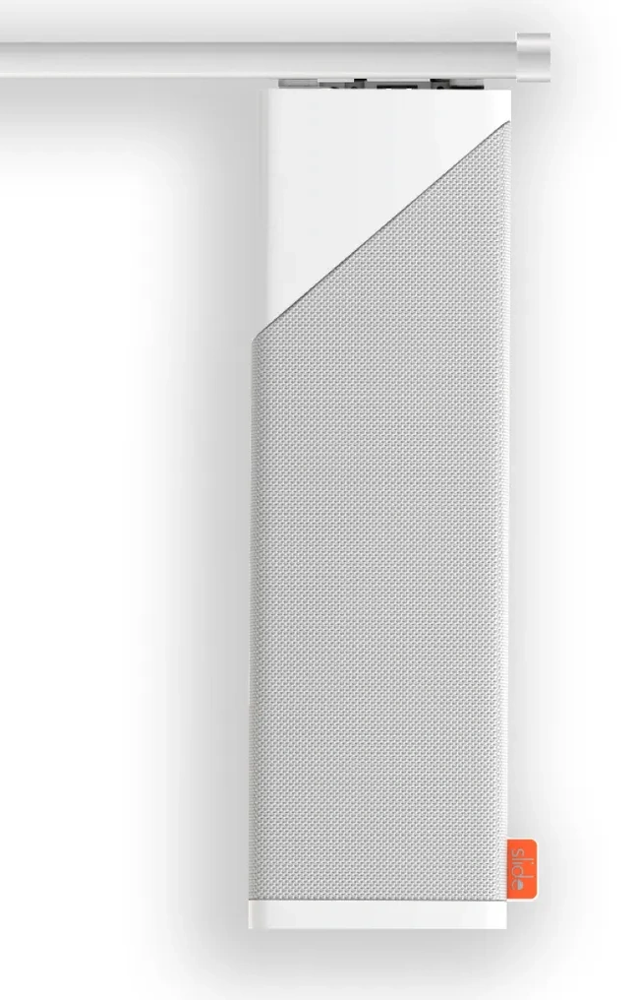
I was looking for smart curtains that work also completely locally, my main requirement for a new hardware device in my home.
Another requirement for me is: to control it also manually.

&nbsp;\
I found the **Slide Pro**, A Dutch product, which met all my requirements.
The manual control is possible if you give it a little tug, then it automatically opens or closes the curtains.

After a few months after buying the product, unfortunately, the company (Innovation in Motion) had to decide to stop the production and support. Due to its local functionality, the product won't end as useless brick when the online/remote functionality stops. My work-locally requirement proved itself again!

Luckily, another company, Robb Shop, took over the production, website and support and continues with this great product! Hopefully they can keep this product alive.

It's now (for only a few days) in [pre-order available only for &euro;149,-](https://www.robbshop.nl/pre-order-slide-slim-gordijnsysteem-wifi) Delivery will be probably in June because a new batch needs to be made.

The product website: https://slide.store

> **_NOTE:_** No affiliate links to this product, I'm just a happy user!

---

## Table of Contents
<!-- TOC -->
  * [Functionalities](#functionalities)
  * [Installation](#installation)
  * [Home Assistant](#home-assistant)
  * [Automations](#automations)
  * [API](#api)
  * [Links](#links)
<!-- TOC -->

---

## Functionalities

The Slide Pro has the following functionalities:
* Works only with U-rails ([supported rails](https://www.robbshop.nl/media/49/04/e2/1718151031/SLD_PRO_download_2.pdf))
* Local control via API (WiFi, no gateway required)
  * This makes it compatible with most smart home systems
* Local control via the [Android](https://play.google.com/store/apps/details?id=nl.innovationinmotion.slide&hl=us) / [iOS](https://itunes.apple.com/us/app/slide-by-iim/id1454014429?mt=8) app
* Pull wires completely invisible 
* Hardwired to power the motor with a 5m power cable
* Support for 0.5 - 6m curtains
* Support for left/right/middle opening curtains
  * middle opening works only if both sides have the same width
* The motor power is variable

<br>

See for all specifications the Dutch pre-order site: https://www.robbshop.nl/pre-order-slide-slim-gordijnsysteem-wifi
The current orders are delivered around June.

---

## Installation

The installation is quite easy. 
You can keep your original U-rail and retrofit it with this addition.\
You need wall power in a reach of 5 meters from the motor, luckily, you can add the motor to each side of the curtain.
You only need some space on each end of the U-rail to attach the end-holders.

<a href="images_slide_curtain/installation_elements.png">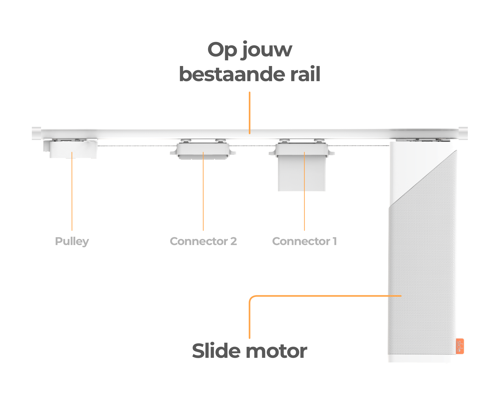</a>

This video shows the basic installation steps to take. 
When installing it yourself, the app contains a lot of steps to help you through the process and gives you the opportunity to install it also for left/right/middle opening curtains.

[](http://www.youtube.com/watch?v=V1wGxKrV05Q "Slide Hardware installation")

---

## Home Assistant

The Slide Local integration adds buttons to control the curtains.

> **_NOTE:_** The **Slide Local** integration is added in Home Assistant 2025.1.1

When you control the curtains with the Slide app you also see this in Home Assistant and the state will also change here.

### Add and setup the integration

Go to integrations and search for `Slide Local`

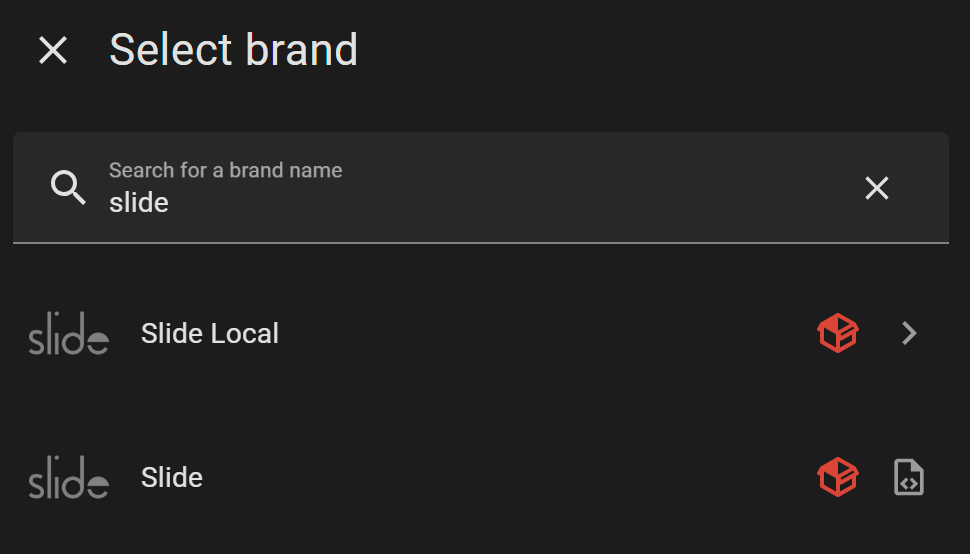

or use this link to install it direct in your own Home Assistant:

[](https://my.home-assistant.io/redirect/config_flow_start/?domain=slide_local)

Fill in the IP-address (and optional the device code) of the already installed Slide.\
In your router you can find it by the name `espressif`.  

<a href="images_slide_curtain/slide_parameters.png">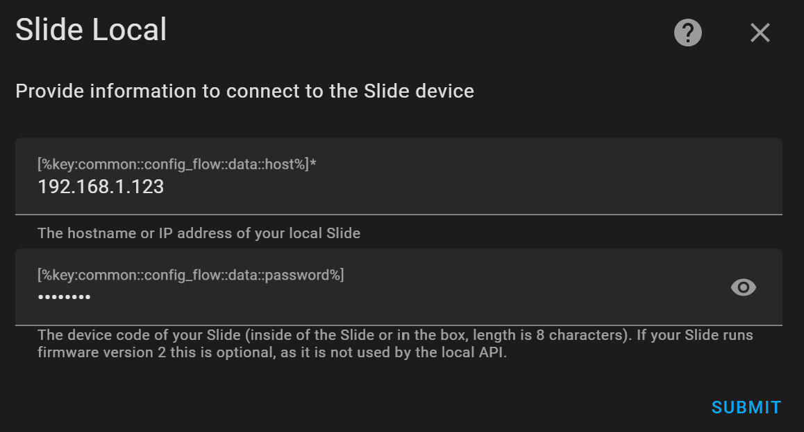</a>

When it's successfully added, you have the controls and configuration buttons available.

<a href="images_slide_curtain/slide_page.png">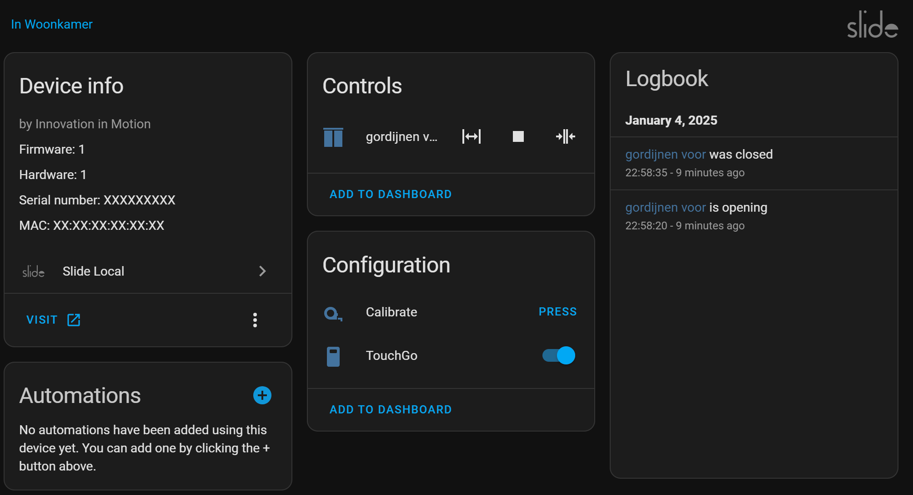</a>

### Dashboard controls

The curtain icon change based on the state of the curtains.

When it's closed, you see this icon:

<a href="images_slide_curtain/slide_dashboard_closed.png">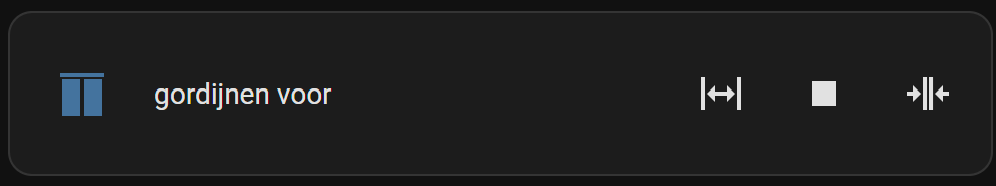</a>

When it's running and opening, you see this icon:

<a href="images_slide_curtain/slide_dashboard_opening.png">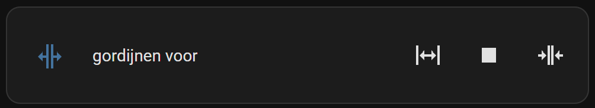</a>

When it's completely opened, you see this icon:

<a href="images_slide_curtain/slide_dashboard_opened.png">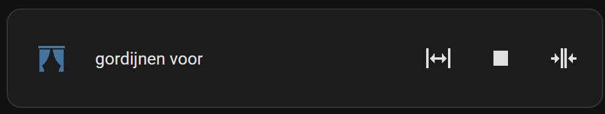</a>

When you click on the name of the curtain, you get a pop-up with two types of controls.\
The first type is a slider where you can open it a specific percentage.\
And the order one are with three buttons, open, stop and close.\
You can toggle the type on the bottom of the popup.

<a href="images_slide_curtain/slide_controls_1.png">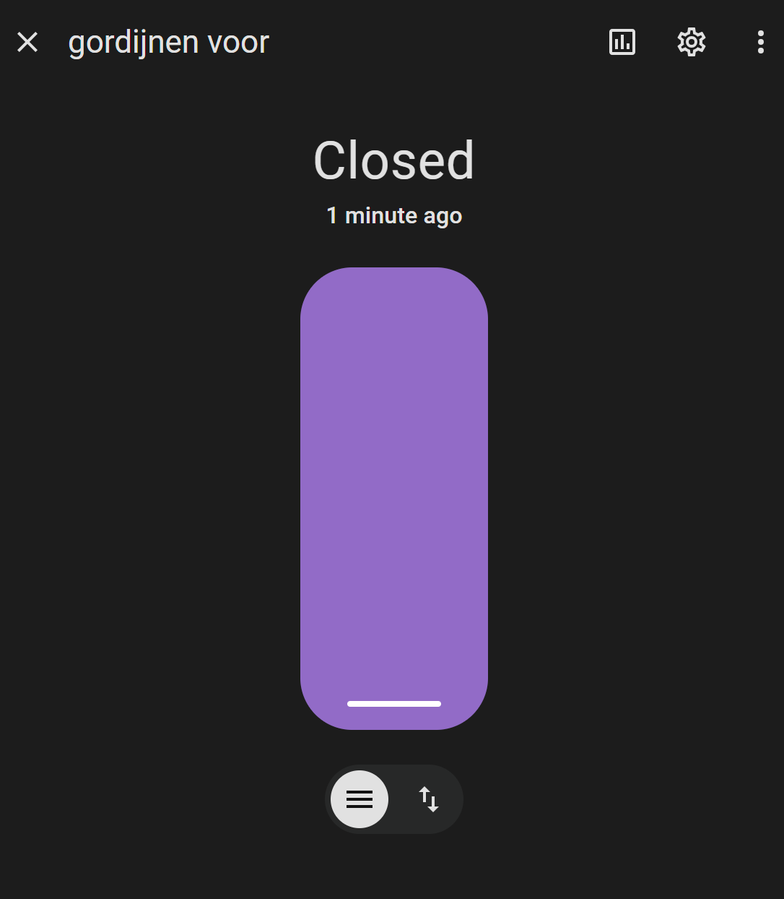</a>
&nbsp;
<a href="images_slide_curtain/slide_controls_2.png">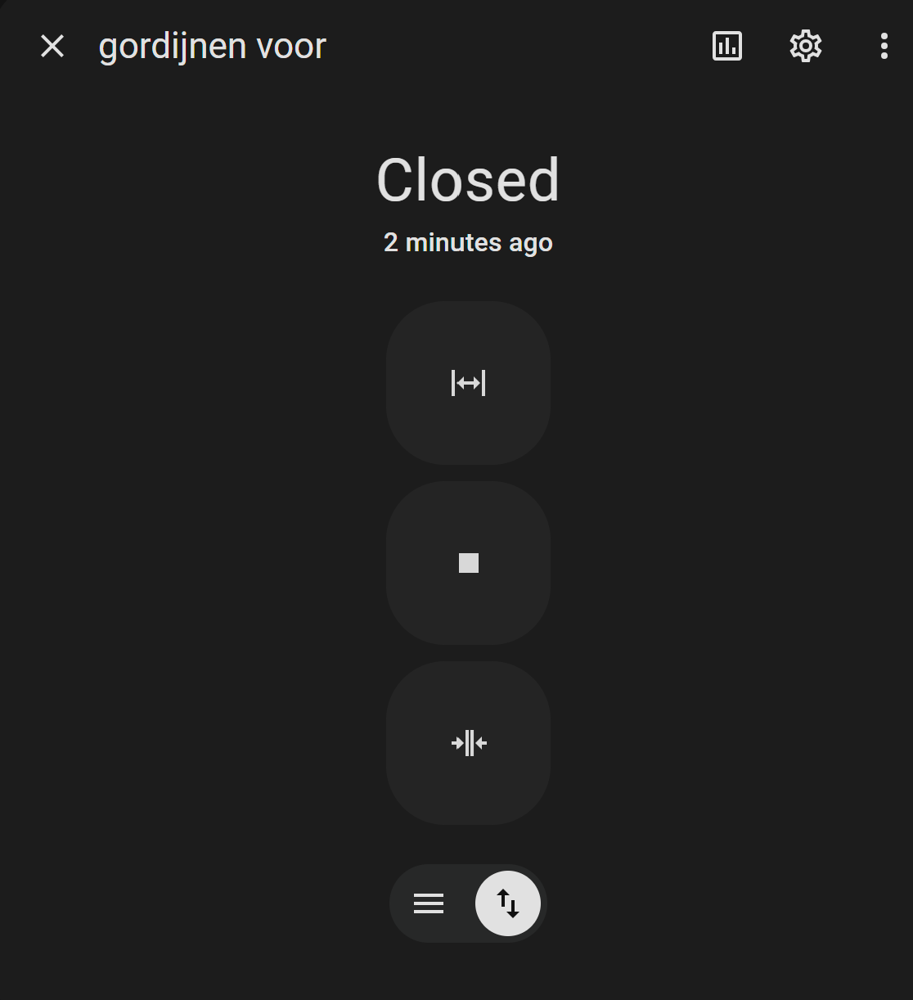</a>


The HA integration page: https://www.home-assistant.io/integrations/slide_local/

---

## Automations

I have some examples of automations which you can apply.

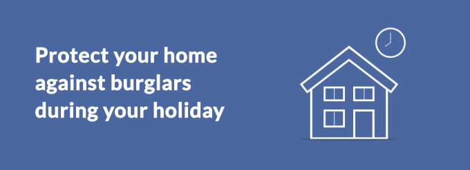

**Close it when...**
 
* it becomes dark after 16:00
  * I use for this automation a [lux sensor](/buy/smart_home_best_buy_tips#light-intensity-sensor) which detects the light intensity outside (from behind the window). Calculated dusk/dawn can also be used.
* the TV turns on to avoid reflection light from outside
* keep it closed to block the heat during a warm summer day
* keep it closed if nobody at home to keep the warm inside during the winter
&nbsp;
 
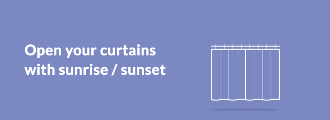

**Open it when...**

  * it becomes light enough after X o'clock
  * as wake-up with natural light
  * a delivery guy is expected
    * If you have an integration with expected packages or meal delivery
  * it's warmer inside than outside during a warm day

<br>

Do you have other curtain automations? 
Please let me know, I'm interested!

---

## API

The power of this device is the possibility to control it locally.\
This can be done via an available API on the IP-address of the device.

### Authentication

The API endpoint must contain these authentication headers.

```bash

 Type    : Digest
 Username: "user"
 Password: "{{slide_device_code}}"

```

The `slide_device_code` is an eight character value.

### Open/Close

There is an endpoint to trigger position of the curtains.

POST `/rpc/Slide.SetPos`

Body request:
```json

{  
  "pos": 0
}

```

Field `pos` value `0` for completely open, and value `1` for close.
You can also use a float value for a percentage opened curtains.

Response:
```json

{
  "response": "success"
}

```

### Current status

POST `/rpc/Slide.GetInfo`

No request body is required.

Response:
```json

{
  "slide_id": "slide_XXXXXXXXXXXX",
  "mac": "XXXXXXXXXXXX",
  "board_rev": 1,
  "device_name": "",
  "zone_name": "",
  "curtain_type": 0,
  "calib_time": 13591,
  "pos": 1.14,
  "touch_go": true
}

```

### Calibrate

POST `/rpc/Slide.Calibrate`

No request body is required.

### Stop

POST `/rpc/Slide.Stop`

No request body is required.

---

## Links

Related links to order, discuss and reviews of this device.

* [Pre-order one at RobbShop](https://www.robbshop.nl/pre-order-slide-slim-gordijnsysteem-wifi)
* [Tweaker discussion about this product (NL)](https://gathering.tweakers.net/forum/list_messages/1889015)
* [Reddit community](https://www.reddit.com/r/slidecurtains/)
* [Dutch YouTube review by Bright](https://www.youtube.com/watch?v=_dCzTU15QKs)
* [Dutch YouTube review by Coolblue](https://www.youtube.com/watch?v=ylDM4SSyO6Q)
* [Text reviews at Coolblue](https://www.coolblue.nl/en/product/864598/slide-smart-curtain-system.html)
