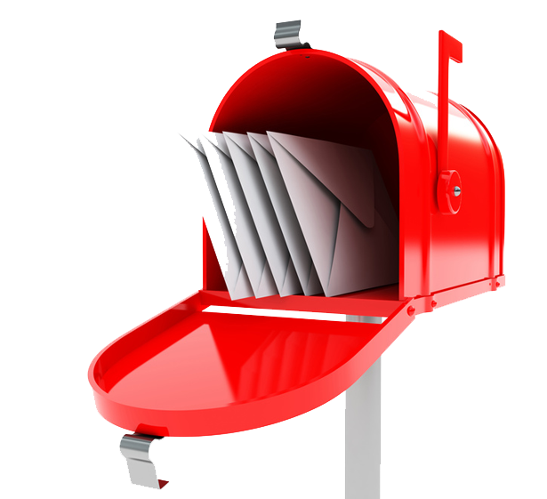
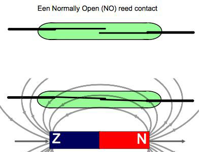
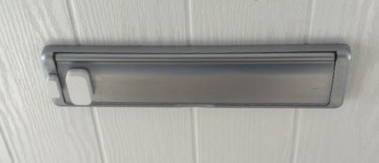
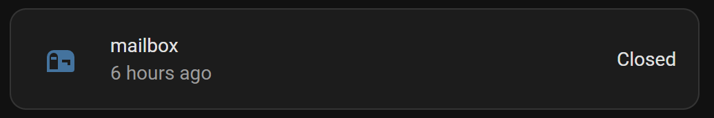
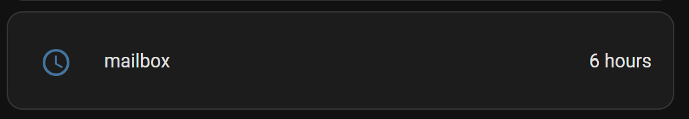

--- 
title: "Smart traditional mailbox"
description: "Make your traditional mailbox smart"
category: Projects
tags: [dumb, smart, mail, box, package, letter, traditional, snail]
image: /projects/images_mailbox/sensor_in_mailbox.jpg
---

# Smart traditional mailbox
*Build with a contact sensor*

## Introduction


A physical (snail)mail notification was one of the first projects I realized.
I lived in an apartment and had to go a few stairs down to check if there was mail delivered.
Sometimes you're waiting for a letter or package and want to know as soon as possible that it's delivered.
<br>
<br>
Here you can read how I've made different mail- and package boxes smart.
<br>
<br>


---
## Table of Contents
<!-- TOC -->
  * [My solution](#my-solution)
  * [Automations](#automations)
  * [Mailbox types](#mailbox-types)
    * [Mailbox](#mailbox)
    * [Letterbox flap](#letterbox-flap)
    * [Package box](#package-box)
  * [Alternative solutions](#alternative-solutions)
    * [Long range protocols](#long-range-protocols)
    * [Camera](#camera)
  * [Home Assistant](#home-assistant)
<!-- TOC -->

> **_NOTE:_** Links on this page can be affiliate links.

---

## My solution

I wanted first to see IF AND WHAT was delivered in my mailbox, so I used a Raspberry Pi Zero with camera 
and took every few minutes a photo and compare it with the previous one.
When the photo was totally different compared to the previous photo, mail was delivered and the photo was sent to my phone.
When I emptied the mailbox, the photo was again different compared to the previous one, but it was the same compared to a reference photo of an empty mailbox.
This marked the mailbox as empty again!\
This worked, but the only downside was that I had no main power supply nearby that mailbox.
I tried with a large battery pack and the use of deep sleep of the board, but still the battery was within less than two weeks empty. 
Changing every two weeks the battery wasn't a suitable solution.

I decided to make it less smart and use my already existing Zigbee network to place a contact sensor inside the mailbox to detect if the flap was opened. 
Less smart, but this battery lasts for way much longer!

<a href="/projects/images_mailbox/mailbox_contact_sensor.jpg">

</a>

---

## Automations

When you automate your mailbox, there are different automations possible:

* Notification on your phone when mail is delivered.
  * Detection: if the contact changes from true to false.
    
* Notification on your smart speaker when mail is delivered.
* Notification if mail is sticking out of the mailbox. 
  * Detection: the flap is opened but still not closed after a few seconds.
* Show the time since the mail was delivered.

<br>

For mailboxes with a locked door to get the mail out of it, some extra automations are possible:

* Set the status `Mail delivered` which can be used to show as status icon on your dashboard.
* Reset the `Mail delivered` status when the mailbox door is opened.

(I have all my automations in Node-RED, I can't share these HA automations.)

---
### Reed contact sensor

I only use reed contact sensors, this is how they work:\
By default, the magnet is placed close by the sensor so the two metals touch each other in the reed-contact and the circuit is closed.
When the mail man opens the flap, the magnet gets too far away and the reed-contact state changes to open, which triggers the change to the contact sensor.

<a href="images_mailbox/reedcontact.jpg"></a>

I use the Zigbee [Aqara contact sensor](/buy/smart_home_best_buy_tips#contact-sensor), they have a good range, long battery life and compact size.

---
## Mailbox types

Over the years, I converted several mailboxes into a smart mailbox.

### Mailbox

I had a metal mailbox, even it was made of (thin) metal, the Zigbee signal could go through it.
There was no Faraday-case effect that blocks the signal. I was afraid that should be the case.

I added a contact sensor on the inside of the mailbox and a magnet on the flap.
Instead of the default magnet provided by the sensor, I glued two strong normal magnets to the flap.
Those are also in the same color and the flap almost close as normal.
So those are not noticeable when you stand for it or when you open it.
When the flap was closed, the magnets are strong enough to trigger the reed sensor on the inside of the mailbox.

<a href="/ideas/images/mailbox.jpg"></a>

---

### Letterbox flap

For my letterbox, I used the regular sensor's magnet and connected it to the flap.
The sensor is small and on one side of the opening. 
It's a wide letterbox, so still all letters fit easily through it.

<a href="/projects/images_mailbox/mailbox_contact_sensor.jpg">

</a>

**Alternatives**

When your mailbox flap opens to the inside you can use the contact sensor like this:\
<a href="images_mailbox/mailbox_open_inside.jpg" target="_blank">
</a>

As another alternative, you can also (ab)use a [leak sensor with a probe](/buy/smart_home_best_buy_tips#leak-sensor) if you don't want the sensor to block a part of the opening.
Now you place the sensor inside your house and only the wire is required to be inside the opening, 
and when the flap is closed they need to be make contact to a metal plate (magnet is also metal) to let the circuit make a closed connection so the sensor knows the flap is closed.
You need to use a custom template to define the mailbox is closed (and it doesn't show as "leak detected").

<a href="/buy/smart_home_best_buy_tips#leak-sensor" target="_blank">
</a>

Or solder wires to a contact sensor yourself to only have those two wires inside your mailbox.
I have a [separated page](/zigbee/zigbee_water_leak_sensor) how I did this for a DIY leak sensor based on a contact sensor.

<a href="/zigbee/zigbee_water_leak_sensor" target="_blank">
</a>

---

### Package box

For bigger packages, I also have a package box next to my front door.
You can read a large blog post how I installed it [here](/projects/packages-mailbox-allux-600).

By default, it wasn't smart at all, but by adding two contact sensors it's now much smarter now.
It knows when a package is delivered, and it knows when the door is opened to remove the packages out of it.
I assume now no package is still there, after this door was opened and closed, again and show this on my dashboard.

This is how the Allux 600 looks from the outside. 
I added an extra sticker on top of it to get some extra attention from delivery companies to let them know they can put the package over here.

<a href="./images_allux-600/final-result.jpg">

</a>

When you open the top lid, another metal plate on the inside comes up to avoid people can steal package from it, 
and this will be part where the package will lie on.\
I placed the contact sensor here, inside where it's also dry, in the middle of the package box a contact sensor. 
This gets triggered when the lid is opened.

<a href="images_allux-600/lid_open_contact_sensor.jpg">

</a>

The second contact sensor is placed in the front door. 
When the front door (in the package box) is opened with the key, this contact breaks, and a trigger is sent by this other sensor.
Now you "know" no package is in the box anymore.

<a href="images_allux-600/front_door_contact_sensor.jpg" height="250px">

</a>

<br>

---

## Alternative solutions

I use Zigbee contact sensors, but there are more solutions to detect if there is mail.

### Leak sensor

A [leak sensor](/buy/smart_home_best_buy_tips#leak-sensor) with a probe, you can place and hide it a bit further away from the flap opening.
As long as the contacts make contact to a metal plate when the mailbox flap is closed.

<a href="/buy/smart_home_best_buy_tips#leak-sensor" target="_blank">
</a>

### Vibration sensor

A [vibration sensor](/buy/smart_home_best_buy_tips#vibration-sensor) can detect changes in x/y/z directions.
This can be attached to a flap which opens when mail is delivered.

### Long range protocols


In some cases, Zigbee doesn't have the range to reach for your mailbox because you life on a high floor in an apartment of you have a very long driveway.

Then you can use these protocols which support longer ranges:
* [Z-Wave Long Range](https://z-wavealliance.org/z-wave-long-range-technology/), up to 2.4 km (1.5 mi)
  * Nabu Casa created their own Z-Wave Long Range adapter, the [Home Assistant Connect ZWA-2](https://www.home-assistant.io/connect/zwa-2)
* [Long Range aka LoRa](https://en.wikipedia.org/wiki/LoRa), up to 10 km (6.1 mi)

### Camera

It is also possible to point a camera outside at your mailbox and with AI analyze the detected person or bus if it's someone from the mail- or package delivery. 

<br>

---

## Home Assistant

On a Home Assistant dashboard you can show different mail delivered statuses.

### Mailbox contact last time changed

Show as secondary information when the last time was that the status of the mailbox contact was changed and show the current status.



```yaml

# Sourcecode by vdbrink.github.io
# Dashboard entities card
type: entities
entities:
  - entity: binary_sensor.contact_mailbox_contact
    name: mailbox
    secondary_info: last-changed  

```
### Timer when the last time mail was delivered

Show the passed time since the last time the mailbox flap was opened. 



First, you need to create a new sensor.
This can be defined in the `configuration.yaml` or as Helper in Home Assistant itself.
With this code it will create a new sensor called `sensor.mailbox_timer`.

```yaml

# Sourcecode by vdbrink.github.io
# configuration.yaml
- platform: template
  sensors:
    mailbox_timer:
      friendly_name: mailbox
      icon_template: mdi:clock-outline
      value_template: >
        {{ relative_time(states.binary_sensor.contact_mailbox_contact.last_changed) }}

```

This timer can now be used on the dashboard.

```yaml

# Sourcecode by vdbrink.github.io
# Dashboard entities card
type: entities
entities:
  - entity: sensor.mailbox_timer
    name: mailbox

```

### Conditional message for two minutes

If you want to show a temporary message on your dashboard that mail is delivered, 
you can create a new sensor which is `true` for (in my case) two minutes which can be used as condition to show if mail is delivered.

The custom sensor template:
```yaml

# Sourcecode by vdbrink.github.io
# configuration.yaml
- platform: template
  sensors:
     mail_recently_changed:
          friendly_name: mailbox sensor triggered
          icon_template: mdi:radar
          value_template: >
             {{ (now() - states.binary_sensor.contact_mailbox_contact.last_changed).total_seconds() < 120 }}

```

The dashboard condition:
```yaml

type: entities
entities:
    - type: conditional
    conditions:
      - entity: binary_sensor.mailbox_recently_changed
        state: "on"
    card:
      type: entities
      entities:
        - entity: sensor.mailbox1_timer

```

### Mushroom icon to indicate there is a package delivered

Show an icon on your dashboard to indicate the package box is filled.


With a [custom binary sensor](/projects/packages-mailbox-allux-600#home-assistant), 
now the conditional card can be used to show only the package icon IF there is a package inside the package box.

If the `binary_sensor.packagebox` has the state `on` THEN show the orange package icon.

```yaml

# Sourcecode by vdbrink.github.io
# Dashboard conditional Mushroom card
type: conditional
conditions:
  - entity: binary_sensor.packagebox
    state: "on"
chip:
  type: template
  icon_color: orange
  icon: mdi:package-variant
  entity: binary_sensor.packagebox
  content: ""

```
<br>

For more Mushroom cards examples, see also my [Mushroom card](/homeassistant/homeassistant_dashboard_card_mushroom) page.

---

See my [Allux 600 package box project](/projects/packages-mailbox-allux-600#home-assistant) page how I created also other dashboard elements for my package box.


---

I hope you can use this for your own smart mailbox!