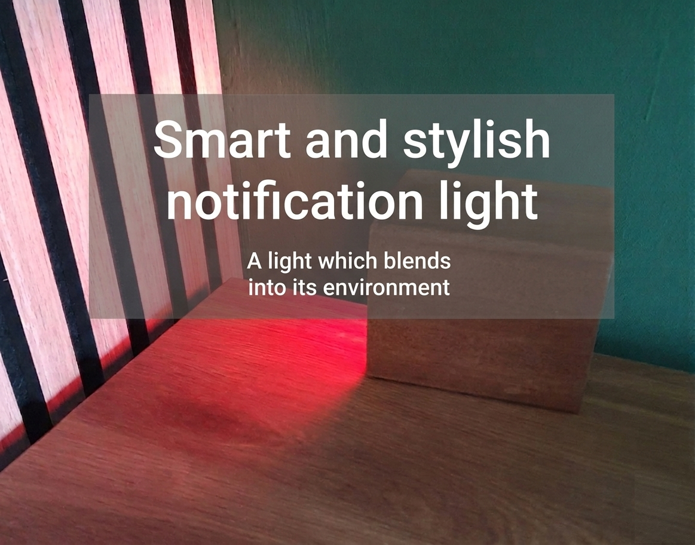
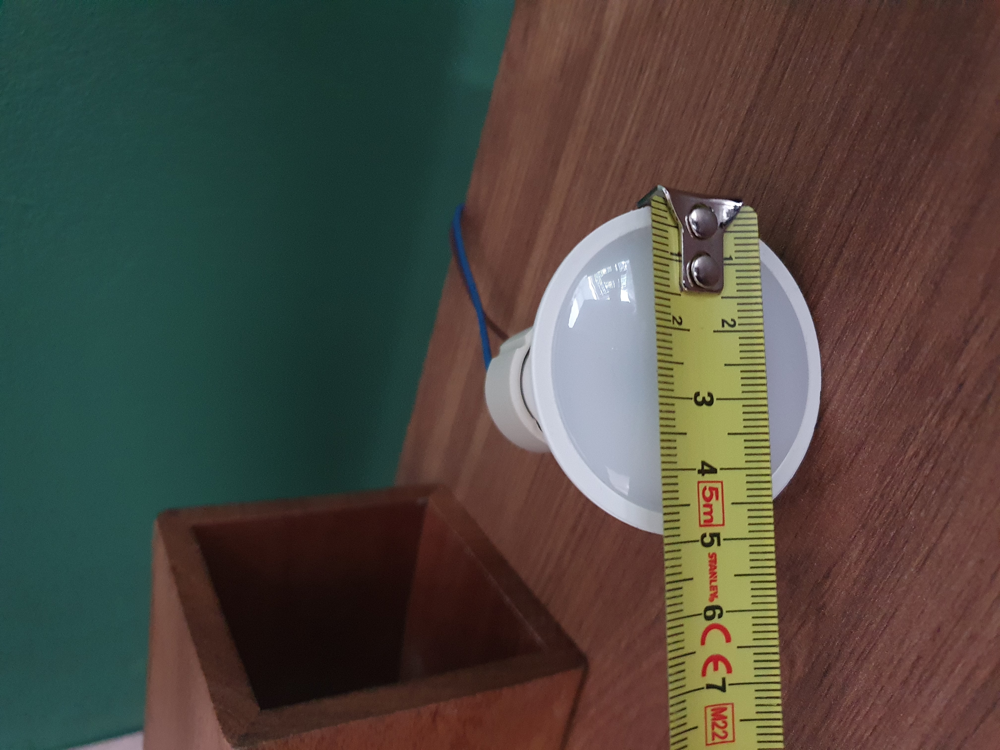
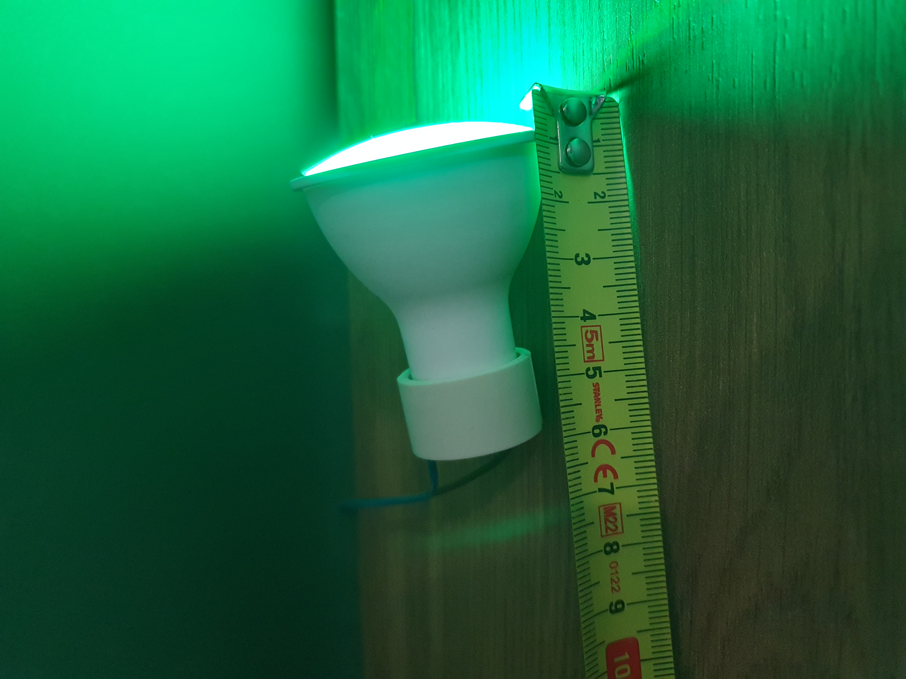
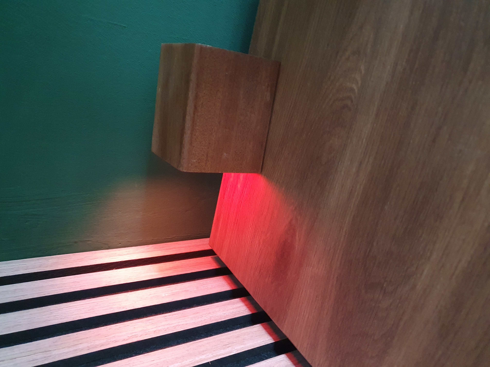
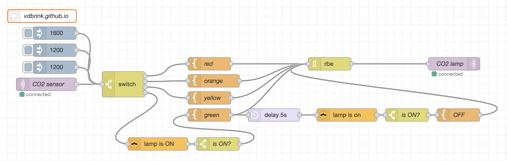



# Smart and stylish notification light

## Introduction

I wanted an indicator for my new office when the CO2 level is too high, and a warning system that doesn't look like an ugly plastic box or a normal lamp.
I wanted a more stylish item on my desk, something that blends in perfectly with the rest of it.
In normal mode, when the light is turned off, it shouldn't draw attention to itself.

I came up with a walnut pencil holder in which I put a small GU10 smart full-color light.
I could now automate this lamp with any color, linked to any kind of notification.
For now, I use it as a warning system when the CO2 level isn't good in my office.

I placed the pencil holder on its side so that the light reflects off the wall.

\
<em>Changing colors based on the current CO2 level.</em>

---
## Table of Contents
<!-- TOC -->
  * [Purposes](#purposes)
  * [Hardware](#hardware)
    * [GU10 Zigbee full color smart light](#gu10-zigbee-full-color-smart-light)
    * [GU10 fitting](#gu10-fitting)
    * [Power cable](#power-cable)
    * [Cable connector](#cable-connector)
    * [Stylish element to hide the lamp in](#stylish-element-to-hide-the-lamp-in)
  * [Connect the hardware](#connect-the-hardware)
  * [Automation](#automation)
<!-- TOC -->

---

## Purposes

I linked it to the CO2 level, but it can also be used for all kinds of notifications.\
Because the light can be set to any color, you can use it for different indicators or combine multiple indicators, each with its own color.

Examples of light notifications are:
* CO2 level too high, from a little too high (orange) to way too high (red).
  * Create your own CO2 sensor with [DIY CO2 sensor - based on ESPHome with a SCD40 sensor](/esphome/co2_scd40)
  
* Is trash can day tomorrow? Match the color of the bin.
  * [Bin day - LED strip reminder](/projects/bin_day_led_strip_reminder)
  
* Mail is delivered.
  * [Smart traditional mailbox](/projects/smart_mailbox)

* When someone is working at home and doesn't want to be interrupted.

* Indicate that a calendar meeting will start in a few minutes.

 
_Do you have any other ideas for a light notification? Let me know!_

---
## Hardware

> **_WARNING:_** If you're not familiar with soldering and electronics, you should ask a professional for help.

For this project, I used these products:

* GU10 Zigbee full-color smart light
* GU10 fitting
* Power cable
* Cable connector (optional)
* Stylish element to hide the lamp in

> **_NOTE:_** Links on this page can be affiliate links.

All these products are also available on Amazon and bundled on these [Amazon US](https://amzn.to/4drcBqy) and [Amazon NL](https://amzn.to/4uWTsUR) pages.

### GU10 Zigbee full color smart light

I already have a Zigbee network, so I chose Zigbee, but this can also be replaced with a similar WiFi GU10 light.

{{imgBasket}}Zigbee GU10 full-color light with RGB and an E14 fitting
<a href="https://s.click.aliexpress.com/e/_c3T9TMn5" target="_blank">(AliExpress)</a>
<a href="https://amzn.to/3PLzxcm#ad" target="_blank">(Amazon US)</a>
<a href="https://amzn.to/4nyvcWC#ad" target="_blank">(Amazon NL)</a>

### GU10 fitting

A GU10 fitting is only a holder for the light and is connected to the power.
There is no need for any voltage adapter or screw system to connect the lamp in the fitting, unlike with an E27 fitting.
This makes it possible to hide this lamp in something small.

{{imgBasket}}Ceramic lamp fitting for GU10
<a href="https://s.click.aliexpress.com/e/_c3E9CGrt" target="_blank">(AliExpress)</a>
<a href="https://amzn.to/4eQsae0#ad" target="_blank">(Amazon US)</a>
<a href="https://amzn.to/4uiccy6#ad" target="_blank">(Amazon NL)</a>

### Power cable

A GU10 light uses the EU 230V from the wall outlet, so there is no need to lower the voltage first with an adapter.

If you have a spare 230V cable, you can use that as well.\
{{imgBasket}}EU 230V power cable
<a href="https://s.click.aliexpress.com/e/_c3bMDrSL" target="_blank">(AliExpress)</a>
<a href="https://amzn.to/4tyCTgJ#ad" target="_blank">(Amazon US)</a>
<a href="https://amzn.to/4wEZjQn#ad" target="_blank">(Amazon NL)</a>

### Cable connector

If you don't want to solder the power cable directly to the GU10 fitting, you can use a cable connector to connect the power cable to the GU10 fitting.

{{imgBasket}}Cable connector
<a href="https://s.click.aliexpress.com/e/_c3PR90Mh" target="_blank">(AliExpress)</a>
<a href="https://amzn.to/49RB6w8#ad" target="_blank">(Amazon US)</a>
<a href="https://amzn.to/#ad" target="_blank">(Amazon NL)</a>

### Stylish element to hide the lamp in

The holder for the light can be anything with a minimum opening of 5 x 6 cm to fit the GU10 light.

&nbsp;&nbsp;

Because my desk is made of walnut wood and is decorated only with black items, I chose this pencil holder, which fits perfectly with the rest of my desk and blends in with its surroundings.

{{imgBasket}}Walnut pencil holder
<a href="https://s.click.aliexpress.com/e/_c3X7srbV" target="_blank">(AliExpress)</a>
<a href="https://amzn.to/43hjVAp#ad" target="_blank">(Amazon US)</a>
<a href="https://amzn.to/4wxXbJW#ad" target="_blank">(Amazon NL)</a>

---
## Connect the hardware

Screw the GU10 light into the fitting.

There are two ways to connect the wires.
> **_WARNING:_** If you're not familiar with soldering and electronics, you should ask a professional for help.

* With soldering: Remove the wires from the GU10 fitting, strip the end of the power cable, and solder the two wires directly onto the fitting.
* Without soldering: Use a cable connector to connect the GU10 fitting to the power cable.

Connect the power adapter into the wall to make sure it always powered.

&nbsp;

&nbsp;

First, test the setup.

When you're happy with the end result, you can drill a hole in the pencil holder and put the cable through it.

---
## Automation

Register the smart light to your network.\
Now an automation can be made with the lamp!

I chose to use the room CO2 sensor output and set the light to a corresponding color.

If the CO2 value is higher than 1100, the color will be yellow.\
If the CO2 value is higher than 1300, the color will be orange.\
If the CO2 value is higher than 1500, the color will be red.\
If the CO2 value drops below 950 again, and the light is still on, the color will be green and, after 5 seconds, the light will go off.

This flow looks like this in Node-RED.

You can download this [flow](images_noti_light/co2_noti_light.json).

---

_Do you know of any other automations that can be used with a light like this? Let me know!_

\
<em>Switching colors from yellow (warning) to red (alert), back to green (okay again), then off.</em>

_I'd like to see your version of the "Smart and stylish notification light". Please share it!_
