# Stretch display
*With a Home Assistant dashboard*

---
## Introduction

<a href="index">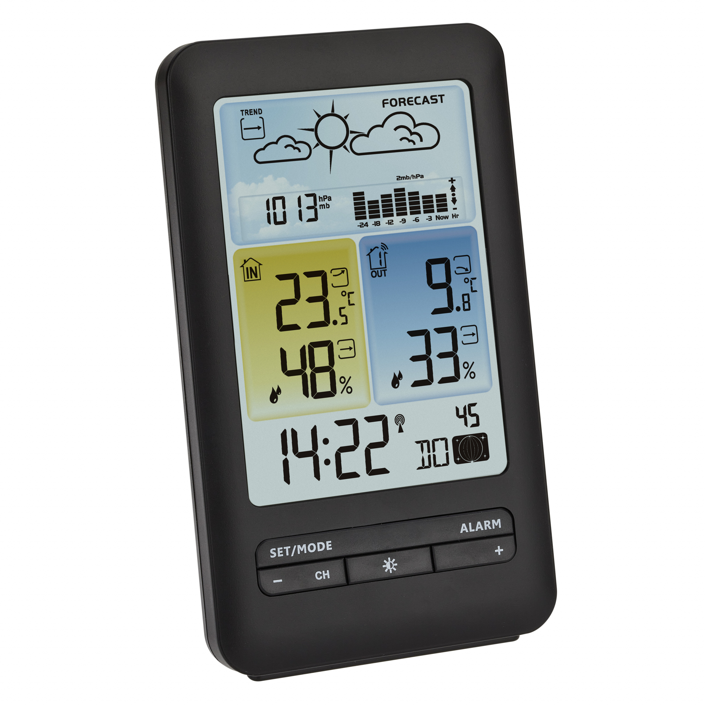</a>
I had for years a basic weather station with a radio receiver to see the in- and outside weather data (temperature, humidity and pressure). Now with Home Assistant, and my local weather station, I have so much more weather data available that I want to replace my old weather station display for something new, based on the data in Home assistant.

I was also looking for a small display to show the actual CO2 and temperature data in my home office.
I found out when the CO2 was too high and/or the temperature is above 23 degrees, the concentration drops.

> This page is still under construction, I fill in all chapters one by one how I set it up. So you can create exactly the same, or use it as a reference for your own display project.

---
## My solutions

A small stretched display, next to my monitor, where I can see my office climate data in a Home Assistant dashboard, controlled by a Raspberry pi.

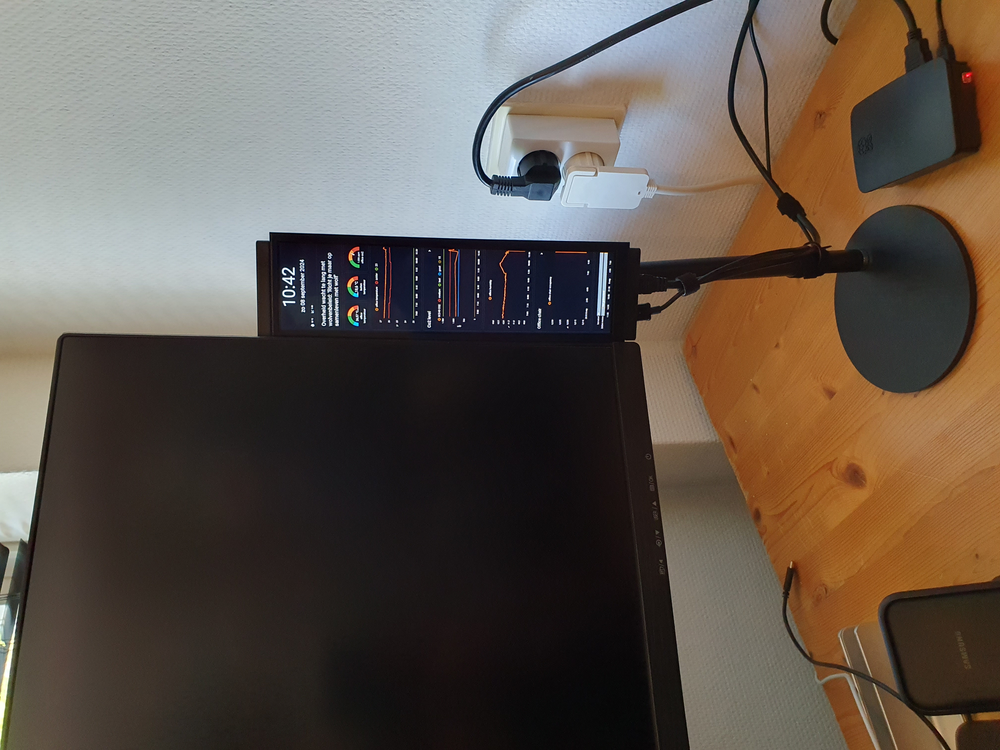

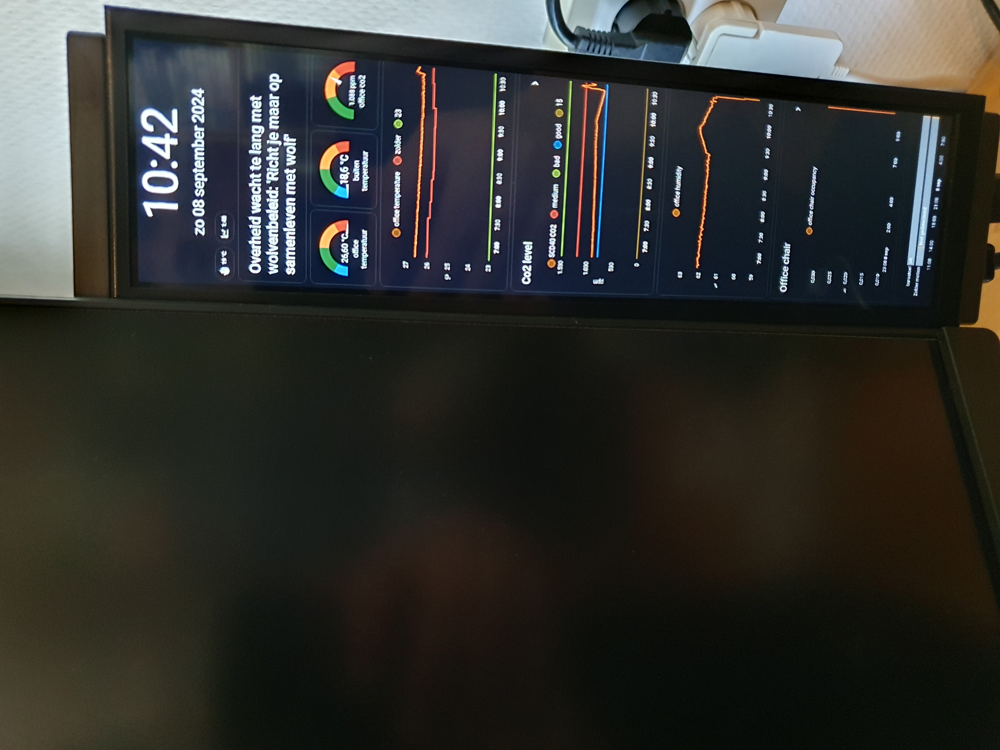

I created two Home Assistant dashboards: one for my office climate and the other as my weather data display.

&nbsp;
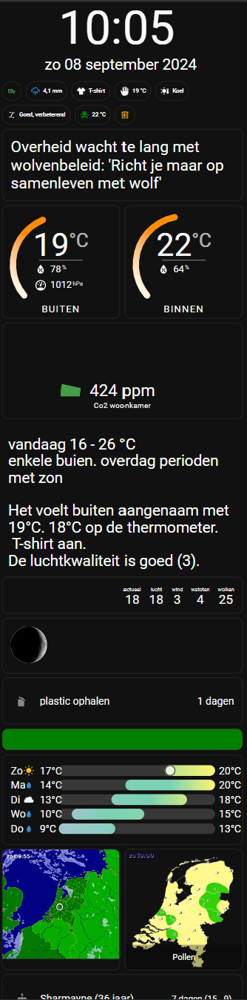

[//]: # (I considered just using a normal tablet, but for me, it was quite big.)

---

## Table of Contents
<!-- TOC -->
  * [Introduction](#introduction)
  * [My solutions](#my-solutions)
  * [Required hardware](#required-hardware)
  * [Required software](#required-software)
  * [Display PC configuration](#display-pc-configuration)
    * [Install Raspberry OS Desktop](#install-raspberry-os-desktop)
    * [Auto-load browser in kiosk mode on boot](#auto-load-browser-in-kiosk-mode-on-boot)
    * [Home Assistant auto login user](#home-assistant-auto-login-user)
    * [Energy saving](#energy-saving)
  * [Home Assistant dashboard](#home-assistant-dashboard)
    * [Weather station stretch display](#weather-station-stretch-display)
    * [Office stretch display](#office-stretch-display)
  * [Future improvements](#future-improvements)
<!-- TOC -->

---

## Required hardware

It's always good to use parts which you still have lying around, but otherwise you can buy these products as well to create this project yourself.\
Also affiliate links are used here.

These hardware components (or alternatives) are required:

### Stretch Display

For my project, I use option 1, but there are a lot of displays available on the market!

#### Option 1

<a href="https://s.click.aliexpress.com/e/_DEfuj8B" target="_blank">Stretch Display 1</a> ~ &euro; 50,- (AliExpress)
* 8.8 Inch 
* Resolution 1920 * 480
* NO touchscreen
* Comes with power and HDMI cable

  <a href="https://s.click.aliexpress.com/e/_DeEXehl" target="_blank">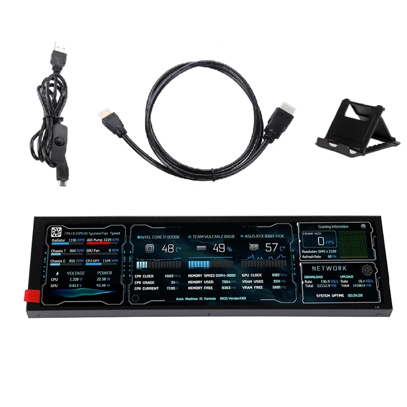</a>

#### Option 2

<a href="https://s.click.aliexpress.com/e/_DEmLYoL" target="_blank">Stretch Display 2 (select the touch variant)</a> ~ &euro; 110,- (AliExpress)
* Same size and resolution but a better version as above
* WITH IPS touchscreen
* Brighter colors
* Raspberry mount on the back

  <a href="https://s.click.aliexpress.com/e/_DEmLYoL" target="_blank">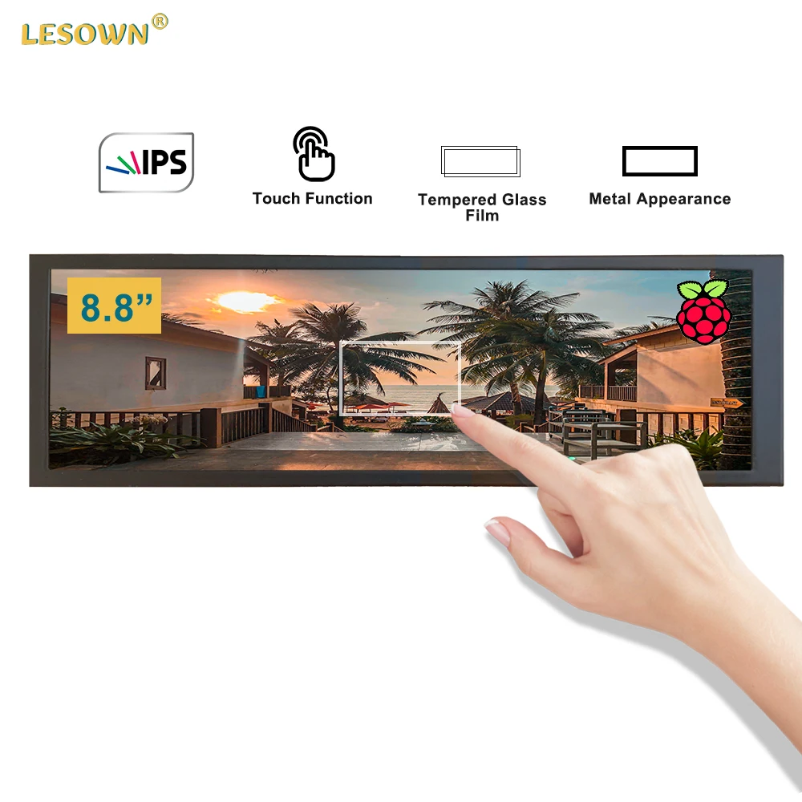</a>

#### Option 3

<a href="https://nl.aliexpress.com/w/wholesale-stretch-monitor.html?g=y&SearchText=stretch+monitor&sortType=price_asc" target="_blank">Stretch displays are also in all different size available</a> (Aliexpress)

Of course, any other display can also be used!

---

### Display holder

<a href="https://s.click.aliexpress.com/e/_Dek5V2b" target="_blank">Display holder</a> (AliExpress) 

The mount for the display can stretch to hold devices in a range of 4.7" - 17.3". 
It fits perfect between the claws, and the cables fit also perfectly through the bottom and directly connect to the ports. 
Which gives it a smooth design.

The stand itself can also adjust in height and angle to position the display in the right position. 
The big round heavy feet make it stand stable.
  
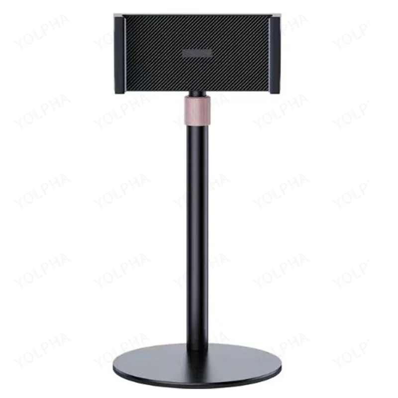

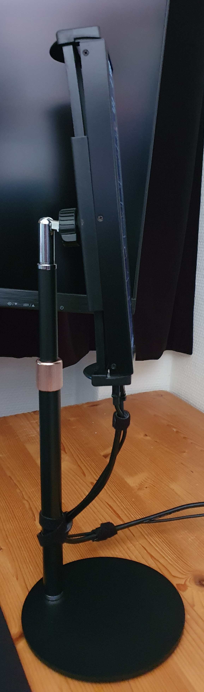

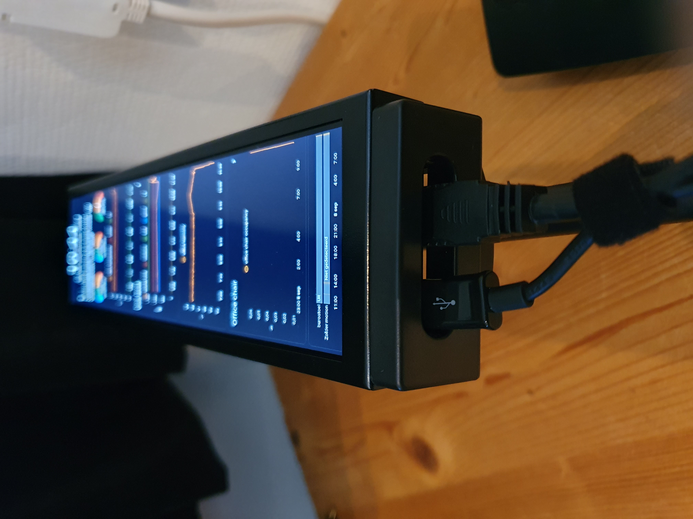

---


### Device with a web browser

A small device with an OS which can run a web browser on it.\
I had a <a href="https://s.click.aliexpress.com/e/_DeRuI2X" target="_blank">Raspberry 3B</a> (AliExpress) lying around which I could use. I bought a black <a href="https://s.click.aliexpress.com/e/_Dmj5kZp" target="_blank">case</a> (AliExpress) for it.\
You can also buy a cheaper <a href="https://s.click.aliexpress.com/e/_Dd3Z9UJ" target="_blank">Raspberry Pi Zero W</a> (AliExpress), a faster <a href="https://s.click.aliexpress.com/e/_DBzV3yf" target="_blank">Raspberry Pi Zero 2 W</a> (AliExpress) or use an old mobile phone. For a mobile phone, I recommend to remove the battery and hack an USB power plug to it.

<a href="https://s.click.aliexpress.com/e/_DeRuI2X" target="_blank">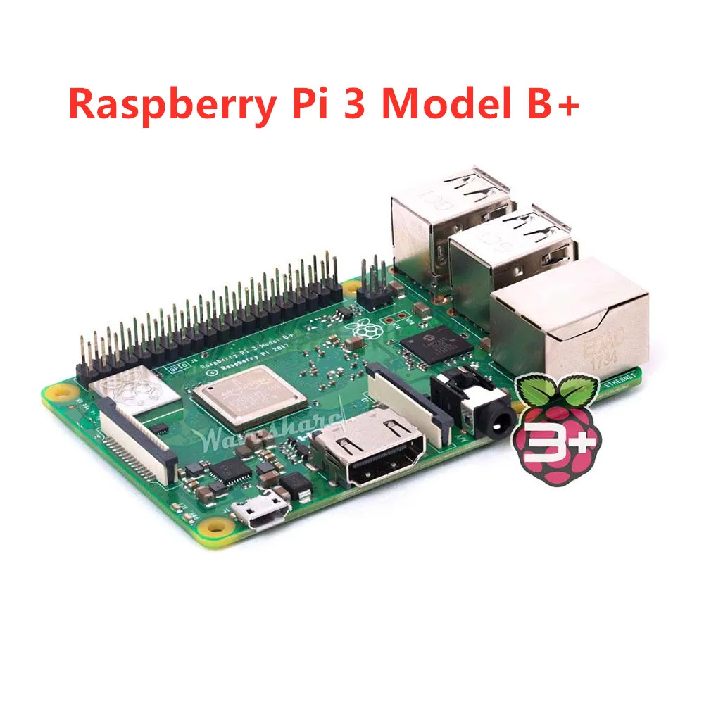</a>
<a href="https://s.click.aliexpress.com/e/_Dd3Z9UJ" target="_blank">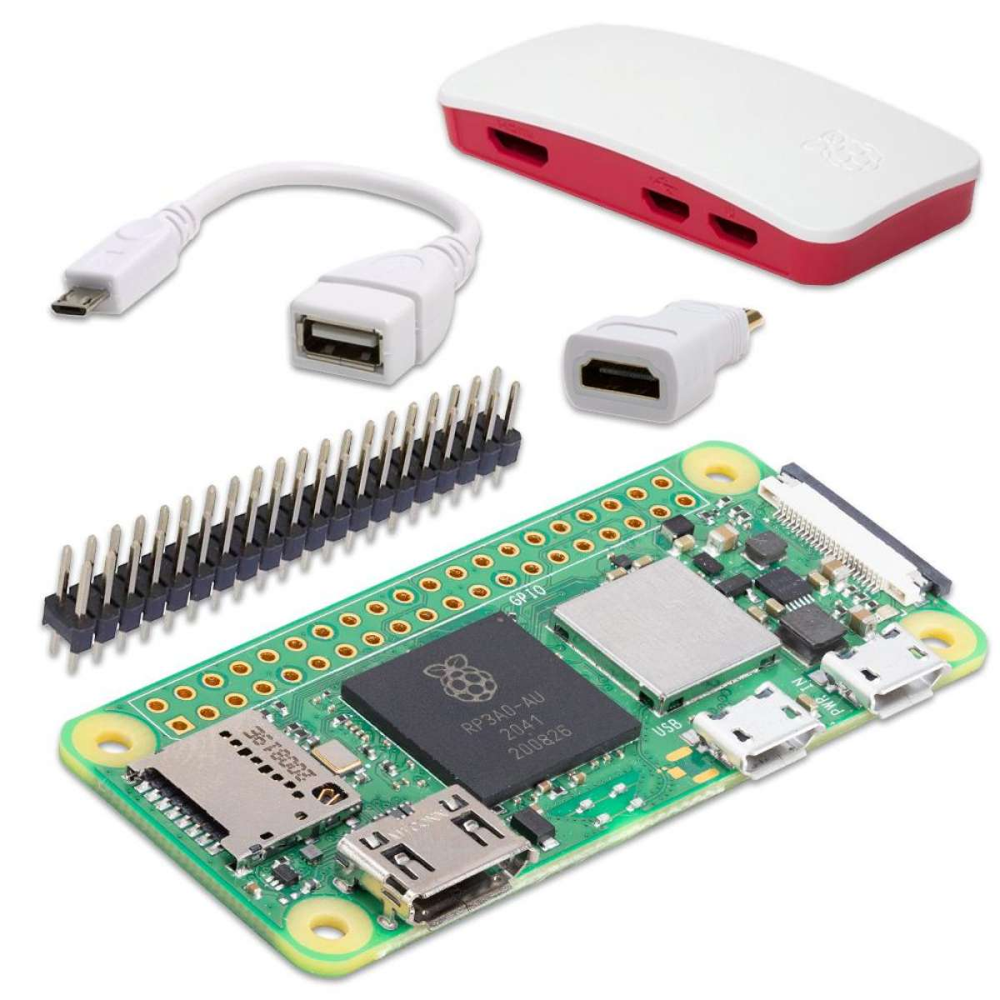</a>
<a href="https://s.click.aliexpress.com/e/_Dmj5kZp" target="_blank">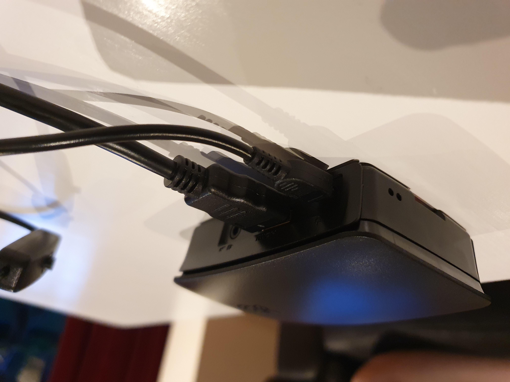</a>


#### Micro SD-card

<a href="https://s.click.aliexpress.com/e/_oFKX7oZ" target="_blank">SD card</a> to install the OS on, such as Raspberry Pi OS desktop.
A minimal of 8 GB version is already enough, but larger one are just a little bit more expensive.
Speed is not an issue for this card, it only boots and then doesn't need to read and write once it's booted.

<a href="https://s.click.aliexpress.com/e/_oFKX7oZ" target="_blank">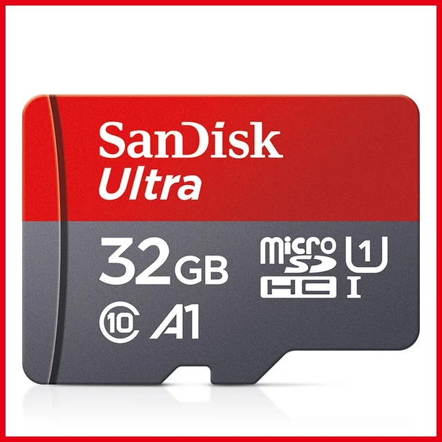</a>

#### Power

To power the Raspberry 3B it requires at least 5V with 3A, otherwise you get the message "Low voltage warning" in Raspberry OS.
To also power the display, I use <a href="https://s.click.aliexpress.com/e/_DEeGxaf" target="_blank">this adapter</a>.

<a href="https://s.click.aliexpress.com/e/_DEeGxaf" target="_blank">
</a>

An <a href="https://s.click.aliexpress.com/e/_DEOs79d" target="_blank">USB cable</a> type A to micro USB to power the RPI 3.

<a href="https://s.click.aliexpress.com/e/_DEOs79d" target="_blank">
</a>

---

### EU Smart socket

<a href="../buy/smart_home_best_buy_tips#smart-socket">Zigbee smart EU plug</a> (AliExpress), to only run the PC and display only when someone is nearby otherwise it can automatically be turned off to save energy.

  <a href="../buy/smart_home_best_buy_tips#smart-socket"></a>

---

### USB Keyboard

Optional [USB keyboard](https://s.click.aliexpress.com/e/_EywEzrL) to install the Raspberry.\
They have different versions with different layouts.\
Once installed, it can be controlled via SSH.

<a href="https://s.click.aliexpress.com/e/_EywEzrL ">
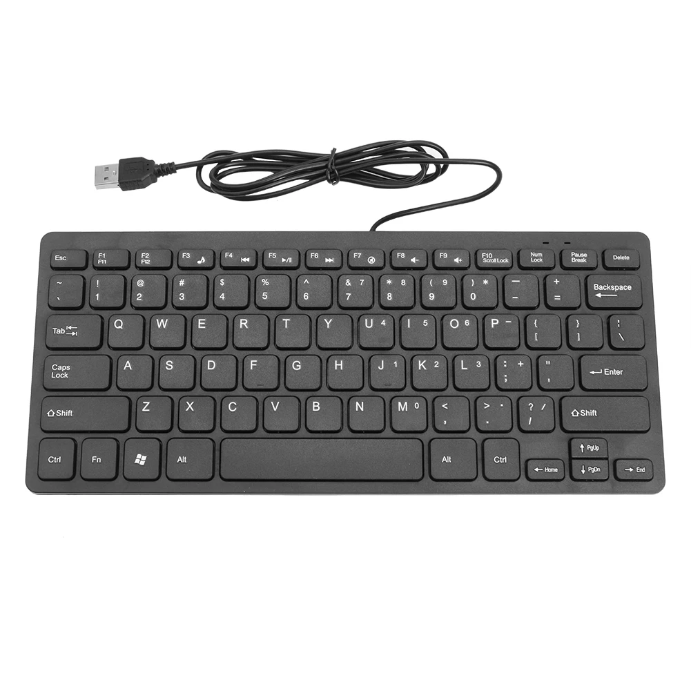
</a>

---

### CO2 sensor

I have a [project page](/esphome/co2_scd40) how to create a cheap CO2 sensor yourself.

<a href="/esphome/co2_scd40"></a>

---

### Temperature sensor

An example of a temperature sensor is this [Aqara Zigbee sensor](/buy/smart_home_best_buy_tips#temperature-sensor).

<a href="/buy/smart_home_best_buy_tips#temperature-sensor"></a>

<br>

Found a dead link? [Please inform me](https://github.com/vdbrink/vdbrink.github.io/issues)

<a href="/buy/esphome_diy" target="_blank">Alternative links</a> for above mentioned products.

---

## Required software

 https://www.raspberrypi.com/software/operating-systems/

Home Assistant

---

## Display PC configuration

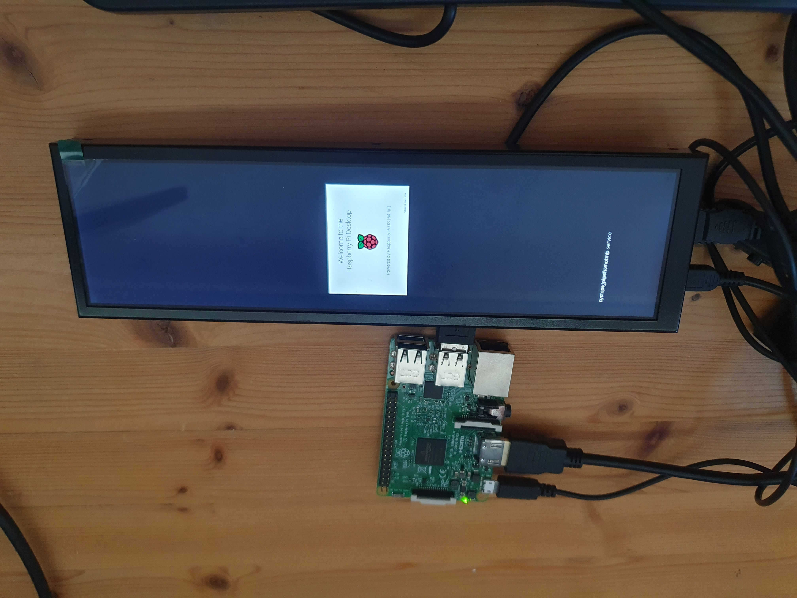


### Install Raspberry OS Desktop


### Auto load browser in kiosk mode on boot

### Home Assistant auto login user

### Home Assistant hide header toolbar

https://github.com/NemesisRE/kiosk-mode

### Energy saving - auto boot/shutdown

---

## Home Assistant dashboard

See [this](/homeassistant/homeassistant_dashboard_stretch_layout) page where I describe the different elements on the dashboard.

### Weather station stretch display


---

### Office stretch display


[//]: # (---)

[//]: # (## Future improvements)

[//]: # ()
[//]: # (* Auto switch tabs )

[//]: # (* Custom boot logo)

[//]: # (* Nice casing)

[//]: # ()
[//]: # (---)

[//]: # ()
[//]: # (RPI OS 64 bit )

[//]: # (activate wifi)

[//]: # ()
[//]: # (activate SSH)

[//]: # ()
[//]: # (Raspberry Pi Kiosk mode)

[//]: # ()
[//]: # (Auto boot with full screen Home Assistant url in a Chrome window.)

[//]: # ()
[//]: # (sudo raspi-config)

[//]: # ()
[//]: # (wayland RPI 4 + 5)

[//]: # (https://www.raspberrypi.com/tutorials/how-to-use-a-raspberry-pi-in-kiosk-mode/)

[//]: # ()
[//]: # (X11 RPI 3)

[//]: # (sudo apt-get install matchbox-window-manager xautomation unclutter)

[//]: # ()
[//]: # ()
[//]: # (vim /home/pi/.config/lxsession/LXDE-pi/autostart)

[//]: # ()
[//]: # (```yaml)

[//]: # ()

[//]: # (@xset s off)

[//]: # (@xset -dpms)

[//]: # (@xset s noblank)

[//]: # (@chromium-browser --kiosk -disable-translate --hide-scrollbars -enable-features=OverlayScrollbar,OverlayScrollbarFlashAfterAnyScrollUpdate,OverlayScrollbarFlashWhenMouseEnter --app=http://192.168.1.100:8123/stretch-display/0)

[//]: # (@unclutter -idle 0)

[//]: # ()

[//]: # (```)

[//]: # ()
[//]: # (https://www.espboards.dev/blog/raspberry-lcd-screen-homeassistant/)

[//]: # (ander 3 maanden actieve login )

[//]: # ()
[//]: # (---)

[//]: # ()

---

Links to other sections of this blog site:

[Main page](../index) | [Other projects](index) | [Home Assistant](../homeassistant/index) | [ESPHome](../esphome/index) | [Node RED](../node-red/index)