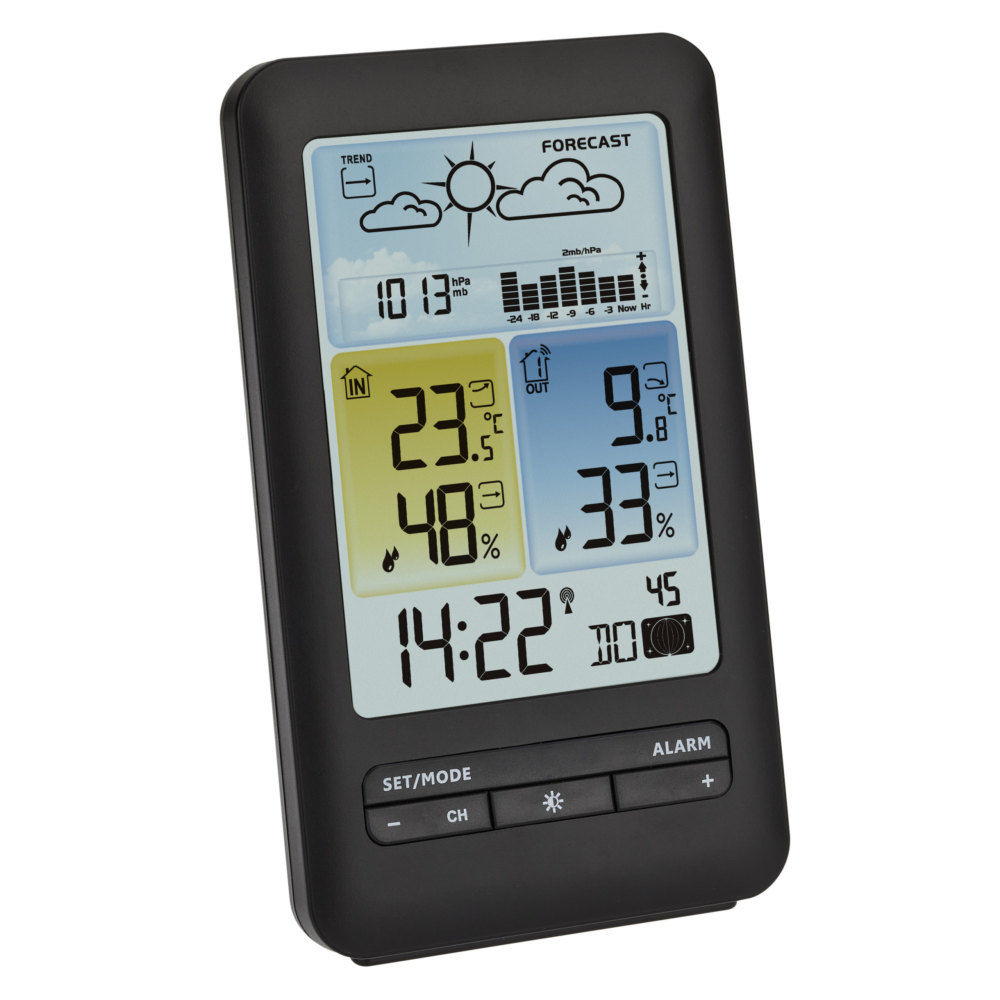
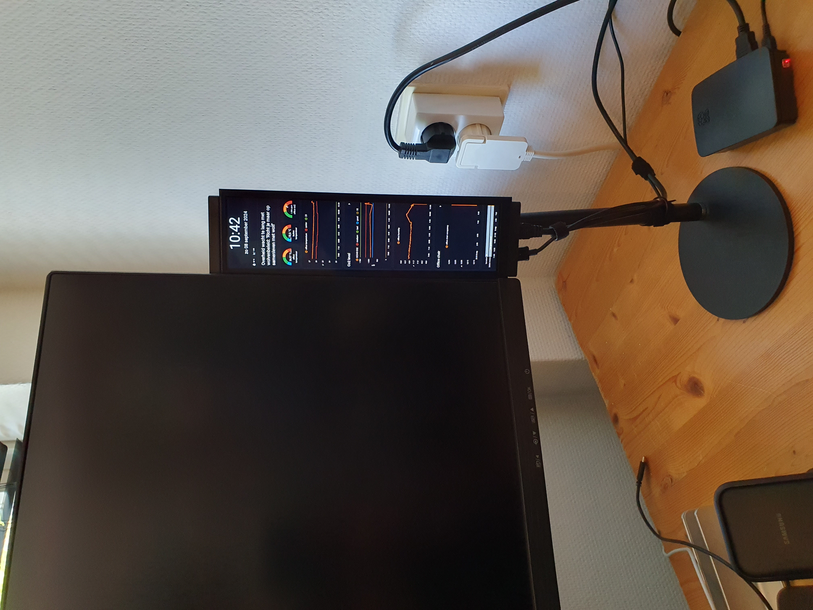
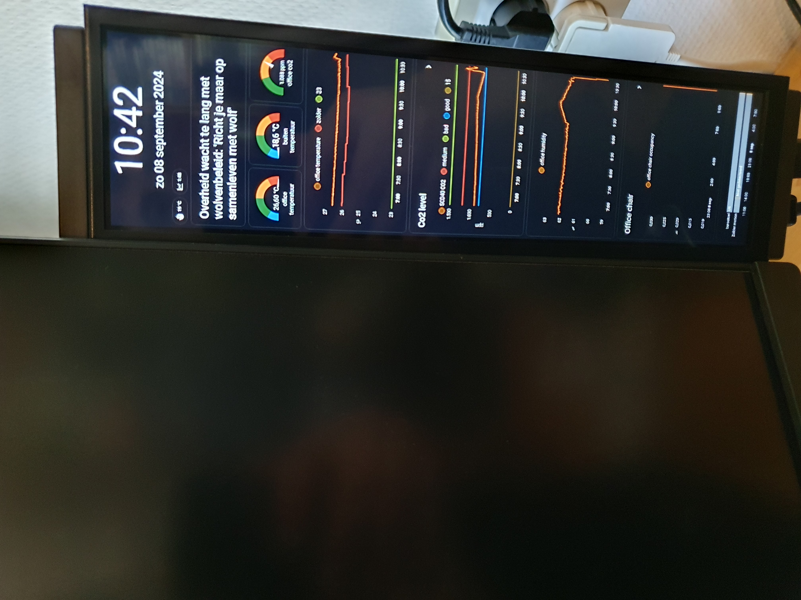
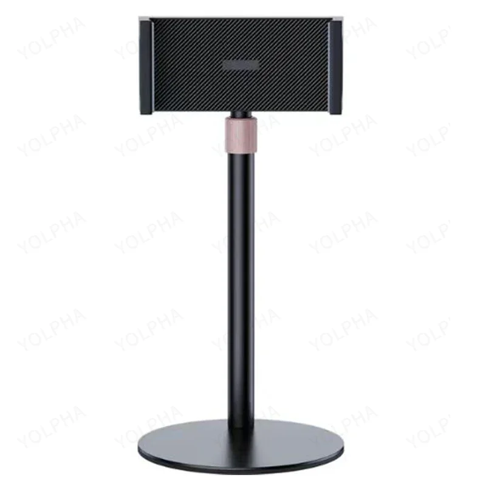
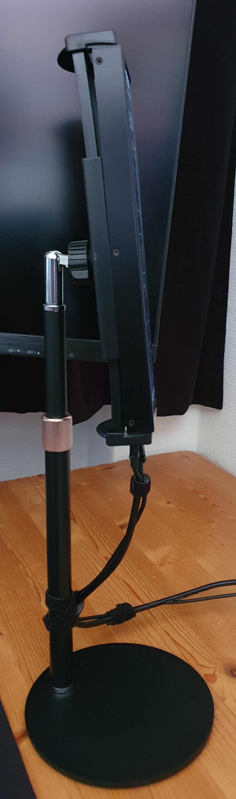
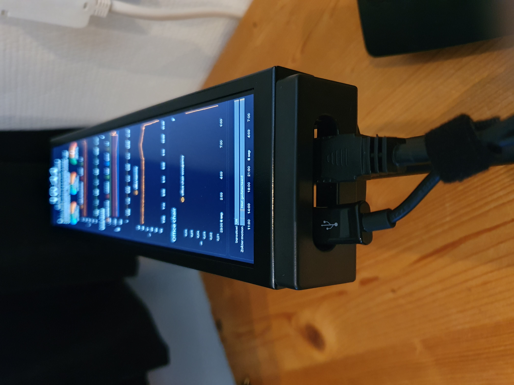
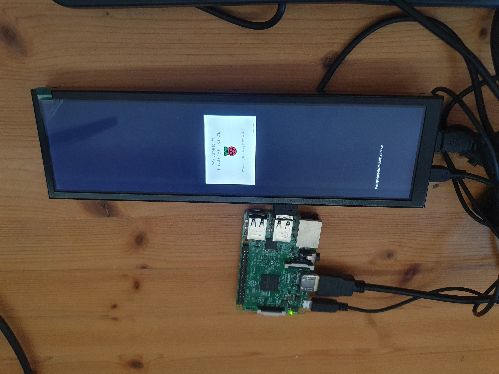
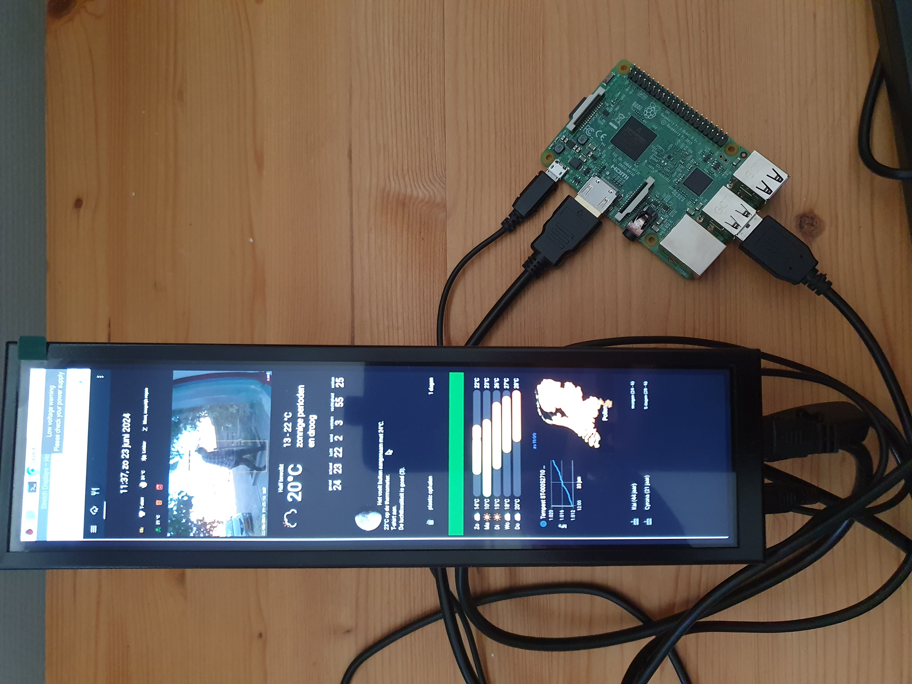

# Stretch display
*With a Home Assistant dashboard*

---
## Introduction

<a href="index"></a>
I had for years a basic weather station with a radio receiver to see the indoor and outdoor weather data (temperature, humidity and pressure). Now with Home Assistant and my local weather station, I have so much more weather data available that I want to replace my old weather station display with something new, based on the data in Home Assistant.

I was also looking for a small display to show the actual CO2 and temperature data in my home office.
I found that when the CO2 is too high and/or the temperature is above 23 degrees, my concentration drops.

> This page is still under construction, I fill in all chapters one by one how I set it up. So you can create exactly the same, or use it as a reference for your own display project.

---
## My solutions

A small stretched display, next to my monitor, where I can see my office climate data in a Home Assistant dashboard, controlled by a Raspberry pi.

<a href="images_stretch_display/office_display_next2monitor.jpg">

</a>

<a href="images_stretch_display/office_display_closeup.jpg">

</a>

I created two Home Assistant dashboards: one for my office climate and the other as my weather data display.

<a href="/homeassistant/images_layout_stretch/weather_display1.png">
</a>
<a href="/homeassistant/images_layout_stretch/office_display1.png"></a>
&nbsp;
&nbsp;
<a href="/homeassistant/images_layout_stretch/office_display_dark.jpg"></a>
&nbsp;
<a href="/homeassistant/images_layout_stretch/office_display_charamel.jpg"></a>

---

## Table of Contents
<!-- TOC -->
  * [Introduction](#introduction)
  * [My solutions](#my-solutions)
  * [Required hardware](#required-hardware)
  * [Required software](#required-software)
  * [Home Assistant dashboard](#home-assistant-dashboard)
    * [Weather station stretch display](#weather-station-stretch-display)
    * [Office stretch display](#office-stretch-display)
<!-- TOC -->

---

## Required hardware

It's always good to use parts which you still have lying around, but otherwise you can buy these products as well to create this project yourself.\
Also affiliate links are used here.

These hardware components (or alternatives) are required:

### Stretch display

For my project, I use option 1, but there are a lot of displays available on the market!

<div class="hp-tiles hp-options">
<div class="hp-card hp-tile">
<a href="https://s.click.aliexpress.com/e/_c430nNIt" target="_blank"></a>
<div class="hp-tile-body"><span class="hp-chip">Option 1 · ~ &euro; 50</span><strong>Stretch Display 1</strong>
<p>8.8 inch, resolution 1920 * 480, NO touchscreen. Comes with power and HDMI cable. This is the one I use.</p>
<p class="hp-store-links"><a href="https://s.click.aliexpress.com/e/_c430nNIt" target="_blank">AliExpress</a></p></div>
</div>
<div class="hp-card hp-tile">
<a href="https://s.click.aliexpress.com/e/_okiVQVv" target="_blank"></a>
<div class="hp-tile-body"><span class="hp-chip">Option 2 · ~ &euro; 90</span><strong>Stretch Display 2 (touch variant)</strong>
<p>Same size and resolution but a better version: WITH IPS touchscreen, brighter colors and a Raspberry mount on the back. Select the touch variant.</p>
<p class="hp-store-links"><a href="https://s.click.aliexpress.com/e/_c3eC255r" target="_blank">AliExpress</a></p></div>
</div>
<div class="hp-card hp-tile">
<div class="hp-tile-body"><span class="hp-chip">Option 3</span><strong>Other sizes</strong>
<p>Stretch displays are also available in all different sizes, like an 11.3". Of course, any other display can also be used!</p>
<p class="hp-store-links"><a href="https://nl.aliexpress.com/w/wholesale-stretch-monitor.html?g=y&SearchText=stretch+monitor&sortType=price_asc" target="_blank">All stretch displays</a> | <a href="https://s.click.aliexpress.com/e/_olMnE0P" target="_blank">11.3"</a></p></div>
</div>
</div>

### Display holder

<div class="hp-tiles hp-options">
<div class="hp-card hp-tile">
<a href="https://s.click.aliexpress.com/e/_Dek5V2b" target="_blank"></a>
<div class="hp-tile-body"><span class="hp-chip">Holder</span><strong>Display holder</strong>
<p>The mount can stretch to hold devices in a range of 4.7" - 17.3".</p>
<p class="hp-store-links"><a href="https://s.click.aliexpress.com/e/_Dek5V2b" target="_blank">AliExpress</a></p></div>
</div>
</div>

The stand itself can also adjust in height and angle to position the display in the right position. 
It fits perfect between the claws, and the cables fit also perfectly through the bottom and directly connect to the ports, which gives it a smooth design.
The big round heavy feet make it stand stable.

<a href="images_stretch_display/holder.webp">

</a>

<a href="images_stretch_display/holder_side.jpg">

</a>

<a href="images_stretch_display/holder_cables.jpg">

</a>

### Device with a web browser

A small device with an OS which can run a web browser on it.

<div class="hp-tiles hp-options">
<div class="hp-card hp-tile">
<a href="https://s.click.aliexpress.com/e/_oDWgdri" target="_blank"></a>
<div class="hp-tile-body"><span class="hp-chip">Device</span><strong>Raspberry Pi 3B</strong>
<p>I had one lying around which I could use.</p>
<p class="hp-store-links"><a href="https://s.click.aliexpress.com/e/_oDWgdri" target="_blank">AliExpress</a></p></div>
</div>
<div class="hp-card hp-tile">
<a href="https://s.click.aliexpress.com/e/_Dd3Z9UJ" target="_blank"></a>
<div class="hp-tile-body"><span class="hp-chip">Device</span><strong>Raspberry Pi Zero W / Zero 2 W</strong>
<p>A cheaper alternative (Zero W) or a faster one (Zero 2 W).</p>
<p class="hp-store-links"><a href="https://s.click.aliexpress.com/e/_Dd3Z9UJ" target="_blank">Zero W</a> | <a href="https://s.click.aliexpress.com/e/_c3XxyiuD" target="_blank">Zero 2 W</a></p></div>
</div>
<div class="hp-card hp-tile">
<a href="https://s.click.aliexpress.com/e/_c3XdiZGV" target="_blank"></a>
<div class="hp-tile-body"><span class="hp-chip">Case</span><strong>Raspberry Pi 3B case</strong>
<p>I bought a black case for my Raspberry.</p>
<p class="hp-store-links"><a href="https://s.click.aliexpress.com/e/_c3XdiZGV" target="_blank">AliExpress</a></p></div>
</div>
<div class="hp-card hp-tile">

<div class="hp-tile-body"><span class="hp-chip">Alternative</span><strong>Old mobile phone</strong>
<p>Or use an old mobile phone. For a mobile phone, I recommend to remove the battery and hack an USB power plug to it.</p>
</div>
</div>
<div class="hp-card hp-tile">
<a href="https://s.click.aliexpress.com/e/_oFKX7oZ" target="_blank"></a>
<div class="hp-tile-body"><span class="hp-chip">Storage</span><strong>Micro SD card</strong>
<p>To install the OS on, such as Raspberry Pi OS desktop. A minimum of 8 GB is already enough. Speed is not an issue, it only boots and then doesn't need to read and write.</p>
<p class="hp-store-links"><a href="https://s.click.aliexpress.com/e/_oFKX7oZ" target="_blank">AliExpress</a></p></div>
</div>
<div class="hp-card hp-tile">
<a href="https://s.click.aliexpress.com/e/_c32Nxdc7" target="_blank"></a>
<div class="hp-tile-body"><span class="hp-chip">Power</span><strong>USB A to micro USB cable</strong>
<p>To power the Raspberry 3B, it requires at least 5V with 3A, otherwise you get the message "Low voltage warning" in Raspberry OS.</p>
<p class="hp-store-links"><a href="https://s.click.aliexpress.com/e/_c32Nxdc7" target="_blank">AliExpress</a></p></div>
</div>
</div>

### Extras

<div class="hp-tiles hp-options">
<div class="hp-card hp-tile">
<a href="../buy/zigbee_smart_socket" target="_blank"></a>
<div class="hp-tile-body"><span class="hp-chip">Socket</span><strong>Zigbee smart EU plug</strong>
<p>To only run the PC and display when someone is nearby, otherwise it can automatically be turned off to save energy.</p>
<p class="hp-store-links"><a href="../buy/zigbee_smart_socket" target="_blank">Buy tips</a></p></div>
</div>
<div class="hp-card hp-tile">
<a href="https://s.click.aliexpress.com/e/_c3TpPCQV" target="_blank"></a>
<div class="hp-tile-body"><span class="hp-chip">Optional</span><strong>USB keyboard</strong>
<p>To install the Raspberry. They have different versions with different layouts. Once installed, it can be controlled via SSH.</p>
<p class="hp-store-links"><a href="https://s.click.aliexpress.com/e/_c3TpPCQV" target="_blank">AliExpress</a></p></div>
</div>
<div class="hp-card hp-tile">
<a href="/esphome/co2_scd40" target="_blank"></a>
<div class="hp-tile-body"><span class="hp-chip">Sensor</span><strong>CO2 sensor</strong>
<p>I have a project page how to create a cheap CO2 sensor yourself.</p>
<p class="hp-store-links"><a href="/esphome/co2_scd40" target="_blank">Project page</a></p></div>
</div>
<div class="hp-card hp-tile">
<a href="/buy/zigbee_temperature_sensor" target="_blank"></a>
<div class="hp-tile-body"><span class="hp-chip">Sensor</span><strong>Temperature sensor</strong>
<p>An example of a temperature sensor is this Aqara Zigbee sensor.</p>
<p class="hp-store-links"><a href="/buy/zigbee_temperature_sensor" target="_blank">Buy tips</a></p></div>
</div>
</div>

<br>

Found a dead link? [Please inform me](https://github.com/vdbrink/vdbrink.github.io/issues)

<a href="/buy/esphome_diy" target="_blank">Alternative links</a> for above-mentioned products.

---

## Required software

I installed [Raspberry Pi OS](https://www.raspberrypi.com/software/operating-systems/) with desktop where a browser runs on.

I created an auto-boot script to load the Home Assistant dashboard in Kiosk-mode on boot.

(Later I'll describe and add the example code here)

<!--

---

## Display PC configuration

<a href="images_stretch_display/setup_wip2.jpg">

</a>

<a href="images_stretch_display/setup_wip1.jpg">

</a>

### Install Raspberry OS Desktop

### Auto load browser in kiosk mode on boot

### Home Assistant auto login user

### Home Assistant hide header toolbar

https://github.com/NemesisRE/kiosk-mode

### Energy saving - auto boot/shutdown
-->

---

## Home Assistant dashboard

See [this separate page](/homeassistant/homeassistant_dashboard_stretch_layout) where I describe the different elements on the dashboard.
I created a new theme and increased font sizes to make it easily readable from a distance.

### Weather station stretch display

This is how my weather overview looks like:

<a href="/homeassistant/homeassistant_dashboard_stretch_layout">

</a>

---

### Office stretch display

This is how my office overview looks like:

<a href="/homeassistant/homeassistant_dashboard_stretch_layout">

</a>

[//]: # (---)

[//]: # (## Future improvements)

[//]: # ()
[//]: # (* Auto switch tabs )

[//]: # (* Custom boot logo)

[//]: # (* Nice casing)

[//]: # ()
[//]: # (---)

[//]: # ()
[//]: # (RPI OS 64 bit )

[//]: # (activate wifi)

[//]: # ()
[//]: # (activate SSH)

[//]: # ()
[//]: # (Raspberry Pi Kiosk mode)

[//]: # ()
[//]: # (Auto boot with full screen Home Assistant url in a Chrome window.)

[//]: # ()
[//]: # (sudo raspi-config)

[//]: # ()
[//]: # (wayland RPI 4 + 5)

[//]: # (https://www.raspberrypi.com/tutorials/how-to-use-a-raspberry-pi-in-kiosk-mode/)

[//]: # ()
[//]: # (X11 RPI 3)

[//]: # (sudo apt-get install matchbox-window-manager xautomation unclutter)

[//]: # ()
[//]: # ()
[//]: # (vim /home/pi/.config/lxsession/LXDE-pi/autostart)

[//]: # ()
[//]: # (```yaml)

[//]: # ()

[//]: # (@xset s off)

[//]: # (@xset -dpms)

[//]: # (@xset s noblank)

[//]: # (@chromium-browser --kiosk -disable-translate --hide-scrollbars -enable-features=OverlayScrollbar,OverlayScrollbarFlashAfterAnyScrollUpdate,OverlayScrollbarFlashWhenMouseEnter --app=http://192.168.1.100:8123/stretch-display/0)

[//]: # (@unclutter -idle 0)

[//]: # ()

[//]: # (```)

[//]: # ()
[//]: # (https://www.espboards.dev/blog/raspberry-lcd-screen-homeassistant/)

[//]: # (ander 3 maanden actieve login )

[//]: # ()
[//]: # (---)

[//]: # ()

[Stretch display layout explanation >>](/homeassistant/homeassistant_dashboard_stretch_layout)

---

Links to other sections of this blog site:

[Main page](../index) | [Other projects](index) | [Home Assistant](../homeassistant/index) | [ESPHome](../esphome/index) | [Node RED](../node-red/index)