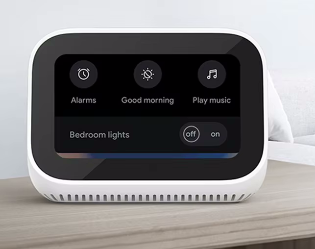

# Xiaomi Mi smart clock with Home Assistant dashboard

> **_NOTE:_** This is a work in progress project...

Product site: https://www.mi.com/global/product/mi-smart-clock/

---
Flash Android on it manual:

https://xdaforums.com/t/xiaomi-mi-smart-clock-development-guide-gsi.4629771/

---
Posts about it:
* https://community.home-assistant.io/t/hack-mi-smart-clock-to-display-lovelace-ui/667007
* https://www.reddit.com/r/homeassistant/comments/1evc5j2/i_bought_a_cheap_xiaomi_alarm_clock_and_turned_it/

---
Where to buy:

> It's a very popular product and sold out on many sites. Or only available for a high price or with high shipping costs.

* [Global version Xiaomi Mi smart clock](https://s.click.aliexpress.com/e/_DBHjC6H) (Aliexpress)\
  

Do you know a good site to buy one, please let me known.