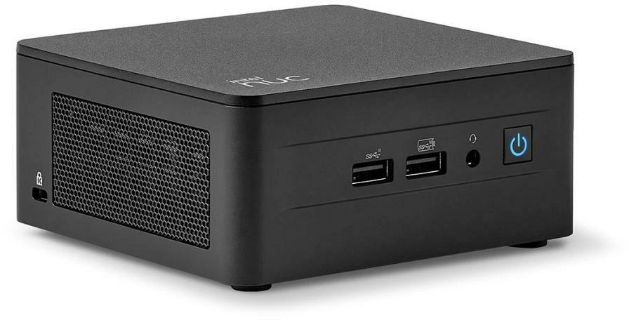
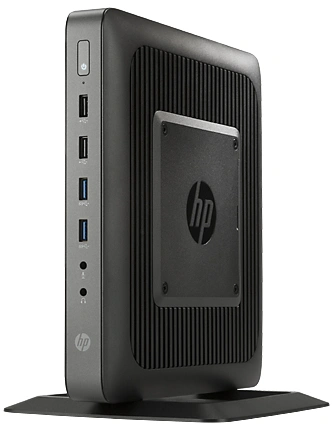

#  How to choose your smart home system?

## Introduction

On social media, I see a lot of questions on how to start and choose the right smart home system.\
You enter a "rabbit hole" with all those unknown terms like NUC, N100, Proxmox and HAOS. 
You have no idea what they mean!
I can completely understand this scares you.

On this page, I try to clear things up by comparing the different smart home solutions and explain terminology with some extra background information.

Be aware that everybody has different knowledge / experience levels, budget, and functionality wishes. 
There is no single best solution for everyone. 
You can compare it to buying a car, there is no single car that fits everybody's needs.
Like cars, there are also some main categories to choose from and it contains different models.

I hope this page will help you make a substantiated choice for yourself. To select the right system for YOUR smart home setup which fits your wishes and experience and which you can enjoy for a while.

> **_NOTE:_** This page is still a raw version

---

## Table of Contents
<!-- TOC -->
  * [Questions before you start](#questions-before-you-start)
    * [Commercial vs nonprofit](#commercial-vs-nonprofit)
    * [Open- vs close source](#open--vs-close-source)
    * [Cloud vs local](#cloud-vs-local)
    * [Protocols](#protocols)
  * [Which categories are there?](#which-categories-are-there)
  * [What is a smart home system?](#what-is-a-smart-home-system)
  * [Voice Assistant vs system](#voice-assistant-vs-system)
  * [What is the difference compare to a smart hub?](#what-is-the-difference-compare-to-a-smart-hub)
  * [Home Assistant Green vs Yellow](#home-assistant-green-vs-yellow)
  * [All-in-one mini PC comparison](#all-in-one-mini-pc-comparison)
  * [Terminology](#terminology)
  * [Remarks](#remarks)
  * [Support my work](#support-my-work)
<!-- TOC -->

---

## Questions before you start

You can ask yourself some questions before you start to choose your smart home system.
This way you can already filter some categories out.

### Commercial vs nonprofit

#### Commercial

Big tech companies sell affordable home automation system solutions (like Google Home, Alexa), but nothing is for free. 
All YOUR local data is stored on THEIR **cloud** servers. 
If you have lamps, motion detections and cameras, they know when you are at home, when you sleep, 
when you are awake, when you are in the bathroom, etc. 
This data do they use eventually for commercial purposes.

> **_NOTE:_** If you don't pay much for the product, you are the product.

#### Nonprofit

Nonprofit solutions like Home Assistant, OpenHAB, Domoticz are open-source and free software solutions.
You can look into all the code of these applications and see what happens with your data.
These solutions don't provide any cloud storage solutions; 
you need to arrange the storage location yourself, which will mainly be on a local (network) hard disk.
These solutions can be installed on a wide range of hardware of your own choice.

### Protocols

In your home, your devices (laptop, phone, tablet) communicate with each other over Wifi or via the wired network via a central router and use the TCP/IP protocol. The same protocol is used to connect with the internet.
Smart home devices also need a protocol to communicate with each other.
This can also be WiFi, then your router is your 'hub'. 
WiFi sensors are easy to start with because you have this already available.

However, there are other protocols, especially for smart home devices, 
like Zigbee, Thread, Matter, Z-Wave, Lora, Bluetooth, Infrared.
Each protocol has its own advantages and disadvantages and is perfect for different situations.
To support a protocol, you need for each protocol a specific USB adapter which 'talks' that protocol. 

| Protocol      | Range* | Speed         | Power consumption | Purpose                                                                                                    |
|---------------|--------|---------------|-------------------|------------------------------------------------------------------------------------------------------------|
| **WiFi**      | 30 m   | 100 Mbps      | High              | Downloading large files and fast communication                                                             |
| **Zigbee**    | 20 m   | 250 kbps      | Low               | Small messages, lower power consumption, it use a mesh network to create bigger coverage of the network    |
| **Thread**    | 200 m  | 250 kbps      | Low               | It use IPv6, which allows direct internet connectivity and easier integration with other IP-based networks |
| **Matter**    | 200 m  | 250 kbps      | Low               | New standard, let different brands and protocols speak with each other over IPv6, also to cloud servers    |
| **Z-Wave**    | 40 m   | 100 kbps      | Low               | Strict standard, mesh network, max 232 devices                                                             |
| **Lora**      | 15 km  | 0,3 - 50 kbps | Low               | Very long distance communication, used for street and traffic lights, bike location tracking               |
| **Bluetooth** | 10 m   | 1 Mbps        | Low               | Communication on a short distance, wireless earphones, mouse, keyboard, toothbrush                         |
| **Infrared**  | 10 m   | 1 Mbps        | Low               | Only one way communication in a direct line on a short distance, like a remote control                     |

* The range is an indication, it can be influenced by walls, floors, and other obstacles.

---

## Which categories in smart hubs are there?

### Voice-Controlled Hubs

Description: These hubs include built-in voice assistants, allowing users to control smart devices through voice commands.

Examples:
* Amazon Echo (Alexa)
* Google Nest Hub (Google Assistant)
* Apple HomePod (Siri)

Key Features:
* Seamless integration with other smart devices.
* Voice-based automation.
* Often include speakers for media playback.

Smart home hubs can be categorized based on their design, functionality, and the type of devices or ecosystems they support. Here's a breakdown of the main smart home hub categories:

#### App-Based Hubs

Description: Hubs managed primarily through mobile or desktop apps, focusing on remote and centralized control.

Examples:
* Samsung SmartThings App
* Apple HomeKit (via the Home app)
* Google Home app

Key Features:
* Unified app interface for all devices.
* Easy setup and management.
* Ideal for users comfortable with smartphone-based control.

#### Open-Source and DIY Hubs

Description: Customizable hubs designed for tech-savvy users who prefer flexibility and control.

Examples:
Home Assistant
OpenHAB
Domoticz

Key Features:
Highly customizable with open-source software.
Requires more technical expertise to set up.
Support for diverse protocols and hardware.

---

## What is a smart home system?

I read all kinds of different namings for a system which runs your smart home software.\
The names I see mostly are: smart home system, homelab.\
How do you call it? I call it here a "smart home system".

I see it as a full (small) computer with:
* A hard disk, memory, and a processor
* A full operating system
* A local protocol to communicate with your smart home devices

| 
**Smart home system - Pros** 
                                                                                                                                             | 
**Smart home system - Cons** 
                                                                                         |                                                                                                                         
|----------------------------------------------------------------------------------------------------------------------------------------------------------------------------------------------------------|------------------------------------------------------------------------------------------------------------------------------------------------------|
| * No risk devices are not supported anymore * You can choose you own supported protocols * You can choose your own software * Hardware upgrades are possible All sensor data keeps local | * You need to make your own backups * You need to update the software yourself * Technical knowledge about hardware and software maintenance |

---
## Voice Assistant vs own system

---
## What is the difference compared to a smart hub?

A smart home hub usually is a hardware device from a specific brand and only supports that brand (or just a few other ones).
You have a corresponding app which can connect to the hub and control your devices. This works also from remote so, via the internet, that means your hub is also connected to the internet via the cloud. It integrates with the cloud Google Echo, Amazon Echo voice assistants.

Examples of smart home hubs are:
* Tuya
* Philips Hue
* Samsung SmartThings
* Xiaomi Mi Home
* Ikea Tradfri
* (LG) Homey

| 
**Hub - Pros**
                                                                                                    | 
**Hub - Cons**
                                                                                                                                                                     |
|--------------------------------------------------------------------------------------------------------------------------------------------------|-------------------------------------------------------------------------------------------------------------------------------------------------------------------------------------------------------------------|
| * Cheap  * Easy to setup * Automatic software updates  * Integrates with famous Voice assistants * No technical knowledge needed | * Limited to some brands * Not extendable * Internet needed * Slower responses * Your data used for commercial purpose * Security risks * Hardware depends on active support of the brand |

---

## Home Assistant Green vs Yellow

|                               | Home Assistant Green                                         | Home Assistant Yellow                                                  |
|-------------------------------|--------------------------------------------------------------|------------------------------------------------------------------------|
| **Website**                   | https://www.home-assistant.io/green/                         | https://www.home-assistant.io/yellow/                                  | 
| **Brand**                     | Nabu Casa                                                    | Nabu Casa                                                              | 
| **Operating system**          | Home Assistant Operating System                              | Home Assistant Operating System                                        | 
| **Processor**                 | 1.8 Ghz Quad core AMD                                        | (Not included: Raspberry Pi Compute Module 4 (CM 4))                   | 
| **Hard disk**                 | 32 GB external flash drive                                   | (Not included: )                                                       | 
| **Working memory (RAM)**      | 4 GB                                                         |                                                                        | 
| **Local protocols**           | Only WiFi                                                    | WiFi, Zigbee 3.0, OpenThread and Matter                                | 
| **Power consumption on load** | 3 W                                                          | 5-9 W                                                                  | 
| **Target group**              | beginner                                                     |                                                                        | 
| **Price range**               | $ 99 / &euro; 110                                            |                                                                        | 
| **Pros**                      | Cheap Plug-and-play                                       | More RAM More and faster hard disk Support for Zigbee and Matter | 
| **Cons**                      | By default no Zigbee or Matter support, extra stick needed   |                                                                        | 
| **Buy link**                  | [NL](https://www.robbshop.nl/home-assistant-green-smart-hub) |                                                                        |

---

## All-in-one mini PC comparison

[Amazon.com](https://amzn.to/4fLSu5F)
[Amazon.com](https://amzn.to/3W6s5Zk)
[Amazon.com](https://amzn.to/4gIrMfs)
[Amazon.com](https://amzn.to/)
[Amazon.com](https://amzn.to/4gqln8T)

|                       | N95                       | N100                | N305               | 12650H         | 185H               | 
|-----------------------|---------------------------|---------------------|--------------------|----------------|--------------------|
| **Processor**         | 12th Intel Alder Lake-N95 | 12th Gen Intel-N100 | Intel Core i3-N305 | Core i7-12650H | Intel Core Ultra 9 | 
| **CPU**               | 3.4 GHz                   | 3.4 GHz             | 3.8 GHz            | 4.7 GHz        | 5.1 GHz            | 
| **Cores / Threads**   | 4 / 4                     | 4 / 4               | 8 / 8              | 10 / 16        | 16 / 22            | 
| **Brand**             | Beelink                   | Beelink             | QAZIPO             | Beelink        | Beelink            |
| **Model**             | Mini S12                  | Mini S12 Pro        | JND13              | EQi12          | GTi14              | 
| **Power consumption** |                           |                     |                    |                |                    |
| **Shop**              | {{n95_us}}                | {{n100_us}}         | {{n305_us}}        | {{12650h_us}}  | {{185h_us}}        | 

https://www.cnx-software.com/2024/05/04/intel-processor-n95-vs-n97-vs-n100-vs-core-i3-n305-benchmarks-comparison/

https://www.facebook.com/share/p/VWSek5d4MwHSbFde/

---

## Terminology

here is a list of abbreviations and terms that frequently come up in discussions on this topic.

| Term         | Explanation                                                                                                                                                                                               | 
|--------------|-----------------------------------------------------------------------------------------------------------------------------------------------------------------------------------------------------------|
| 12th Gen     |                                                                                                                                                                                                           | 
| HA           | Abbreviation for **Home Assistant**                                                                                                                                                                       | 
| IoT          | Abbreviation for **Internet of Things**                                                                                                                                                                   | 
| HAOS         | Abbreviation for **Home Assistant Operating System**                                                                                                                                                      | 
| Mesh network | A network topology where nodes can relay data for the network. This can make the range much wider.                                                                                                        |
| Mini PC      | This refer to the size of popular **small pc** cases                                                                                                                                                      | 
| NUC          | It stands for 'Next Unit of Computing' a small (4"x4") but complete desktop **pc serie**, original from Intel and now take over by Asus    | 
| N100         | It's a popular, low power consuming, but powerful Intel **processor** number, mostly used in Mini PCs. Others N-series processors are N95, N200, N305                                                     | 
| Proxmox      | Is a Debian Linux Operating System where applications can be 'installed' via virtual machines and containers                                                                                              | 
| T630/T620    | A small, compact and energy effective Thin client **PC model** (like a NUC) by HP. A cheap, second hands, opportunity to run HA on.  | 
| Thin client  | An energy effective PC with just enough power to connect to a central (cloud) system where the heavy tasks runs.                                                                                          | 

---

## Remarks
I hope this pages clear things up for you.
But are there still terms, hardware or anything else you miss here and is also good to explain?
Do you have any other remarks? Suggestions? Spell errors?\
Please let me know, you can reach me in one of mine social media posts or create a [GitHub issue](https://github.com/vdbrink/vdbrink.github.io/issues).

---

## Support my work

Do you like my blog posts and articles? You can support my work in different ways. 
Or just leave a comment on one of my posts if it is useful for you.

* [PayPal](https://www.paypal.me/revdbrink)
* [GitHub sponsoring](https://github.com/sponsors/vdbrink)
* [Smart Home Best Buy Tips](/buy/smart_home_best_buy_tips)
* [T-shirt, Hoodies, Mugs shop](https://quote-shirt-shop.myspreadshop.net/)