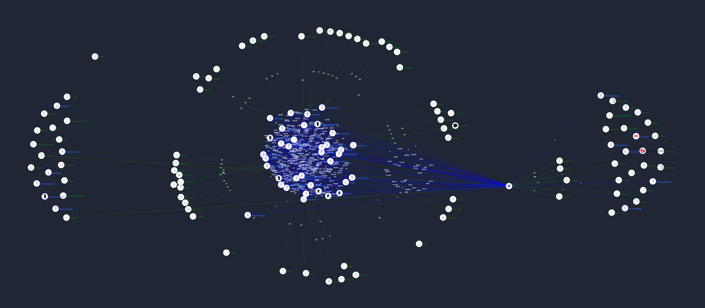

# Zigbee

Zigbee is a local smart home protocol.\
I'm a hugh fan of it because it's local, affordable and has a wide range of products available.\  
I have over 140 devices from all kinds of brands, and they’re all working together, no limitations.

On this page you find products, information and projects related to Zigbee.

---
## Table of Contents
<!-- TOC -->
  * [Device highlights](#device-highlights)
  * [DIY projects](#diy-projects)
  * [Why I chose Zigbee](#why-i-chose-zigbee)
  * [Zigbee details](#zigbee-details)
    * [The network](#the-network)
    * [Pairing](#pairing)
    * [MQTT](#mqtt)
    * [Link Quality Indicator (LQI)](#link-quality-indicator-lqi)
  * [My Zigbee coordinator](#my-zigbee-coordinator)
  * [Best Buy Tips](#best-buy-tips)
  * [Zigbee2MQTT](#zigbee2mqtt)
<!-- TOC -->

---
## Device highlights

I created some detailed pages about specific Zigbee devices:

* [Soil sensor](zigbee_soil_sensor)
* [Infrared transmitter / receiver](smart_infrared_transmitter_receiver)

---

## DIY projects

How to create custom Zigbee sensors:

* [DIY Zigbee chair occupancy sensor](zigbee_chair_occupancy_sensor)

  

* [DIY Zigbee outlet (temperature, leak, motion) sensor](zigbee_outlet_sensor)

  

* [DIY Zigbee leak detector](zigbee_water_leak_sensor)
  
  

---

## Why I chose Zigbee

On the market, there are different types of protocols to create a smart home network. Like Zigbee, Thread, WiFi, Bluetooth, Z-Wave and Matter. All with their pros and cons. You can use different protocols next to each other. I chose for one protocol: Zigbee.

This is why I choose for Zigbee:
* There is a wide range of sensor and actuator types available;
* Every Zigbee device, independent of a manufacturer, it works in your network;
* The prices are low;
* It works locally, no internet is required;
* You can even link buttons direct to (a group) lamps without the need of a hub;
* Not dependent on the manufacture app, cloud or other software. When a manufacture gets bankrupt, you still can use your devices.
* It works as a mesh network, you can reach devices far away from the coordinator as long as there are enough active hops in between;
* The standard is an open protocol, you don't pay for a license fees (for Z-Wave you do) to use it;
* No compatibility issues with hardware with older or newer Zigbee versions;
* Active development on the software Zigbee2MQTT with every release a bulk of new supported Zigbee devices;

A reason why not to choose for Zigbee? I don't know :)

---

## Zigbee details

In this section, I'll explain some technical details how Zigbee works.

### The network

Zigbee operates on the IEEE 802.15.4 standard and wireless ad hoc network. 
It's similar to WiFi but with a lower power consumption and a shorter range, ideal for smart home automation devices.
You can have a separate Zigbee network in your house, independent of your WiFi network. 
When your wifi network is down, your Zigbee network still works.
Zigbee operates on the 2.4 GHz frequency band and has a range of 10-100 meters.

Zigbee is a **mesh network**, devices can communicate with any other Zigbee device in the network.
There are different types of roles in the mesh network: **coordinator**, **routers**, and **end devices**.
* A coordinator (hub/adapter) is the main device that manage the addresses and communicate with all devices in the network.
* A router is a device which can communicate with other devices and can dynamically route messages to other devices. This is a device that is always powered like a lamp, wall-switch, socket. Packages can hop from one router to another router to reach the coordinator or any end device.
* An end device is a low-powered (battery powered) device which can only direct communicate with a router or coordinator. These devices can go in sleep mode to save battery power, that makes that they can't act as router.

The network is **self-healing**, if a device fails, the network will automatically tries to find a new path to communicate with the adapter. 
It's not possible to force a specific path.
If your end device is out of reach it will help to add more router devices in the virtual path to the end device to increase the network coverage.
The network becomes more stable with more router devices in it and correct positioned.

When you **remove** a device from the network, the network will automatically update the routing tables and the network will be direct stable again.

Zigbee is **interoperability** and can communicate with any other Zigbee device, independent of the manufacturer.

This is an example of a Zigbee mesh network:

### Pairing

Each Zigbee device must have a button and a small LED light which is used to add it to the network.
Your coordinator must be set first in pairing mode, 
and then you can press the button on the device, for most devices this is like 10 seconds (it can also be different) to set the device in pairing mode. 
The LED will indicate that the device is in pairing mode.
When the device is added to the network, the LED will blink a few times to indicate that it's accepted to the network. The device receives an address in the network and can communicate with other devices. An address looks by default to a hash as `0x00124b0012345678`. 
In the software you can rename the device to a more human-readable name like `Living_room_lamp`.

When you remove a device from the network, the device will be reset to factory settings and can be added to another network.
Now you can directly use the device.

---

### MQTT

The software Zigbee2MQTT is used to communicate with the Zigbee network via a MQTT broker.

MQTT use for each device a separated topic which contains the name of the device.
A device can send its data to the MQTT broker on a predefined topic, it looks like like `zigbee2mqtt/{device_name}`.
The device can also receive data from the MQTT broker on a predefined topic, it looks like `zigbee2mqtt/{device_name}/set`.
For example, a lamp can receive a message to turn it on, set the brightness and color.

---

### Link Quality Indicator (LQI)

The Link Quality Indicator (LQI) is a metric used to assess the quality of a wireless link between two devices in the network. 
It is an important part of the protocol for maintaining reliable communication and optimizing network performance.
It provides a qualitative assessment of the strength and quality of a received signal.
It considers factors like signal strength, signal-to-noise ratio (SNR), and packet error rate (PER).
The LQI value is a number between 0 and 255, where 0 indicates the worst possible link quality and 255 indicates the best possible link quality.

The network layer uses it to select the best routes in a mesh network.
Devices choose routes with higher values to ensure robust communication.

You can see the values in the software which can help to evaluate what happens when you move routers and end devices to see if it's better reachable and if it improves the network stability.

You can use the value to monitor network health and diagnose connectivity issues.

It's useful in identifying interference, obstacles, or malfunctioning devices.

---

## My Zigbee coordinator

Since 2020, I've run non-stop my Zigbee network with the {{imgBasket}}<a href="https://slae.sh/projects/cc2652/" target="_blank">Slaesh's CC2652RB stick (Slae website)</a> without any issues, 
it's a very reliable stick.
My network grew to 140+ devices today, and it still runs fast.

Another new coordinator which many people are very satisfied with is the <a href="https://s.click.aliexpress.com/e/_EuPZr6H" target="_blank">Sonoff ZBDongle-E Plus (AliExpress)</a> <a href="https://amzn.to/3OkLelX" target="_blank">(Amazon)</a> <a href="https://www.zigbee2mqtt.io/guide/adapters/zstack.html" target="_blank" alt="https://www.zigbee2mqtt.io/guide/adapters/zstack.html#zstack-adapters-texas-instruments">{{imgZ2M}}EFR32MG21</a>

To avoid interference with Bluetooth or WiFi,
it's better to move the stick away from the server. This is recommended for every stick.
You can use a {{imgBasket}}<a href="https://s.click.aliexpress.com/e/_Dm5S1BL" target="_blank">USB A extension cord (AliExpress)</a> for it.

---

## Best Buy Tips

I create my [Zigbee Smart home - Best Buy Tips](../buy/smart_home_best_buy_tips) with all kinds or Zigbee hardware that I like and advice to buy for others.
After buying and using them, on a daily basis, by myself. 
I have more than 120 Zigbee devices and some running already for more than 4 years non-stop.

---

## Zigbee2MQTT

</a>
[Zigbee2MQTT](https://www.zigbee2mqtt.io/) is the application which retrieves the sensor data via the coordinator, and convert the data to a JSON format and push that data to the MQTT topics.

You can also send data to sensors and actuators on their topic to define settings, like activate a socket or set a light to a specific color and brightness.