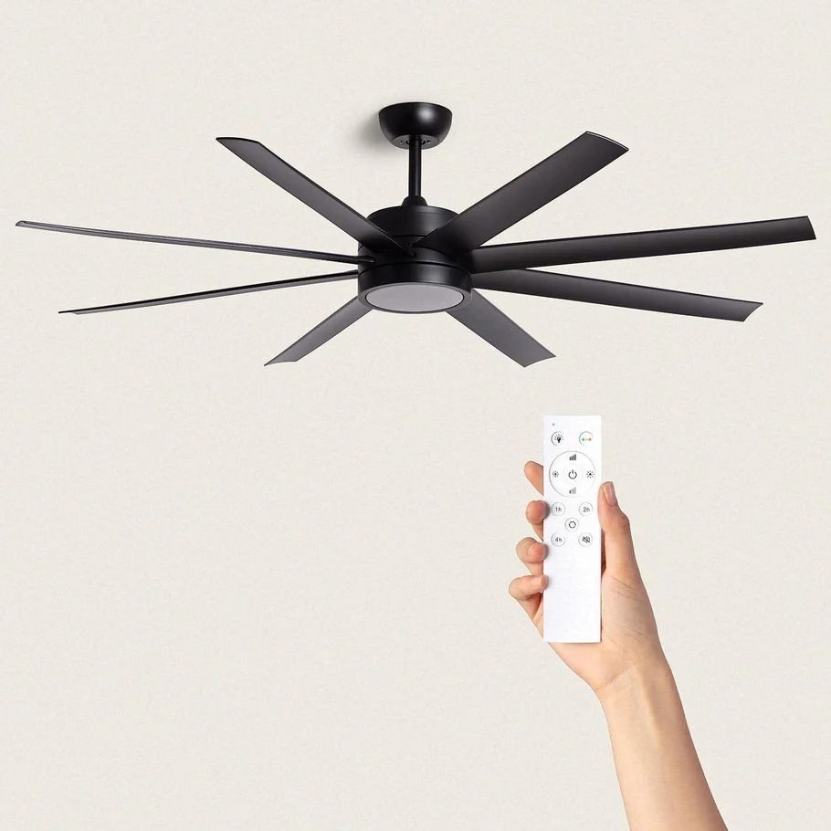
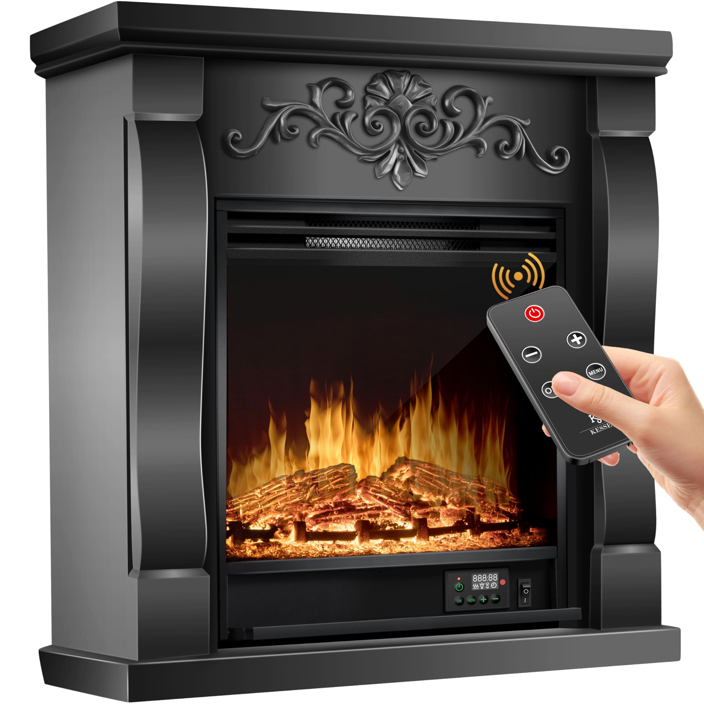

## Introduction

With a infrared controller box, you can automate all your infrared controlled devices! 
 There are lot devices that have a remote which works via infrared. 
Like a TV, air conditioner, (ceiling) fans, fireplace, screens, lights or electric candles.
The signal of an infrared remote has no encryption and is always the same. 
This makes it easy to capture, store and resend the signal.

 


 

 


> **_NOTE:_** Also affiliate links are used on this page. You sponsor my work and still pay the original price. 

---
### Smart infrared transmitter / receiver

<a href="/buy/images_zigbee/zigbee_ir_remote.webp"></a>
I used for this project the <a href="https://s.click.aliexpress.com/e/_DEUWZ73" target="_blank">Zigbee IR remote control - Moes (AliExpress)</a>
<a href="https://www.zigbee2mqtt.io/devices/UFO-R11.html" target="_blank" title="TS0003">{{imgZ2M}}UFO-R11</a> 
With this small black box, powered on batteries, you can control any infrared device. 

> There are also similar [WiFi versions](https://s.click.aliexpress.com/e/_DnpWmYp) available of this device.

You can set the device in learning mode to copy signals and store it.\
Or trigger the device, with a code, to send one of the stored signals. 

I used this solution also for my Christmas decorations. 
For my Christmas star and electronic tea lights, see my [dedicated page](/projects/automate_christmas_decorations#infrared-lights) about this project.

---
### Learning mode

To learn a new signal, set the device in learning mode by sending this payload to the MQTT topic of the device, for it that `zigbee2mqtt/irremote/set`

```yaml

{     
  "learn_ir_code":"ON" 
}

```
Now a LED light turned on in front of the device.
Now you can hold the original remote in front of the device and press a single button.

The response in MQTT on the topic `zigbee2mqtt/irremote` contains the infrared code. You need this code to resend the signal via this same device.
```yaml

{
  "battery" : 11,
  "last_seen" : "2024-11-03T09:21:03.343Z",
  "learn_ir_code" : null,
  "learned_ir_code" : "Bb8jphFIAuAXAQF9BuAVA0ABwCPgAwFAE0ABwAdAAUALwANAAUALCcqdvyPBCEgC///gAgcCCEgC",
  "linkquality" : 43,
  "voltage" : 1200
}

```

### Resend signal

To resend the signal, send on the MQTT topic `zigbee2mqtt/irremote/set` this payload to resend the same signal as send from the original remote.

Make sure your signal is in line with the device because the infrared signal is an invisible light beam. 
My experience is that the signal can control devices still in a range of 5 meters.
Because it works on batteries your free to position the device.

```yaml

{
  "ir_code_to_send": "Bb8jphFIAuAXAQF9BuAVA0ABwCPgAwFAE0ABwAdAAUALwANAAUALCcqdvyPBCEgC///gAgcCCEgC"
}

```

If all went correctly, the device now also react on your box!
Now you can add also other buttons from the remote to the box.

Now the fun continues to automation the commands!
Turn the candles/fireplace on when you enter the room in the evening or whatever scenario you can think of! 
Enjoy home automation!

---
### Home Assistant

From Home Assistant, you can create buttons on your dashboard and send a MQTT events to a specific topic.


```yaml

# Sourcecode by vdbrink.github.io
# Dashboard button card code
type: button
name: Turn on
tap_action:
  action: perform-action
  perform_action: mqtt.publish
  data:
    topic: zigbee2mqtt/irremote/set
    payload: >-
      {"ir_code_to_send":"BcsjsBFGAuAXAQGFBuAZA0ABQCfgAwHgAw/AC0AHwANAAUALCc+dyyPDCEYC///gCgcCCEYC"}

```

You can create a script which contains the MQTT event and call this script from an automation. 
For readability, I place it here direct on the dashboard as action for a button.

---
### Hardware

These hardware devices are examples of what you need and can use in your own infrared automations.

#### Infrared transmitter / receiver

* {{imgBasket}}<a href="/buy/smart_home_best_buy_tips#infrared-remote-control" target="_blank">An few examples of Zigbee and WiFi devices which act as programmable infrared remotes</a>.

  They can learn signals from the original remote, and via WiFi or Zigbee you can resend the copied signal to simulate the press on the button via an automation.
  There are also devices which support RF signals as well.

  <a href="/buy/smart_home_best_buy_tips#infrared-remote-control" target="_blank">
    
  </a>
  
#### Infrared controlled devices

As mentioned in the introduction there are a lot of devices which can be controlled via infrared. 
Here are some links to products which all work via infrared, and can be controlled via the above mentioned infrared transmitter / receiver.

LEDS
* {{imgBasket}}<a href="https://s.click.aliexpress.com/e/_EIwZk97" target="_blank">(1 - 6) LED lights, with different colors and brightness, controlled by a remote</a>

  <a href="https://s.click.aliexpress.com/e/_EIwZk97" target="_blank">
    
  </a>

Light curtains

* {{imgBasket}}<a href="https://s.click.aliexpress.com/e/_oF8f3Kd" target="_blank">Light curtains</a>

  <a href="https://s.click.aliexpress.com/e/_oF8f3Kd" target="_blank">
  
  </a>

Tea lights

* {{imgBasket}}<a href="https://s.click.aliexpress.com/e/_DFWJ9gH" target="_blank">Tea lights controlled by an infrared remote</a>

  <a href="https://s.click.aliexpress.com/e/_DFWJ9gH" target="_blank">
    
  </a>


Candles

* {{imgBasket}}<a href="https://s.click.aliexpress.com/e/_ondkuzR" target="_blank">Candle lights controlled by an infrared remote</a>

  <a href="https://s.click.aliexpress.com/e/_ondkuzR" target="_blank">
    
  </a>

* {{imgBasket}}<a href="https://s.click.aliexpress.com/e/_oDcngfL" target="_blank">Long candle lights controlled by an infrared remote</a>

  <a href="https://s.click.aliexpress.com/e/_oDcngfL" target="_blank">
    
  </a>

Also, Christmas decorations, see my [dedicated page](/projects/automate_christmas_decorations#infrared-lights) about this subject.

---

Where do you use the infrared transmitter / receiver for in your smart home?