

# DIY chair occupancy sensor
*Based on a leak or contact sensor and a car seat pressure sensor*

## Introduction

<a href="images_chair/pillow_with_sensor.jpg">
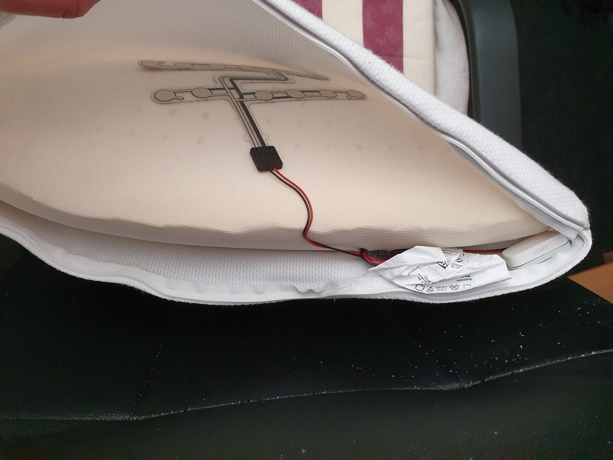
</a>
<p class="hp-lead">For my home office I want a way to detect if I'm there behind my desk. 
So I can automate my desk peripherals, such as the heater, monitor power, desk light and phone charger.</p>

To detect that, it's possible to use a motion sensor, 
 but to detect you when you sit still on a chair, it's better to use a presence sensor. 
The downside of those is that they also detect animals or blowing fans, and they are more expensive. 
They detect a wider range and not only the chair occupancy.\
I also use this room when I'm not at my desk; then I don't need all these things powered up.

Of course, with a regular button you can also activate these devices, but now my "bottom presses the button".

Also, when I walk away from my desk, it's automatically detected and my heater goes off, 
and if I haven't returned after X minutes, everything shuts down automatically.

> UPDATE 2025-07: Now there are off-the-shelf Zigbee pressure mat sensors available but they are really expensive compared to this DIY version!
> ([AliExpress](https://s.click.aliexpress.com/e/_c4bqlnbj))\
> I haven't tested it myself yet; I'd like to hear your experience with it.

<hr class="hp-divider">
## My solution

<div style="float:right; width:170px; margin-left:15px;">
<a href="images_chair/car_seat.png">
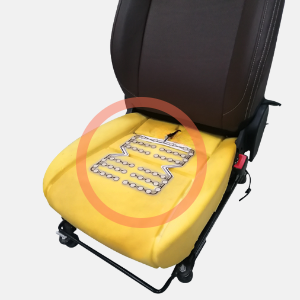
</a>
<em style="display:block; text-align:center">a car seat pressure sensor sits inside the seat cushion</em>
</div>

So I found the solution with this "hack".
It uses a contact (or leak) sensor connected to a car seat pressure sensor to detect if a chair is occupied, 
exactly what I needed!

Other purposes for this sensor are:
* In the cat/dog basket
* In the couch/sofa/relax chair
* Under your mattress to detect bed occupancy (only works if there is enough pressure through the mattress)
* Under a mat on the floor (to detect if someone enters a space or when the laundry basket is too heavy)

<hr class="hp-divider">

## Table of Contents
<!-- TOC -->
  * [My solution](#my-solution)
  * [Automations](#automations)
  * [Required hardware](#required-hardware)
  * [Wire them together](#wire-them-together)
  * [Home Assistant](#home-assistant)
<!-- TOC -->

<hr class="hp-divider">

## Automations


With this new sensor, your home automation knows exactly when you sit on your chair and when you stand up again.
Unlike a motion sensor, it keeps reporting "occupied" while you sit still, and it ignores pets and moving air.
That makes it a reliable trigger, and you can combine it with other sensors, a time of day or a delay to create all kinds of different automations, like:
* When the light still needs to be on because it's still occupied.
* Power up all the computer peripherals (monitor, lights, chargers, heater).
* Shutdown the computer and peripherals automatically when you don't sit behind your desk for a while.
* When it's time to take a break to stand up and stretch your legs.
* When it's time to end your working day.
* Show or announce today's calendar events at the start of the day. 

* Control the room temperature because it's occupied.
* Send notifications with incorrect office health state values only when you're there ([CO2](/esphome/co2_scd40), [temperature](buy/smart_home_best_buy_tips#temperature-sensor), [humidity](buy/smart_home_best_buy_tips#temperature-sensor), [PM2.5](/buy/smart_home_best_buy_tips#air-quality-sensor), [VOC](/buy/smart_home_best_buy_tips#air-quality-sensor), or [Formaldehyde](/buy/smart_home_best_buy_tips#air-quality-sensor)).

<hr class="hp-divider">

## Required hardware

This project only requires these two devices: A boolean sensor to detect true or false and a pressure sensor.

> I have a Zigbee network, so I use a Zigbee contact sensor, but any other protocol sensor can also do the trick.

1. The first device needs to detect anything or nothing. 
This can be achieved with two different types of sensors. 
A water leak sensor or a contact sensor. 
Both work with a boolean (true or false) state.

<div class="hp-tiles hp-options">
<div class="hp-card hp-tile hp-preferred" id="hw-aqara-leak">
<span class="hp-pick" tabindex="0" role="img" aria-label="Preferred: the easiest option, no soldering required." data-tip="Preferred: the easiest option, no soldering required.">&#10003;</span>
<a href="https://s.click.aliexpress.com/e/_c3QCb0sj" target="_blank"></a>
<div class="hp-tile-body"><span class="hp-chip">1a. No soldering</span><strong>Aqara Zigbee water leak sensor</strong>
<p>It has two metal screw contacts on the back where you can directly connect the two wires of the pressure sensor.</p>
<p class="hp-wire-link"><a href="#wire-aqara-leak">How to wire it &darr;</a></p>
<p class="hp-store-links"><a href="https://s.click.aliexpress.com/e/_c3QCb0sj" target="_blank">AliExpress</a> | <a href="https://amzn.to/4AkIkVn#ads" target="_blank">Amazon</a></p></div>
</div>
<div class="hp-card hp-tile" id="hw-contact">
<a href="https://s.click.aliexpress.com/e/_c3udT3zH" target="_blank"></a>
<div class="hp-tile-body"><span class="hp-chip">1b. Soldering required</span><strong>Zigbee (or WiFi) contact sensor</strong>
<p>Mostly cheaper than the water leak sensor, but it requires soldering. On this page I describe how it works with this sensor.</p>
<p class="hp-wire-link"><a href="#wire-contact">How to wire it &darr;</a></p>
<p class="hp-store-links"><a href="https://s.click.aliexpress.com/e/_c3udT3zH" target="_blank">AliExpress</a> | <a href="https://amzn.to/4xWyGWB#ads" target="_blank">Amazon</a></p></div>
</div>
<div class="hp-card hp-tile" id="hw-leak">
<a href="https://s.click.aliexpress.com/e/_omkbvFz" target="_blank"></a>
<div class="hp-tile-body"><span class="hp-chip">1c. No soldering</span><strong>Alternative (Zigbee/WiFi) leak sensor</strong>
<p>It has external contact points, which makes it really easy to connect to the two seat sensor wires. See 3a how to connect the wires.</p>
<p class="hp-wire-link"><a href="#wire-leak-clips">How to wire it &darr;</a></p>
<p class="hp-store-links"><a href="https://s.click.aliexpress.com/e/_omkbvFz" target="_blank">AliExpress</a> | <a href="https://amzn.to/46ACEJe#ads" target="_blank">Amazon</a></p></div>
</div>
</div>

<hr class="hp-divider">

2\. A [car seat pressure sensor](../buy/esphome_diy#pressure-sensor): smaller or bigger versions are available.

<div class="hp-tiles hp-options">
<div class="hp-card hp-tile hp-preferred">
<span class="hp-pick" tabindex="0" role="img" aria-label="Preferred: I used this one myself." data-tip="I used this one myself.">&#10003;</span>
<a href="https://s.click.aliexpress.com/e/_c3phM4ij" target="_blank"></a>
<div class="hp-tile-body"><span class="hp-chip">Pressure sensor</span><strong>Car seat pressure sensor (standard)</strong>
<p>The standard size, fits most chairs.</p>
<p class="hp-store-links">
<a href="https://s.click.aliexpress.com/e/_c3phM4ij" target="_blank">AliExpress</a> | <a href="https://amzn.to/4AF0GAm" target="_blank">Amazon</a></p></div>
</div>
<div class="hp-card hp-tile">
<a href="https://s.click.aliexpress.com/e/_c3uYUMaV" target="_blank"></a>
<div class="hp-tile-body"><span class="hp-chip">Pressure sensor</span><strong>Car seat pressure sensor (large)</strong>
<p>A bigger version than the standard one.</p>
<p class="hp-store-links"><a href="https://s.click.aliexpress.com/e/_c3uYUMaV" target="_blank">AliExpress</a> | <a href="https://amzn.to/4j46OvS" target="_blank">Amazon</a></p></div>
</div>
<div class="hp-card hp-tile">
<a href="https://s.click.aliexpress.com/e/_c4FL7beB" target="_blank"></a>
<div class="hp-tile-body"><span class="hp-chip">Pressure sensor</span><strong>Car seat pressure sensor (extra large)</strong>
<p>Covers the most space on the chair.</p>
<p class="hp-store-links"><a href="https://s.click.aliexpress.com/e/_c4FL7beB" target="_blank">AliExpress</a>| <a href="https://amzn.to/3Ub5Un3" target="_blank">Amazon</a></p></div>
</div>
</div>

<hr class="hp-divider">

3\. Connect the leak or contact sensor to the pressure sensor:

<div class="hp-tiles hp-options">
<div class="hp-card hp-tile">
<a href="https://s.click.aliexpress.com/e/_c3PR90Mh" target="_blank"></a>
<div class="hp-tile-body"><span class="hp-chip">3a. No soldering</span><strong>Cable clips (connectors)</strong>
<p>To connect the alternative leak sensor and the pressure sensor without soldering. See also <a href="../buy/esphome_diy#cable-connectors">all clips</a>.</p>
<p class="hp-store-links"><a href="https://s.click.aliexpress.com/e/_c3PR90Mh" target="_blank">AliExpress</a>| <a href="https://amzn.to/4hohaW4" target="_blank">Amazon</a></p></div>
</div>
<div class="hp-card hp-tile">
<a href="https://s.click.aliexpress.com/e/_oBrUAsr" target="_blank"></a>
<div class="hp-tile-body"><span class="hp-chip">3a. No soldering</span><strong>Cable clips (alternative)</strong>
<p>Another kind of clip to connect two wires without soldering.</p>
<p class="hp-store-links"><a href="https://s.click.aliexpress.com/e/_oBrUAsr" target="_blank">AliExpress</a></p></div>
</div>
<div class="hp-card hp-tile">
<a href="https://s.click.aliexpress.com/e/_DEDR08n" target="_blank"></a>
<div class="hp-tile-body"><span class="hp-chip">3b. Soldering required</span><strong>Soldering iron and tin</strong>
<p>To connect the contact sensor you need soldering tools.</p>
<p class="hp-store-links">Iron: <a href="https://s.click.aliexpress.com/e/_DEDR08n" target="_blank">AliExpress</a> | <a href="https://amzn.to/3TcfCFq#ads" target="_blank">Amazon</a></p>
<p class="hp-store-links">Tin: <a href="https://s.click.aliexpress.com/e/_DEDR08n" target="_blank">AliExpress</a> | <a href="https://amzn.to/4hjQhBc#ads" target="_blank">Amazon</a></p></div>
</div>
<div class="hp-card hp-tile">
<a href="images_chair/hot_glue_gun.png">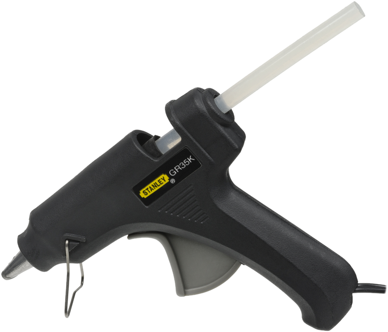</a>
<div class="hp-tile-body"><span class="hp-chip">3c. No soldering</span><strong>Hot glue gun</strong>
<p>Or use hot glue. That can also be possible as long as the metals make contact.</p>
<p class="hp-store-links"><a href="https://s.click.aliexpress.com/e/_c4KgCj2d" target="_blank">AliExpress</a> | <a href="https://amzn.to/4zexcYE#ads" target="_blank">Amazon</a></p>
</div>
</div>
</div>

<hr class="hp-divider">

## Wire them together

Now connect the two wires of the pressure sensor to the boolean sensor, so the sensor reports a change when someone sits down.
How you do that depends on the sensor you chose: the leak sensors need no soldering, the contact sensor does.
Pick the description that matches your sensor.

<div class="hp-tiles hp-wire">
<div class="hp-card hp-tile" id="wire-aqara-leak">
<div class="hp-tile-body"><div class="hp-wire-head"><div class="hp-wire-title"><span class="hp-chip">No soldering</span><strong>With an Aqara water leak sensor</strong></div><a href="#hw-aqara-leak"></a></div>
<p>With the Aqara Zigbee water leak sensor, you only need to unscrew the screws and wrap the bare wires from the pressure sensor around them. Screw them tight again, and done!</p>
<a href="images_chair/aqara_leak_sensor_screws.jpg">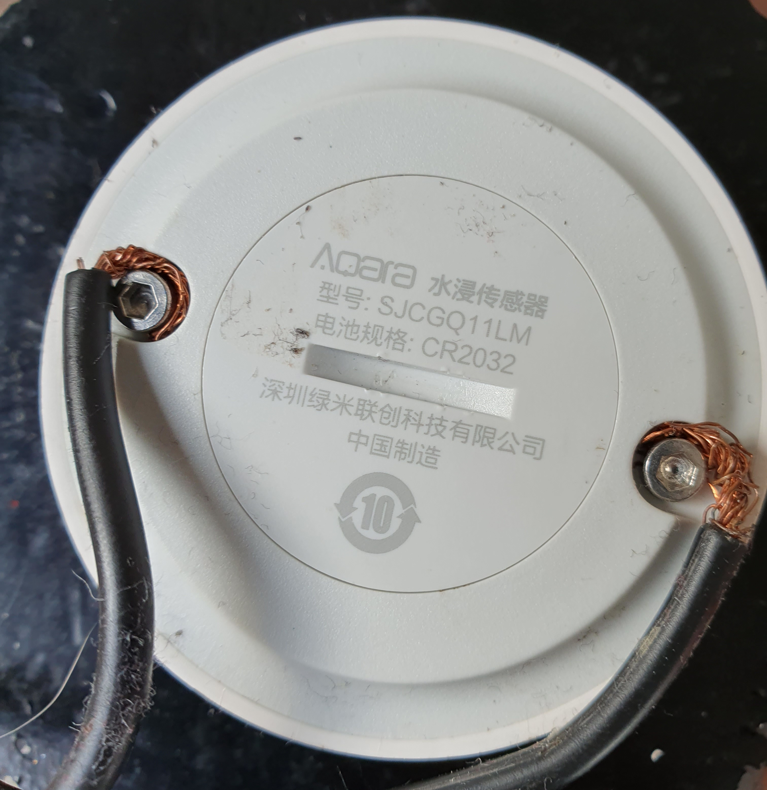</a>
<p>You can skip the contact sensor description and continue with the <a href="#home-assistant">Home Assistant</a> section if you use this leak sensor.</p></div>
</div>
<div class="hp-card hp-tile" id="wire-leak-clips">
<div class="hp-tile-body"><div class="hp-wire-head"><div class="hp-wire-title"><span class="hp-chip">No soldering</span><strong>With the alternative leak sensor and clips</strong></div><a href="#hw-leak"></a></div>
<p>The alternative leak sensor has external contact points. Connect the two wires of the pressure sensor to these contact points with <a href="../buy/esphome_diy#cable-connectors">cable clips</a>, so no soldering is needed.</p>
<a href="/buy/images_diy/cable_connectors1.avif"></a>
<p>Clip one wire of the pressure sensor to each contact point of the leak sensor. It doesn't matter which wire goes where.</p>
<a href="/buy/images_diy/cable_connectors2.avif"></a>
<p>When you now sit on the pressure sensor, the state of the leak sensor will change. Now you can create automations based on it!</p>
<p>You can skip the contact sensor description and continue with the <a href="#home-assistant">Home Assistant</a> section.</p></div>
</div>
<div class="hp-card hp-tile" id="wire-contact">
<div class="hp-tile-body"><div class="hp-wire-head"><div class="hp-wire-title"><span class="hp-chip">Soldering required</span><strong>With a contact sensor</strong></div><a href="#hw-contact"></a></div>
<p>A contact sensor is a boolean sensor, the circuit can be opened or closed. That's also exactly what the car seat pressure sensor returns.</p>
<p>The thing that has to be done is connecting the pressure sensor wires to the (reed) contacts of the contact sensor.</p>
<p>First open the contact sensor.</p>
<a href="images_chair/opened_contact_sensor.jpg">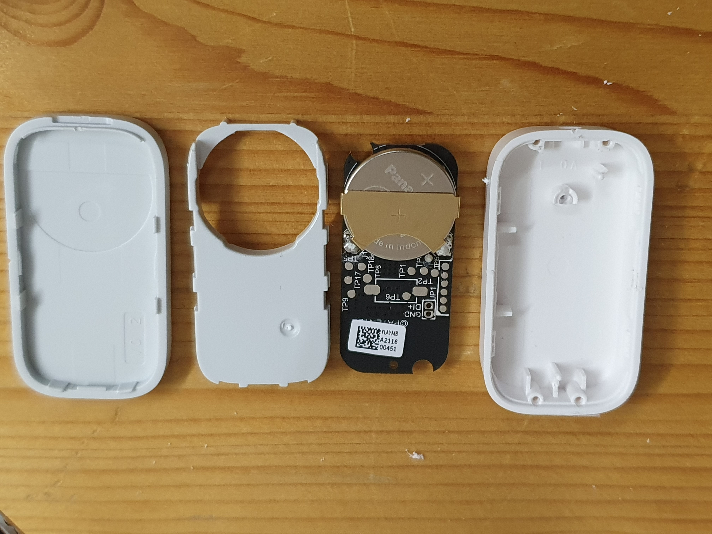</a>
<p>You can remove the reed contact, but you can also leave it like it is. Because there is no magnet nearby, those ends don't make contact. The pressure sensor is connected in parallel with this switch.</p>
<a href="images_chair/remove_reed_from_contact_sensor.jpg">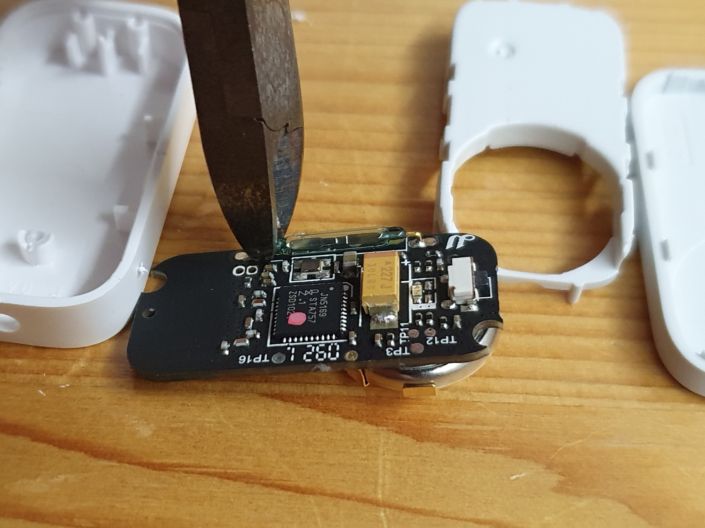</a>
<p>Drill a hole in the side of the contact sensor so the cables can go inside.</p>
<a href="images_chair/wires_through_hole.jpg">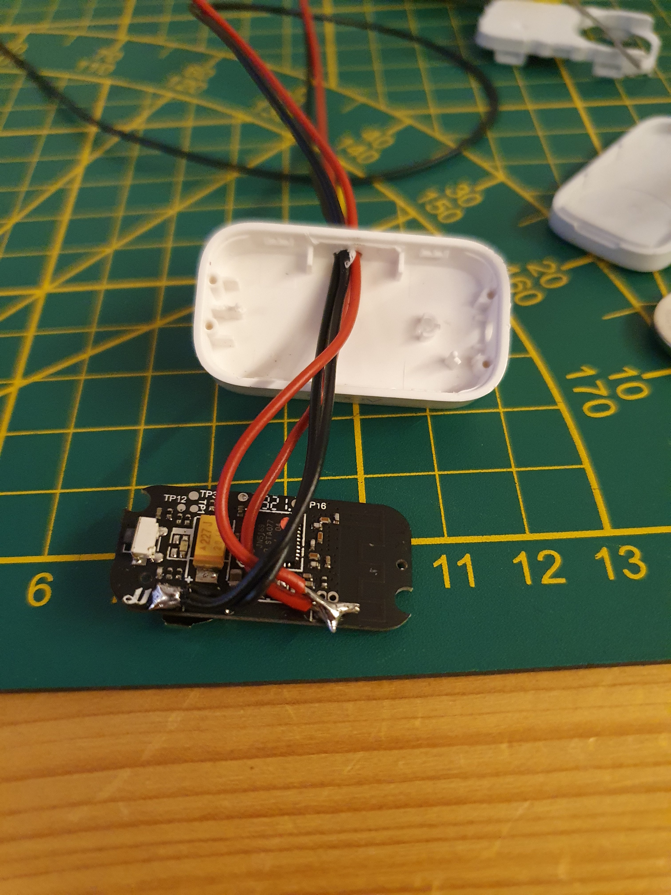</a>
<p>Solder the wires to each side of the (reed) contact.</p>
<a href="images_chair/solder_wires_to_reed_contacts.jpg">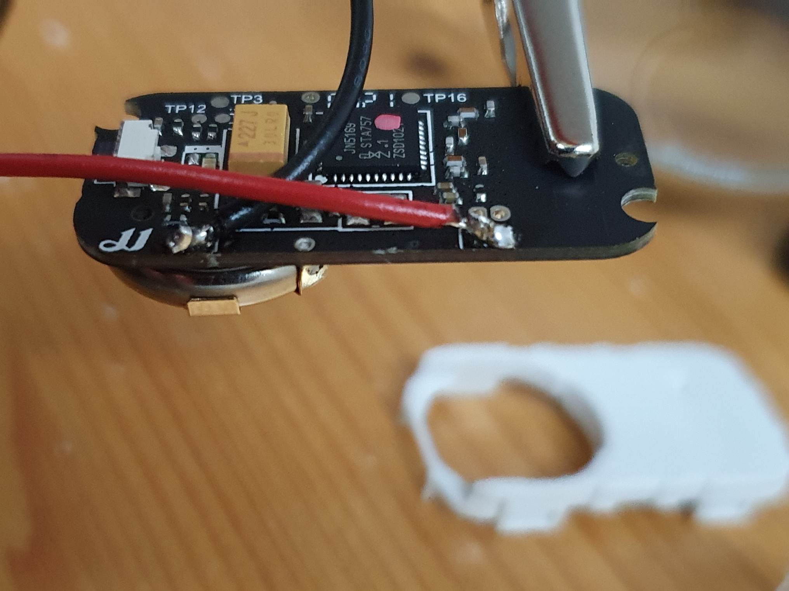</a>
<p>You can also use two pressure sensors if you want to cover more space with just one sensor. You connect both sensors together on the same reed contacts ends.</p>
<a href="images_chair/double_pressure_sensor.jpg">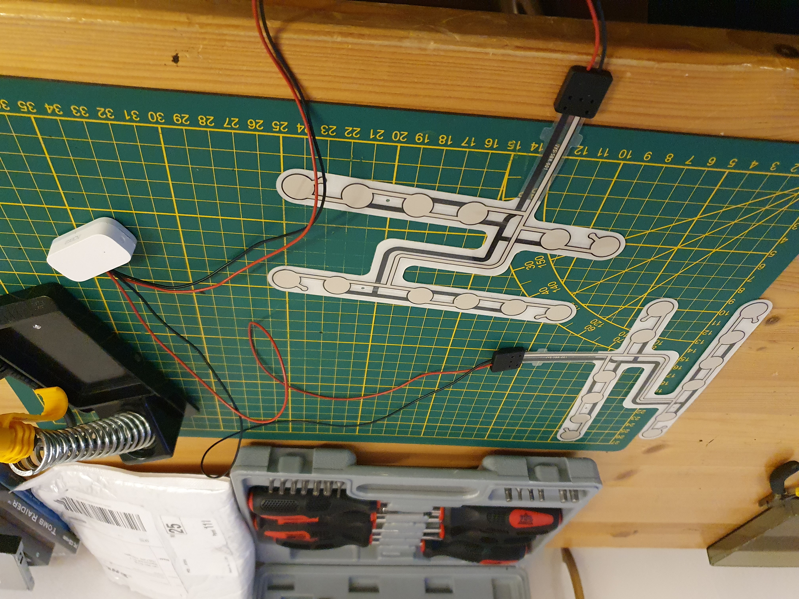</a>
<p>Now you can place the sensor inside a pillow on the chair or inside the chair itself if you can zip the seat open.</p>
<a href="images_chair/pillow_with_sensor_top.jpg">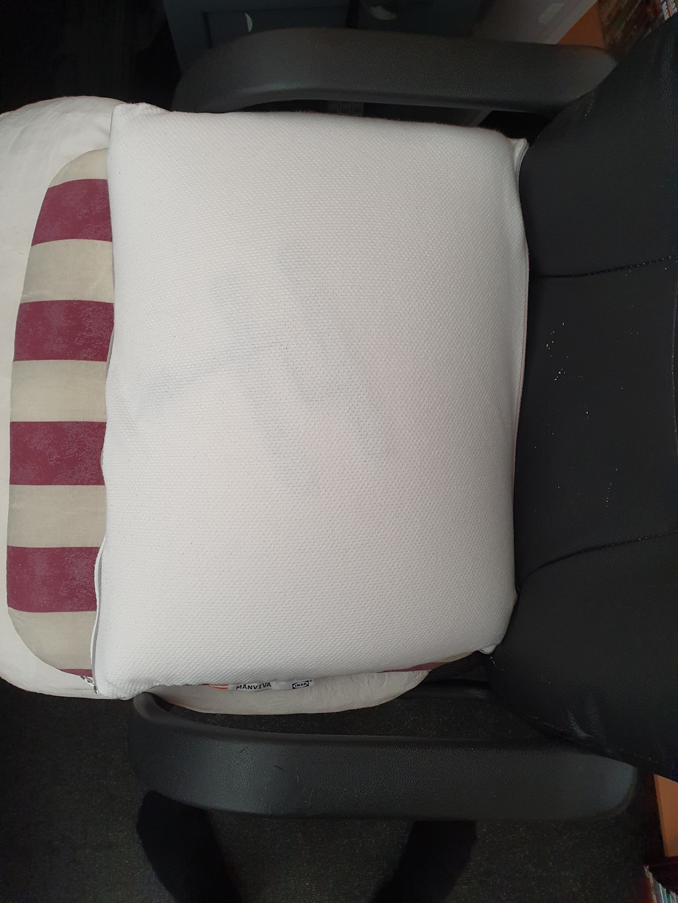</a>
<p>When you now sit on it, the state of the contact sensor will change. Now you can create automations based on it!</p></div>
</div>
</div>

<hr class="hp-divider">

## Home Assistant

Once the sensor is paired with your Zigbee network, it shows up in Home Assistant as a regular contact or leak sensor.
In this chapter I turn it into a usable chair sensor: first fix the inverted state, then track how long the chair is occupied each day, and finally show the results on a dashboard.

### Create a new custom chair sensor

By default, the contact status is inverted from what is preferred.
With this addition in the `configuration.yaml` file, it creates a new sensor that shows the correct status in the dashboard.


```yaml

# Sourcecode by vdbrink.github.io
# configuration.yaml
binary_sensor:
  - platform: template
    sensors:
      chair:
        friendly_name: "chair"
        value_template: >-
          
             on
          
             off
          

homeassistant:
  customize: 
    binary_sensor.chair:
      icon: mdi:chair-rolling

```

### Occupancy time sensor

With the [history stats](https://www.home-assistant.io/integrations/history_stats/) it's possible to create new sensors which indicate how long something has been in a certain state.
In this case we want to track how long the chair is occupied each day.
The start/reset is at the beginning of a new day, the end time is the current time, and within this timeframe it measures how long entity `binary_sensor.chair_work` has had the state `on`.

This is the code to add in the `configuration.yaml`.\
This will generate a new sensor called `sensor.chair_occupancy`.

```yaml

# Sourcecode by vdbrink.github.io
# configuration.yaml
- platform: history_stats
  name: chair occupancy
  entity_id: binary_sensor.chair_work
  state: 'on'
  type: time
  start: '{{ now().replace(hour=0, minute=0, second=0) }}'
  end: '{{ now() }}'

```

### Graphs

Now that we have the data, it's possible to present this on the dashboard!

#### Total time as text

Show the amount of time on the chair as an entity.\
8 hours, 12 minutes and 36 seconds.

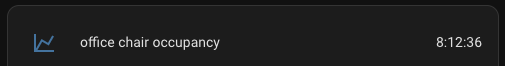

```yaml

# Sourcecode by vdbrink.github.io
type: entities
entities:
  - entity: sensor.chair_occupancy

```

#### Occupied in time as graph

Or show the occupied time in a line graph over time.\
It shows exactly where I took some breaks, the line is flat at that time.

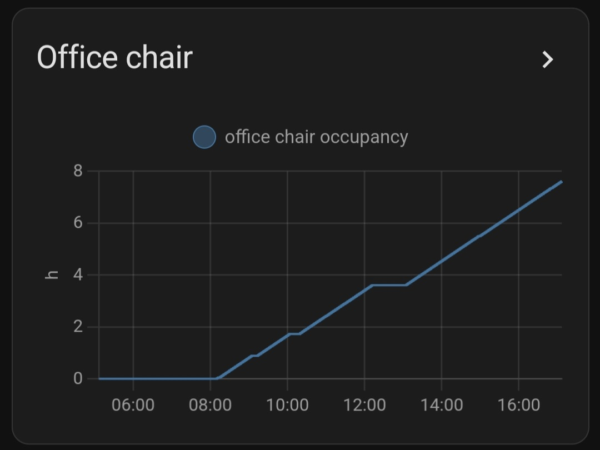

A History graph Card is used for this.

```yaml

# Sourcecode by vdbrink.github.io
type: history-graph
entities:
  - entity: sensor.chair_occupancy
logarithmic_scale: false
hours_to_show: 24
title: Office chair

```

#### Total time in a bar

Use the same History graph Card with binary sensors, then it's presented as a bar.

Here I add the chair occupancy sensor next to the value of a pir motion sensor in the same room. 
As you can see, the chair sensor is much more reliable if you sit still!

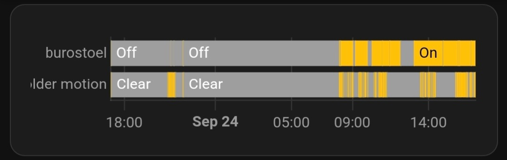

```yaml

# Sourcecode by vdbrink.github.io
type: history-graph
entities:
  - entity: binary_sensor.chair_occupancy
  - entity: binary_sensor.motion_occupancy
hours_to_show: 24


```

#### Is occupied

Indicate if someone is sitting on the chair.


```yaml

# Sourcecode by vdbrink.github.io
type: entities
entities:
  - entity: binary_sensor.chair_occupancy

```

<br>

That's it, a very useful and reliable DIY chair occupancy sensor (for me at least!).

<br>

<hr class="hp-divider">

[<< See also my other Zigbee related content](index)
