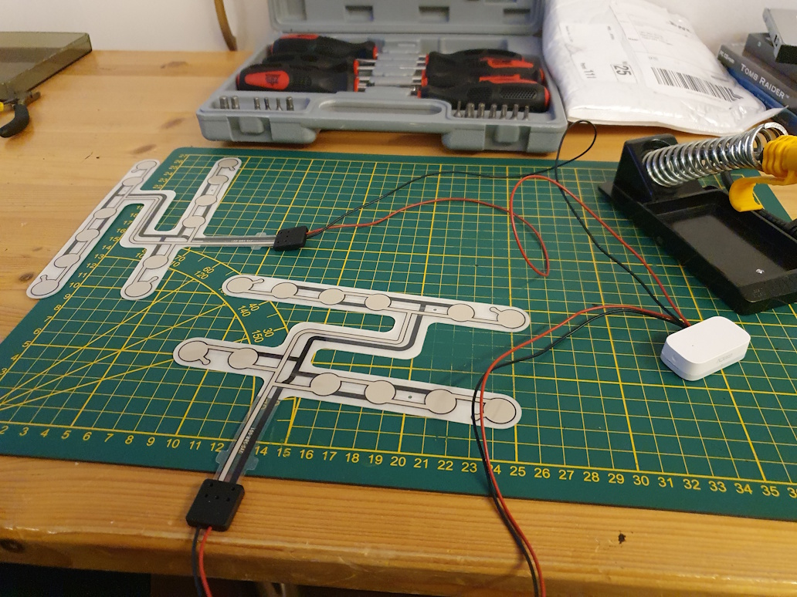

# DIY Zigbee chair occupancy sensor
*Based on a Zigbee contact sensor and a car seat pressure sensor*

## Introduction


For my office I want a way to detect if I'm there.
To detect that you can use a motion sensor, or to detect when you sit still on a chair you can use a radar millimeter wave sensors, 
the downside with one this is it will also detect animals or blowing fans.

---
## My solution

This "hack" uses a Zigbee contact sensor connected to a car seat sensor to detect if a chair is occupied, or not, exactly what I needed!

---

## Table of Contents
<!-- TOC -->
  * [My solution](#my-solution)
  * [Required hardware](#required-hardware)
  * [Automations](#automations)
  * [Home Assistant](#home-assistant)
<!-- TOC -->

---

## Required hardware

You only need these two devices:
 
[Zigbee contact sensor](../buy/smart_home_best_buy_tips#contact-sensor)\
I have a Zigbee network, so I use a Zigbee contact sensor, but any other protocol sensor can also be used for this.

<a href="../buy/smart_home_best_buy_tips#contact-sensor">

</a>

[Car seat pressure sensor](../buy/esphome_diy#pressure-sensor)

<a href="../buy/esphome_diy#pressure-sensor">

</a>

To connect both together, you need also some soldering tools:
* [Soldering iron](../buy/esphome_diy#soldering-iron)
* [Soldering iron tin](../buy/esphome_diy#soldering-tin-wire)

---

## Wire them together





---

## Automations

With this new sensor you can make all kind different automations, a few examples are:
* When the light can turn on/off
* When the PC can shut down
* When it's time to take a break
* When it's time to end your working day
* Control the room temperature because it's occupied

---

## Home Assistant

### Create a new custom chair sensor

By default, the contact status is inverted as preferred.
With this addition to `configuration.yaml` you can create a new sensor that shows the correct status in your dashboard.
```yaml

# Sourcecode by vdbrink.github.io
# configuration.yaml
binary_sensor:
  - platform: template
    sensors:
      chair:
        friendly_name: "chair"
        value_template: >-
          
             on
          
             off
          

homeassistant:
  customize: 
    binary_sensor.chair:
      icon: mdi:chair-rolling

```

### Occupancy time sensor

With the [history stats](https://www.home-assistant.io/integrations/history_stats/) it's possible to create new sensors which indicate how long something takes.
In this case we want to track how long the chair is occupied on each day.
The start/reset is on a new day and end time is the current time and within this timeframe how long has entity `binary_sensor.chair_work` the state `on`.
This is the code you need to add in the `configuration.yaml`. This will generate a new sensor called `sensor.chair_occupancy`.

```yaml

# Sourcecode by vdbrink.github.io
# configuration.yaml
- platform: history_stats
  name: chair occupancy
  entity_id: binary_sensor.chair_work
  state: 'on'
  type: time
  start: '{{ now().replace(hour=0, minute=0, second=0) }}'
  end: '{{ now() }}'

```

### Graphs

Now we have the data, it's possible to present this on the dashboard!

#### Total time as text

Show the amount of time on the chair as an entity.\
8 hours, 12 minutes and 36 seconds.


```yaml

# Sourcecode by vdbrink.github.io
type: entities
entities:
  - entity: sensor.chair_occupancy

```

#### Occupied in time as graph

Or show the occupied time in a line graph in time.\
You can exactly see where I took some breaks, the line is broken.


A History graph Card is used for this.

```yaml

# Sourcecode by vdbrink.github.io
type: history-graph
entities:
  - entity: sensor.chair_occupancy
logarithmic_scale: false
hours_to_show: 24
title: Office chair

```

#### Total time in a bar

If you use the same History graph Card with binary sensors, it's presented as a bar.

Here I add the chair occupancy sensor next to the value of a pir motion sensor in the same room. As you can see the chair sensor is much more reliable if you sit still! A  


```yaml

# Sourcecode by vdbrink.github.io
type: history-graph
entities:
  - entity: binary_sensor.chair_occupancy
  - entity: binary_sensor.motion_occupancy
hours_to_show: 24


```

Indicate if someone is sitting on the chair.


```yaml

# Sourcecode by vdbrink.github.io
type: entities
entities:
  - entity: binary_sensor.chair_occupancy

```
