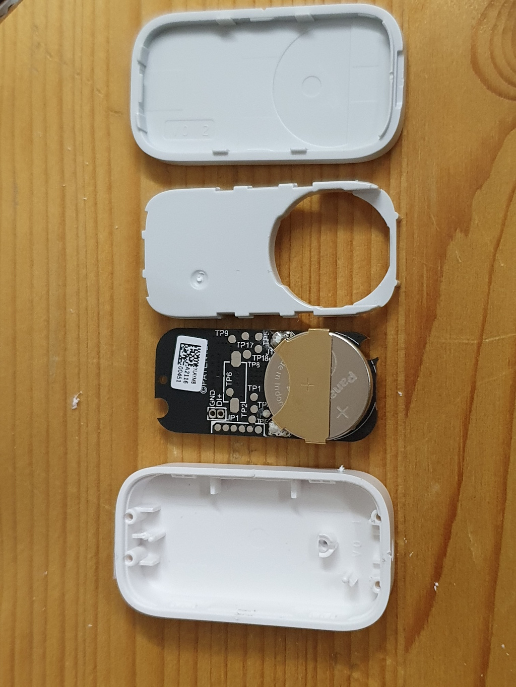

# DIY chair occupancy sensor
*Based on a contact sensor and a car seat pressure sensor*

## Introduction


For my home office I want a way to detect if I'm there behind my desk. 
So I can automate my desk peripherals as heater, monitor power, desk light and phone charger.

To detect that, it's possible to use a motion sensor, 
 to detect when you also sit still on a chair, it's better to use a presence sensor. 
The downside with one of those is, they will also detect animals or blowing fans and are more expensive. 
They detect a wider range and not only the chair occupancy.\
I also use this room when I'm not at my desk then I don't need all these things powered up.

---
## My solution

So I found the solution in this "hack". 
It uses a contact (or leak) sensor connected to a car seat sensor to detect if a chair is occupied, 
exactly what I needed!

Other purposes for this sensor are:
* In the couch/sofa/relax chair
* Under your mattress to detect bed occupancy (only works if there is enough pressure through the mattress)
* Under a mat on the floor (to detect if someone entering a space)

---

## Table of Contents
<!-- TOC -->
 * [My solution](#my-solution)
 * [Automations](#automations)
 * [Required hardware](#required-hardware)
 * [Home Assistant](#home-assistant)
<!-- TOC -->

---

## Automations
 


With this new sensor, it's possible to make all kind different automations, a few examples are:
* When the light still needs to be on
* Power up all the computer peripherals (monitor, lights, chargers, heater)
* Shutdown the computer and peripherals automatically when you don't sit behind your desk for a while
* When it's time to take a break to stand up and stretch your legs
* When it's time to end your working day

* Control the room temperature because it's occupied
* Send notifications with incorrect office health state values (CO2, temperature, humidity, PM2.5, VOC, or Formaldehyde)

---

## Required hardware

This project only requires these two devices: A boolean sensor to detect true or false and a pressure sensor.

> I have a Zigbee network, so I use a Zigbee contact sensors, but any other protocol sensor can also do the trick.

The first device needs to detect anything or nothing. 
This can be achieved with two different types of sensors. 
A water leak sensor or a contact sensor. 
Both work with a boolean (true of false) state.

1a. [Aqara Water leak sensor](/buy/smart_home_best_buy_tips#leak-sensor) (No soldering required)\
The Aqara leak sensor has two metal screw contacts on the back of the sensor where you can connect direct the two wires of the pressure sensor behind.

<a href="/buy/smart_home_best_buy_tips#leak-sensor">

</a>

<br>

1b. Or use a [(Zigbee) Contact sensor](/buy/smart_home_best_buy_tips#contact-sensor) (Soldering required)\
A contact sensor is (mostly) cheaper than the water leak, but it requires soldering.

On this page I describe how it works with this sensor.

<a href="/buy/smart_home_best_buy_tips#contact-sensor">

</a>

1c. Or use an alternative [(Zigbee) leak sensor](/buy/smart_home_best_buy_tips#other-leak-sensor) (Soldering required)\
This alternative leak sensor has external contact point, really easy to connect to the two seat sensor wires.

<a href="/buy/smart_home_best_buy_tips#other-leak-sensor">

</a>

2. A [Car seat pressure sensor](../buy/esphome_diy#pressure-sensor) (smaller or bigger versions are available)

<a href="/buy/esphome_diy#pressure-sensor">
 


</a>


To connect them together, and you use the contact or the alternative leak sensor, you also need soldering tools (even hot clue can be possible as long as the metals make contact!):
* [Soldering iron](../buy/esphome_diy#soldering-iron)
* [Soldering iron tin](../buy/esphome_diy#soldering-tin-wire)

---

## Wire them together

### With an Aqara water leak sensor

With the Aqara water leak sensor, you only need to unscrew the screws, wrap the blank wires from the pressure sensor around it. Screw them tight again and done!!

<a href="images_chair/aqara_leak_sensor_screws.jpg"></a>

### With a contact sensor

A contact sensor is a boolean sensor, the circuit can be opened or closed.\
That's also exact what the car seat pressure sensor returns.

The only this that has to be done is connecting the pressure sensor wires to the (reed) contacts of the contact sensor.

First open the contact sensor.

You can remove the reed contact, but you can also leave it like it is. 
Because there is no magnet nearby, those ends don't make contact. 
The sensor is set parallel over this switch. 

Drill a hole in the side of the contact sensor so the cables can go inside.

Solder the wires to each side of the (reed) contact.

You can also use two pressure sensors if you want to cover more space with just one sensor.\
You connect both sensors together on the same reed contacts ends.

Now you can place the sensor inside a pillow on the chair of inside the chair itself if you can zip the seat open.


When you now sit on it, the state of the contact sensor will change.\
Now you can create automations based on it!

---

## Home Assistant

### Create a new custom chair sensor

By default, the contact status is inverted as preferred.
With this addition in the `configuration.yaml` file, it creates a new sensor that shows the correct status in the dashboard.
```yaml

# Sourcecode by vdbrink.github.io
# configuration.yaml
binary_sensor:
  - platform: template
    sensors:
      chair:
        friendly_name: "chair"
        value_template: >-
          
             on
          
             off
          

homeassistant:
  customize: 
    binary_sensor.chair:
      icon: mdi:chair-rolling

```

### Occupancy time sensor

With the [history stats](https://www.home-assistant.io/integrations/history_stats/) it's possible to create new sensors which indicate how long something takes.
In this case we want to track how long the chair is occupied on each day.
The start/reset is on a new day and end time is the current time and within this timeframe how long has entity `binary_sensor.chair_work` the state `on`.
This is the code to add in the `configuration.yaml`.  
This will generate a new sensor called `sensor.chair_occupancy`.

```yaml

# Sourcecode by vdbrink.github.io
# configuration.yaml
- platform: history_stats
  name: chair occupancy
  entity_id: binary_sensor.chair_work
  state: 'on'
  type: time
  start: '{{ now().replace(hour=0, minute=0, second=0) }}'
  end: '{{ now() }}'

```

### Graphs

Now we have the data, it's possible to present this on the dashboard!

#### Total time as text

Show the amount of time on the chair as an entity.\
8 hours, 12 minutes and 36 seconds.


```yaml

# Sourcecode by vdbrink.github.io
type: entities
entities:
  - entity: sensor.chair_occupancy

```

#### Occupied in time as graph

Or show the occupied time in a line graph over time.\
It shows exactly where I took some breaks, the line is flat at that time.


A History graph Card is used for this.

```yaml

# Sourcecode by vdbrink.github.io
type: history-graph
entities:
  - entity: sensor.chair_occupancy
logarithmic_scale: false
hours_to_show: 24
title: Office chair

```

#### Total time in a bar

Use the same History graph Card with binary sensors, then it's presented as a bar.

Here I add the chair occupancy sensor next to the value of a pir motion sensor in the same room. 
As you can see, the chair sensor is much more reliable if you sit still!


```yaml

# Sourcecode by vdbrink.github.io
type: history-graph
entities:
  - entity: binary_sensor.chair_occupancy
  - entity: binary_sensor.motion_occupancy
hours_to_show: 24


```

#### Is occupied

Indicate if someone is sitting on the chair.


```yaml

# Sourcecode by vdbrink.github.io
type: entities
entities:
  - entity: binary_sensor.chair_occupancy

```

<br>

That's it, a very useful and reliable DIY Zigbee chair sensor (for me at least!).

<br>

---

See also: [Zigbee Best Buy Tips](/buy/smart_home_best_buy_tips)

---

[^^ Top](#table-of-contents)

[<< See also my other Zigbee content](index)
