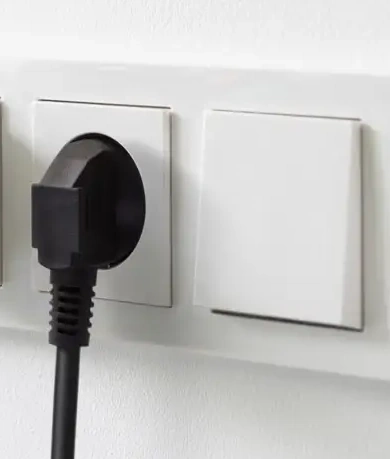

# DIY Zigbee outlet sensor
*Based on a battery powered sensor and a battery replacements*

## Introduction

Zigbee sensors, like a temperature sensor measure periodic the current temperature and run on a battery for a long time, but still that battery needs to be replaced from time to time.
Sometimes you just want a solution which always works, without the need to replace batteries once in a while.

 
 
 
This solution works for all these types of sensors:

    

    

---

## Table of Contents
<!-- TOC -->
  * [My solution](#my-solution)
  * [Required hardware](#required-hardware)
    * [Combination 1: Temperature sensor with CR2032 battery replacement](#combination-1-temperature-sensor-with-cr2032-battery-replacement)
    * [Combination 2: Temperature sensor with AAA battery replacement](#combination-2-temperature-sensor-with-aaa-battery-replacement)
    * [Combination 3: Leak sensor with AAA battery replacement](#combination-3-leak-sensor-with-aaa-battery-replacement)
    * [Combination 4: motion sensor with AAA battery replacement](#combination-4-motion-sensor-with-aaa-battery-replacement)
<!-- TOC -->

---

## My solution

You can create a DIY WiFi based temperature sensor with the BME280 temperature sensor and a 5V adapter powered ESP, flashed with ESPHome.

Or, what I choose, use a Zigbee temperature sensor 
and replace the normal battery with a dummy battery adapter to USB and connect it to an outlet.

There are multiple battery-eliminators:

* For AA batteries\
  
* For AAA batteries\
  
* For a CR 2032 cell battery\
  

---

## Required hardware

This project only requires these devices: A battery powered sensor and a battery replacement kit with a power adapter.

> I have a Zigbee network, so I use a Zigbee temperature sensors, but any other protocol sensor can also do the trick.

---

### Combination 1: Temperature sensor with CR2032 battery replacement

1. The <a href="/buy/smart_home_best_buy_tips#temperature-sensor" target="_blank">Aqara WSDCGQ11LM</a> is a CR2032 battery powered temperature sensor\
   

2. A <a href="/buy/batteries#cr2032-usb-battery-replacements">CR2032 battery to USB adapter</a>\
   

3. A <a href="/buy/smart_home_best_buy_tips#adapters">USB to outlet adapter</a>\
   

---

### Combination 2: Temperature sensor with AAA battery replacement

1. The <a href="/buy/smart_home_best_buy_tips#temperature-sensor" target="_blank">Tuya WSD500A AAA Battery powered temperature and humidity sensor</a>\
   

2. A <a href="/buy/batteries#battery-eliminators">AAA battery replacement/eliminator to USB adapter</a>\
   

3. A <a href="/buy/smart_home_best_buy_tips#adapters">USB to outlet adapter</a>\
   

---

### Combination 3: Leak sensor with AAA battery replacement

1. It also works with other sensors like this leak sensor with two AAA batteries.
  <a href="https://s.click.aliexpress.com/e/_c4547Us5" target="_blank">Zigbee leak sensor (AliExpress)</a> 
  <a href="https://amzn.to/3Zj7va8#ad" target="_blank">(Amazon)</a>
  

2. A <a href="/buy/batteries#battery-eliminators">AAA battery replacement/eliminator to USB adapter</a>\
   

3. A <a href="/buy/smart_home_best_buy_tips#adapters">USB to outlet adapter</a>\
   

---

### Combination 4: motion sensor with AAA battery replacement

1. It also works with other sensors like this motion sensor with two AAA batteries.\
   

2. A <a href="/buy/batteries#battery-eliminators">AAA battery replacement/eliminator to USB adapter</a>\
   

3. A <a href="/buy/smart_home_best_buy_tips#adapters">USB to outlet adapter</a>\
   

---

Any other solutions or feedback? Please let me know!

 

---

[<< See also my other Zigbee content](index)
