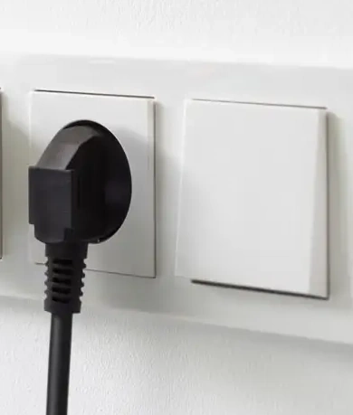

# DIY Zigbee outlet sensor
*Based on a battery powered sensor and a battery replacements*

## Introduction

Zigbee sensors, like a temperature sensor measure periodic the current temperature and run on a battery for a long time, but still that battery needs to be replaced from time to time.
Sometimes you just want a solution which always works, without the need to replace batteries once in a while.
 
This solution works for all these types of sensors:

    

    

---

## Table of Contents
<!-- TOC -->
  * [My solution](#my-solution)
  * [Required hardware](#required-hardware)
    * [Combination 1: Temperature sensor with CR2032 battery replacement](#combination-1-temperature-sensor-with-cr2032-battery-replacement)
    * [Combination 2: Temperature sensor with AAA battery replacement](#combination-2-temperature-sensor-with-aaa-battery-replacement)
    * [Combination 3: Leak sensor with AAA battery replacement](#combination-3-leak-sensor-with-aaa-battery-replacement)
    * [Combination 4: motion sensor with AAA battery replacement](#combination-4-motion-sensor-with-aaa-battery-replacement)
<!-- TOC -->

---

## My solution

You can create a DIY WiFi based temperature sensor with the BME280 temperature sensor and a 5V adapter powered ESP, flashed with ESPHome.

Or, what I choose, use a Zigbee temperature sensor 
and replace the normal battery with a dummy battery adapter to USB and connect it to an outlet.

There are multiple battery-eliminators:

AA<strong>AA battery eliminator</strong>

For devices with AA batteries.

<a href="/buy/batteries#battery-eliminators" target="_blank">Buy tips</a>

AAA<strong>AAA battery eliminator</strong>

For devices with AAA batteries.

<a href="/buy/batteries#battery-eliminators" target="_blank">Buy tips</a>

CR2032<strong>CR2032 battery to USB adapter</strong>

For devices with a CR2032 cell battery.

<a href="/buy/batteries#cr2032-usb-battery-replacements" target="_blank">Buy tips</a>

---

## Required hardware

This project only requires these devices: A battery powered sensor and a battery replacement kit with a power adapter.

> I have a Zigbee network, so I use a Zigbee temperature sensors, but any other protocol sensor can also do the trick.

---

### Combination 1: Temperature sensor with CR2032 battery replacement

A compact setup for sensors that run on a single CR2032 coin cell, like the Aqara temperature sensor. The CR2032-to-USB adapter takes the place of the coin cell and is powered by a USB adapter in the outlet, so this sensor never runs out of battery.

1. Sensor<strong>Aqara WSDCGQ11LM</strong>

A CR2032 battery powered temperature sensor.

<a href="/buy/zigbee_temperature_sensor" target="_blank">Buy tips</a>

2. Battery replacement<strong>CR2032 battery to USB adapter</strong>

Replaces the CR2032 battery and is powered via USB.

<a href="/buy/batteries#cr2032-usb-battery-replacements" target="_blank">Buy tips</a>

3. Power<strong>USB to outlet adapter</strong>

To power the battery replacement from the wall outlet.

<a href="/buy/smart_home_power#adapters" target="_blank">Buy tips</a>

---

### Combination 2: Temperature sensor with AAA battery replacement

The same idea for a temperature and humidity sensor that runs on AAA batteries. Put the AAA battery eliminator in the battery compartment instead of the batteries, and connect its USB cable to an adapter in the outlet.

1. Sensor<strong>Tuya WSD500A temperature and humidity sensor</strong>

An AAA battery powered temperature and humidity sensor.

<a href="/buy/zigbee_temperature_sensor" target="_blank">Buy tips</a>

2. Battery replacement<strong>AAA battery replacement (eliminator) to USB adapter</strong>

Replaces the AAA batteries and is powered via USB.

<a href="/buy/batteries#battery-eliminators" target="_blank">Buy tips</a>

3. Power<strong>USB to outlet adapter</strong>

To power the battery replacement from the wall outlet.

<a href="/buy/smart_home_power#adapters" target="_blank">Buy tips</a>

---

### Combination 3: Leak sensor with AAA battery replacement

This also works for other sensor types. This leak sensor runs on two AAA batteries, so the same AAA battery eliminator and USB adapter can power it permanently. Handy for a spot where you want it always on.

1. Sensor<strong>Zigbee leak sensor</strong>

It also works with other sensors, like this leak sensor with two AAA batteries.

<a href="https://s.click.aliexpress.com/e/_c3Su3S8r" target="_blank">AliExpress</a> | <a href="https://amzn.to/44ELc0F#ad" target="_blank">Amazon US</a>

2. Battery replacement<strong>AAA battery replacement (eliminator) to USB adapter</strong>

Replaces the AAA batteries and is powered via USB.

<a href="/buy/batteries#battery-eliminators" target="_blank">Buy tips</a>

3. Power<strong>USB to outlet adapter</strong>

To power the battery replacement from the wall outlet.

<a href="/buy/smart_home_power#adapters" target="_blank">Buy tips</a>

---

### Combination 4: motion sensor with AAA battery replacement

A motion sensor on two AAA batteries can be powered the same way. A sensor that reacts to movement is used a lot, so its batteries drain faster. Wired to an outlet it always keeps working.

1. Sensor<strong>Zigbee motion sensor</strong>

It also works with other sensors, like this motion sensor with two AAA batteries.

<a href="https://s.click.aliexpress.com/e/_c3xcbfC7" target="_blank">AliExpress</a>

2. Battery replacement<strong>AAA battery replacement (eliminator) to USB adapter</strong>

Replaces the AAA batteries and is powered via USB.

<a href="/buy/batteries#battery-eliminators" target="_blank">Buy tips</a>

3. Power<strong>USB to outlet adapter</strong>

To power the battery replacement from the wall outlet.

<a href="/buy/smart_home_power#adapters" target="_blank">Buy tips</a>

---

Any other solutions or feedback? Please let me know!

 

---

[<< See also my other Zigbee content](index)
