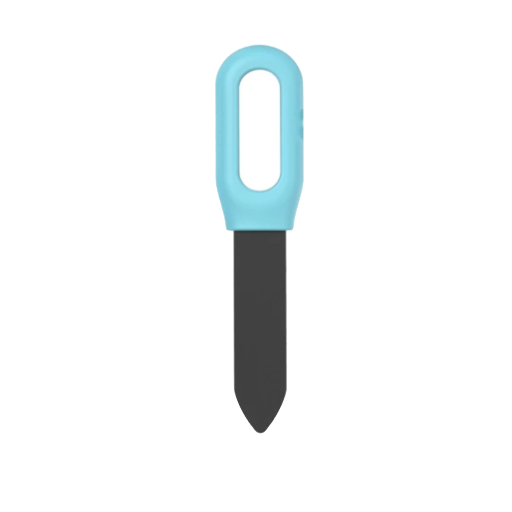



 | 

# Zigbee soil sensor
*measure ground moisture and temperature*

## Introduction


I was looking for an outdoor sensor to measure the ground humidity to see if I need to water the plants outside.

I found this soil sensor, with a solar panel, which could do the job!

<br>

> **_NOTE:_** Affiliate links are used on this page.

---

## Table of Contents
<!-- TOC -->
  * [Specifications](#specifications)
  * [Zigbee2MQTT](#zigbee2mqtt)
  * [Home Assistant](#home-assistant)
  * [Buy](#buy)
  * [Other plant sensors](#other-plant-sensors)
<!-- TOC -->

---

## Specifications

These are the specifications for this sensor:

| **Key**                                            | **Value**                                |
|----------------------------------------------------|------------------------------------------|
| Battery                                            | AA 1.2V * 3 Ni-MH battery (Rechargeable) |
| Solar Charging Current                             | 35mA                                     |
| Communication Protocol                             | Zigbee 3.0                               |
| Wireless Protocol                                  | Zigbee IEEE 802.15.4                     |
| Wireless Distance                                  | 50M                                      |
| Waterproof Level                                   | IP66                                     |
| Temperature Detection Range                        | -10～60℃ (14℉～140℉)                       |
| Moisture Detection Range                           | 0～100%RH (Non-Condensing)                |
| Maximum Detection Range of Electrical Conductivity | 20ms/cm                                  |
| Temperature Detection Accuracy                     | 0.5℃ (Adjustable)                        |
| Moisture Detection Accuracy                        | 5%RH (Adjustable)                        |
| Electrical Conductivity Detection Accuracy         | 3%FS 0.01ms/cm                           |
| Time Span of Detection                             | 10min (Adjustable)                       |
| Working Temperature                                | -10 ~ 60℃ (14 ~ 140℉)                    |
| Working Humidity                                   | 0 ~ 100%RH (Non-Condensing)              |
| Size                                               | 78mm x 78mm x 146mm                      |

<a href="images_soil_sensor/side.avif">

</a>
<a href="images_soil_sensor/bottom.avif">

</a>

{{imgBasket}}<a href="https://s.click.aliexpress.com/e/_opMcYj3" target="_blank">Zigbee soil sensor (AliExpress)</a>
<a href="https://www.zigbee2mqtt.io/devices/NAS-STH02B2.html" target="_blank" title="NAS-STH02B2">{{imgZ2M}}NAS-STH02B2</a>

---

## Installation

To install it, press only the metal pins full in the ground.

<a href="images_soil_sensor/installation.png">

</a>

If you have a model which is battery powered, you can reach those via the bottom and unscrew the panel.

<a href="images_soil_sensor/battery.png">

</a>

---

## Zigbee2MQTT

The model is registered as [NAS-STH02B2](https://www.zigbee2mqtt.io/devices/NAS-STH02B2.html) in Zigbee2MQTT.

To pair it, there is a button underneath the head that you need to press for a few seconds to get in pairing mode.

<a href="images_soil_sensor/pair_button.avif">

</a>


```yaml

  {
    "battery": 81,
    "ec": 1,
    "fertility": "normal",
    "humidity": 0,
    "humidity_alarm": "lower_alarm",
    "humidity_sensitivity": 2,
    "last_seen": "2025-01-12T10:01:00.904Z",
    "linkquality": 94,
    "max_humidity_alarm": 70,
    "max_temperature_alarm": 40,
    "min_humidity_alarm": 20,
    "min_temperature_alarm": 10,
    "schedule_periodic": 5,
    "temperature": 16.4,
    "temperature_alarm": "cancel",
    "temperature_f": 61.5,
    "temperature_sensitivity": 0.5
  }

```

---

## Home Assistant

The sensor generates a lot of entities, but the main ones are temperature and humidity. There are a lot of alarms you can define and end up as entities.

<a href="images_soil_sensor/soil_ha_entities.jpg">

</a>

The temperature and humidity can be added on the dashboard.

<a href="images_soil_sensor/soil_ha_temp_hum.jpg">

</a>

These settings can be changed.

<a href="images_soil_sensor/soil_ha_settings.jpg">

</a>

---

## Buy

Are you also excited about this sensor? Here you can buy it yourself.

<a href="https://s.click.aliexpress.com/e/_opMcYj3" target="_blank">


{{imgBasket}}Zigbee soil sensor (AliExpress)</a>

<br>

See [here](/buy/zigbee_outdoor) for more  outdoor Zigbee devices!

---

## Other plant sensors

<a href="https://s.click.aliexpress.com/e/_okZVL7L" target="_blank">
</a>
Other Zigbee sensors to track your plant health!

* [Tiny indoor plant senors (AliExpress)](https://s.click.aliexpress.com/e/_okZVL7L)

* [Cheaper version on 3 AA batteries (AliExpress)](https://s.click.aliexpress.com/e/_okhmDa9)

* [Green soil sensor measure also lux (AliExpress)](https://s.click.aliexpress.com/e/_oBMB8Vf)

* [Other outdoor soil sensor (AliExpress)](https://s.click.aliexpress.com/e/_on02f3r)

* [Indoor soil sensor - MOES (AliExpress)](https://s.click.aliexpress.com/e/_oC6bebb)

* [Rain and light sensor (AliExpress)](https://s.click.aliexpress.com/e/_EIt99cD)

* [Light sensor (AliExpress)](https://s.click.aliexpress.com/e/_DdVtS4P)
