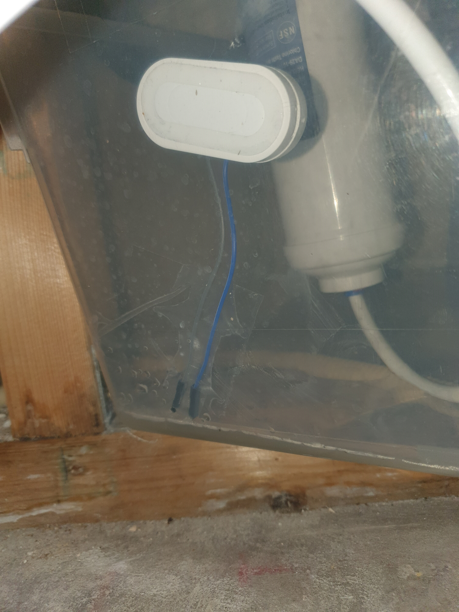
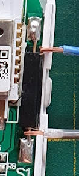

# DIY Zigbee leak sensor
*Based on a Zigbee contact sensor and two wires*

## Introduction

A have a water filter behind my kitchen closets, and I want to detect if there is any leak because you don't see it and have no easy access to it. When you find out it leaks it tool late. It never happened, but in case of a disaster happened I want to know it direct!
I had no leak sensor direct available, and they were at that time quite expensive, but I still had some contact sensors lying around. 

Water conducts current, so I thought I could also create from a contact sensor a leak sensor with just a small modification, and so I did.

Nowadays, these [leak sensors](../buy/smart_home_best_buy_tips#leak-sensor) are widely available, and you can buy them for the same price as a contact sensor but if you want to create one based on a contact sensor it's also possible ;) 

---

## Required hardware

You only need a Zigbee contact sensor and two wires:

[Zigbee contact sensor](../buy/smart_home_best_buy_tips#contact-sensor)

[(Dupont) wires](../buy/esphome_diy#dupont)

**Tools:**

[Soldering iron](../buy/esphome_diy#soldering-iron)

[Soldering iron tin](../buy/esphome_diy#soldering-tin-wire)

---

## Assemblage

Open the contact sensor. Now you see the black part, this is a reed switch.
When you hold a magnet close enough to it, it will make a closed circuit.

Use two dupont cables, remove the connectors at one end and remove for a centimeter at the end the isolation 
and solder them to the reed switch.

